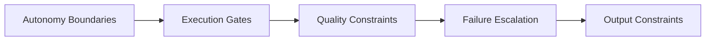
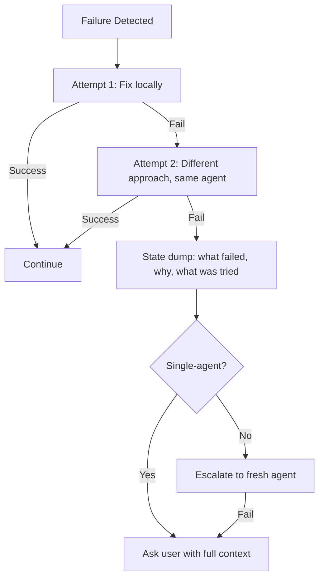
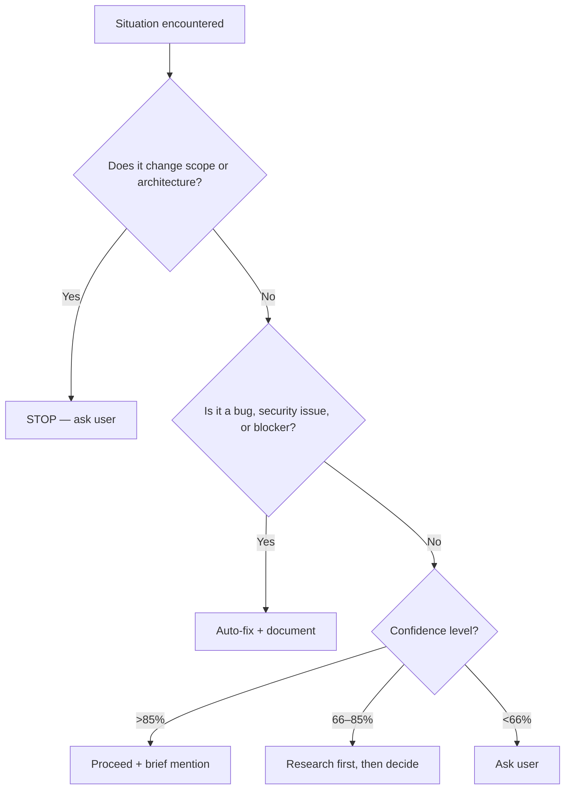

# Behavioral Rules & Constraint Patterns

> Cross-framework catalog of behavioral rules, autonomy boundaries, quality constraints, and failure escalation patterns that shape how AI coding agents operate within defined limits. Synthesized from GSD, Squad, awesome-copilot, Anthropic skills, and community instruction patterns.
>
> **Key concepts:** deviation rules, autonomy boundaries, planning locks, confidence scoring, anti-AI-slop, forced refinement, reviewer lockout, structured returns, section mutability, STOP & COMMIT points

## Overview

The most effective AI coding agents are the most constrained ones. This is the central insight that emerges across every major framework in the ecosystem — from GSD's four-tier deviation rules to Anthropic's explicit forbidden-pattern lists to awesome-copilot's observation that heavily restricted agents outperform permissive ones.

Behavioral rules define **what agents can and cannot do independently**. They are distinct from capabilities (what agents *can* do) and instructions (what agents *should* do). A behavioral rule is a hard constraint: a boundary, a gate, an escalation trigger. It fires when the agent encounters a situation that requires a decision about scope, quality, or autonomy — and it tells the agent whether to proceed, pause, or stop.



## Autonomy Boundaries

Every framework must answer: **when does the agent proceed on its own, and when does it stop and ask?** The approaches vary from GSD's numbered rule table to Squad's natural-language boundary lists, but they all solve the same problem — preventing both over-asking (agent paralyzed by uncertainty) and under-asking (agent making scope decisions silently).

### Four-Tier Deviation Rules

Categorize deviations by impact, not type. Only architectural changes require human approval; bugs, missing validation, and blockers are pre-authorized for auto-fix with documentation.

This pattern originates in GSD's deviation rules (see [GSD](../projects/gsd.md) § Deviation Rules) and maps to Squad's charter boundaries (see [Squad](../projects/squad.md) § The Charter Template).

### Domain-Scoped Boundaries

Boundary lists scope agents by domain ("I handle frontend, not API design") rather than by situation type. This is less precise than numbered deviation rules but more flexible — domain scope adapts naturally to multi-agent systems where each agent owns a vertical slice. The "When I'm unsure" fallback prevents silent guessing; in single-agent systems it translates to explicit mode handoffs.

*See [Squad](../projects/squad.md) § The Charter Template*

### Three-Zone Autonomy Model

A synthesis pattern that appears across multiple frameworks, though none uses this exact terminology:

| Zone | Agent Behavior | Example Triggers |
|------|---------------|-----------------|
| **No-ask** | Proceed and document. Don't interrupt the user. | Bug fixes, formatting, typos, mechanical refactors |
| **Brief-mention** | Proceed but note what you did and why. | Style choices, minor scope adjustments, tool selection |
| **Ask** | Stop and get explicit approval before proceeding. | Scope expansion, architectural changes, destructive operations, ambiguous requirements |

GSD's deviation rules map directly: Rules 1–3 are no-ask, Rule 4 is ask. Squad's charter boundaries define what falls in each zone per agent. The three-zone model generalizes these into a reusable pattern for any agent system.

The critical design insight: **the no-ask zone must be explicitly defined, not left implicit.** Without it, agents either ask too much (retro Pattern G: "asks permission for obvious work") or assume too much (retro Pattern B: "do more than asked"). Explicit no-ask rules eliminated Pattern G instances in observed sessions.

### Confidence Scoring

The awesome-copilot ecosystem surfaces a quantitative autonomy model:

| Confidence | Action |
|-----------|--------|
| **>85%** | Proceed — sufficient certainty to act |
| **66–85%** | Research first — gather more evidence before deciding |
| **<66%** | Ask the user — uncertainty is too high for autonomous action |

This appears in the "Spec-Driven Workflow V1" instruction pattern from awesome-copilot, and GSD uses a similar threshold (80%) for its research-phase stopping criterion: "Stop researching at 80% confidence to avoid over-researching."

The thresholds are heuristic, not precise — agents can't actually calculate confidence percentages. But framing autonomy as a confidence gradient gives the agent a reasoning framework: "Am I confident enough to proceed, or should I gather more information first?"

*See [awesome-copilot](../projects/copilot-awesome.md) § Instruction Patterns*

## Planning Locks and Execution Gates

Autonomy boundaries define *what* the agent can do freely. Execution gates define *when* the agent must pause — structural checkpoints in the workflow that require explicit verification before proceeding.

### GSD's Planning Lock

GSD enforces a hard gate between planning and execution: plans must exist and be approved (in interactive mode) before execution can begin. The executor's job is to implement the plan, not to revise it. This prevents a failure mode where the agent silently changes the plan mid-execution to avoid a difficult implementation, then delivers something different from what was approved.

The plan is a contract. The separation of concerns — planner writes, executor implements, neither does both — is the structural version of GSD's deviation Rule 4.

*See [GSD](../projects/gsd.md) § Workflow Phases*

### STOP & COMMIT Points

Explicit pause markers in implementation plans force the agent to save progress and verify each step's output before proceeding. This prevents the common failure mode of implementing an entire plan in one pass, discovering a bug in step 3, and having to unwind steps 4–7. It also creates natural checkpoints where context can be flushed and a fresh subagent can take over if the context is degrading.

Both awesome-copilot and Squad implement this pattern — awesome-copilot via `STOP & COMMIT` annotations in plan steps, Squad via `STOP/WAIT` keywords gated by regex checks.

*See [awesome-copilot](../projects/copilot-awesome.md) § Agent Architecture Patterns, [Squad](../projects/squad.md)*

### Squad's Design Review Gate

Before any multi-agent task involving 2+ agents on shared systems, Squad auto-triggers a design review ceremony facilitated by the Lead agent. Implementation work cannot start until the review completes.

This maps to a simpler principle for single-agent systems: **for refactor-scale work, audit before implementing.** The sequence — analyze existing state → design target state → inventory changes → implement — consistently produces better results than jumping straight to implementation.

*See [Squad](../projects/squad.md)*

## Quality Constraint Patterns

Quality constraints define the *standard* of agent output — not what the agent does, but how well it does it.

### Constraint > Capability

The single most important principle across the ecosystem:

> **"The most effective agents are the most constrained."**
> — Observed across awesome-copilot agent patterns

The principle inverts the intuition that more capable = more useful. Unconstrained agents produce more output but lower quality. Constrained agents produce exactly what's needed. Heavy verbatim constraints (scope limits, output caps, confidence thresholds) consistently outperform permissive instructions across observed agent patterns.

Evidence from retro analysis supports this: Pattern B ("do more than asked") accounts for 20 mistakes across 12 sessions, making it the second most common failure pattern. Every instance involved an agent exceeding its constraints — adding unrequested features, over-engineering solutions, fabricating scope.

*See [awesome-copilot](../projects/copilot-awesome.md) § Agent Architecture Patterns for concrete constraint examples*

### Anti-AI-Slop Patterns

Prohibitions outperform aspirations for LLM instruction-following — listing what bad output looks like and forbidding it is more effective than describing ideal output abstractly. Default LLM outputs are treated as unacceptable until proven otherwise; skills encode quality as explicit forbidden-pattern lists rather than positive descriptions.

The anti-slop philosophy extends beyond visual design into documentation and naming. The philosophical divide: Anthropic constrains to force quality; community repos maximize variety. Notably, awesome-copilot does *not* enforce anti-slop — a deliberate breadth-over-quality trade-off.

*See [Anthropic Skills](../projects/anthropic-skills.md) § The Anti-AI-Slop Philosophy for forbidden-pattern examples*

### Forced Refinement

Anthropic's canvas-design skill encodes a remarkable assumption: **the first output is never good enough.**

> The FINAL STEP explicitly assumes the user said "It isn't perfect enough" and forces a refinement pass. The workflow EXPECTS iteration.

This inverts the typical agent workflow where the agent delivers output and waits for feedback. The doc-coauthoring skill extends this further: after 3 consecutive iterations with no changes, the agent asks "is there anything we can remove?" — forcing a subtractive pass even when the additive work is complete.

The sub-agent reader test takes forced refinement to its logical conclusion: spawn a fresh Claude instance with no context to simulate a naive reader, then iterate based on what the naive reader doesn't understand. This is evaluation-by-proxy — the agent creates its own reviewer.

*See [Anthropic Skills](../projects/anthropic-skills.md) § Forced Refinement Pattern*

## Failure Escalation Patterns

When things go wrong, behavioral rules determine how urgently and to whom the agent escalates.

### The N-Strike Escalation Rule

Multiple frameworks implement a variant of "try N times, then escalate":

- **shariqriazz (2-attempt rule):** "If two attempts at the same approach fail, stop. Use `ask_user` to reassess."
- **GSD (implicit in deviation rules):** auto-fix once; if the fix doesn't resolve the blocker, STOP. The DEBUG.md template advises: "If evidence grows very large (10+ entries), consider whether you're going in circles."
- **Retro evidence:** The failure to follow this rule is Pattern A's most common manifestation — agents loop on the same failing approach without stepping back.

The effective pattern: **After N failed attempts at the same approach, dump state and escalate.** The state dump is critical — without it, the person or agent receiving the escalation doesn't know what was tried. The shariqriazz escalation protocol specifies: "error output, stack traces, what's been tried, why it failed."

A stricter variant from shariqriazz: after 2 failed fix attempts, **escalate to a fresh agent with full context**. The fresh agent owns the fix end-to-end. This breaks the anchoring bias where the original agent keeps trying variations of its first (wrong) approach.

*See [awesome-copilot](../projects/copilot-awesome.md) § Instruction Patterns*

### Reviewer Lockout

Squad implements the most aggressive failure escalation in the ecosystem:

> When the Tester or Lead rejects work, **the original author cannot revise it.** A different agent must handle the revision. If that revision is also rejected, the second agent is locked out too.

This prevents the "agent keeps fixing its own work in circles" failure mode. Each rejection brings a fresh perspective — literally a different agent with different context. Lockout cascades: first rejection → new agent; second rejection → another new agent; enough rejections → the task itself is escalated for redesign.

In single-agent systems, reviewer lockout doesn't apply directly. But the underlying principle does: **don't let the author of a mistake be the sole reviewer of its fix.** The single-agent equivalent is forced external verification — read the deliverable file fresh before marking a task complete, rather than trusting the in-session state.

*See [Squad](../projects/squad.md) § Reviewer Protocol and Rejection Lockout*

### Failure-Escalation Ladder

Synthesizing across frameworks, a general escalation ladder emerges:



The ladder has three properties:
1. **Bounded attempts** — never more than 2–3 tries at the same approach
2. **State preservation** — every escalation includes what was tried
3. **Fresh perspective** — escalation brings new context (new agent, or human review)

## Output Constraints

Output constraints shape *how* the agent communicates its results.

### Structured Returns

GSD and awesome-copilot both standardize agent output with structured status headers:

```
## COMPLETE
## BLOCKED: {reason}
## PARTIAL: {what's done, what remains}
```

GSD uses variants: `PLANNING COMPLETE`, `VERIFICATION PASSED`, `ISSUES FOUND`. The orchestrator parses these to decide next steps without re-reading the full report. This is a communication protocol — structured status headers enable reliable agent-to-agent (or agent-to-orchestrator) handoffs.

The pattern extends to subagent returns: when a parent agent spawns a subagent, the subagent ends its report with a structured status line. The parent reads the status to decide whether to proceed, retry, or escalate.

*See [GSD](../projects/gsd.md) § Structured Returns for Orchestration*

### Response Mode Tiering

Match response depth to request complexity — simple factual questions shouldn't trigger full agent spawns with charter reads. The selection bias is toward upgrading when uncertain; it's better to over-respond slightly than to under-respond and miss something.

For single-agent research workflows, this maps to: quick factual answer → standard investigation → deep landscape survey, each with different tool budgets and deliverable expectations.

*See [Squad](../projects/squad.md) § Response Mode Tiering for the four-tier classification*

### Conciseness Rules

Across frameworks, output constraints enforce brevity:

- awesome-copilot Gem Team orchestrator: **"Direct answers in ≤3 sentences. Status updates and summaries only."**
- GSD: Summary artifacts are structured, not narrative — status fields, not paragraphs.
- Anthropic cookbooks: "Be professional, friendly, and concise. Be direct but not dismissive."

Without explicit conciseness rules, agents produce paragraphs where a sentence suffices. The ≤3-sentence rule is the sharpest version — it's specific enough to be falsifiable.

### Section Mutability Rules

GSD tags each section of its state files with a mutation policy:

| Policy | Meaning | Example Sections |
|--------|---------|-----------------|
| **OVERWRITE** | Always reflects latest state | Status, current focus |
| **APPEND-only** | History preserved, new entries added at end | Evidence log, eliminated hypotheses, timeline |
| **IMMUTABLE** | Reference point, never changes after creation | Original trigger, symptoms, success criteria |

This prevents a subtle failure mode: agents updating historical records to match current understanding, erasing the original context that motivated a decision. When the "original symptoms" section is IMMUTABLE, the agent can't retroactively rewrite history to match its current hypothesis.

The pattern generalizes to any structured document with mixed-purpose sections. Objectives, plans, and findings all benefit from explicit mutability annotations. Without them, agents treat every section as OVERWRITE by default — which is correct for status fields but destructive for historical records.

*See [GSD](../projects/gsd.md) § Section-Level Mutability Rules*

## The Constraint-as-Design-Philosophy Principle

The patterns in this document converge on a single principle: **constraints are not limitations on agent capability — they are the primary mechanism for producing quality output.**

Evidence from three independent sources:

1. **awesome-copilot (empirical):** Surveying 120+ agents, the most starred and most effective agents have the most restrictive behavioral rules. Permissive agents produce more output; constrained agents produce better output.

2. **Anthropic (philosophical):** Anti-slop prohibitions, forced refinement, sub-agent reader testing — every quality mechanism is a constraint. The assumption is that unconstrained LLM output is below acceptable quality, and the skill's job is to prevent default behavior.

3. **Retro evidence (observational):** Across 25 agent sessions, the two most common failure patterns — "hypothesize before reading" (26 instances) and "do more than asked" (20 instances) — are both cases of insufficient constraint. Pattern A fires when the agent isn't constrained to read before acting. Pattern B fires when the agent isn't constrained to the requested scope.

The implication for agent system design: **start with maximum constraints and selectively relax them**, rather than starting permissive and adding restrictions when things go wrong. The no-ask zone should be explicitly enumerated.

## Quick Reference

### Autonomy Decision Tree



### Pattern Summary Table

| Pattern | Source Framework | Problem Solved | Key Rule |
|---------|----------------|---------------|----------|
| 4-tier deviation rules | GSD | When to auto-fix vs. stop | Only architectural changes require human input |
| "I handle / I don't handle" | Squad | Agent scope confusion | Explicit boundary lists per agent |
| Three-zone model | Cross-framework | Over-asking / under-asking | No-ask, brief-mention, ask zones |
| Confidence scoring | awesome-copilot | Quantitative autonomy | >85% proceed, 66-85% research, <66% ask |
| Planning lock | GSD | Plan mutation during execution | Executor cannot edit the plan |
| STOP & COMMIT points | awesome-copilot | Unbounded implementation passes | Forced save + verify between steps |
| Design review gate | Squad | Jumping to implementation | Audit → design → implement sequence |
| Constraint > capability | awesome-copilot | Agent over-production | Tighter constraints → higher quality |
| Anti-AI-slop | Anthropic skills | Generic/default LLM output | Prohibitions > aspirations |
| Forced refinement | Anthropic skills | Delivering first drafts as final | Assume "not good enough," iterate |
| N-strike escalation | shariqriazz / cross-fw | Looping on failing approaches | 2–3 attempts max, then state dump + escalate |
| Reviewer lockout | Squad | Agent fixing own bugs in circles | Author of rejected work cannot revise it |
| Structured returns | GSD | Ambiguous agent completion status | COMPLETE / PARTIAL / BLOCKED |
| Response mode tiering | Squad | Over-processing simple requests | Direct / lightweight / standard / full |
| Section mutability | GSD | Rewriting historical records | OVERWRITE / APPEND / IMMUTABLE per section |

## References

| Source | What It Contributes | Library Doc |
|--------|-------------------|-------------|
| GSD (Get Shit Done) | Deviation rules, planning lock, section mutability, context budget, structured returns | [gsd.md](../projects/gsd.md) |
| Squad | Reviewer lockout, charter boundaries, response tiering, routing rules, STOP gates | [squad.md](../projects/squad.md) |
| awesome-copilot | Constraint > capability, confidence scoring, STOP & COMMIT, conciseness rules | [copilot-awesome.md](../projects/copilot-awesome.md) |
| Anthropic skills | Anti-AI-slop prohibitions, forced refinement, sub-agent reader testing | [anthropic-skills.md](../projects/anthropic-skills.md) |

## See Also

- [GSD](../projects/gsd.md) — deviation rules, planning lock, fresh-context-per-task model
- [Squad](../projects/squad.md) — reviewer lockout, charter boundaries, response mode tiering
- [Anthropic Skills](../projects/anthropic-skills.md) — anti-slop philosophy, forced refinement
- [awesome-copilot](../projects/copilot-awesome.md) — constraint > capability, confidence scoring
- [Hooks and Lifecycle](../vscode/hooks-and-lifecycle.md) — hooks-based constraint enforcement
- [delegation-and-subagents.md](delegation-and-subagents.md) — delegation constraints, subagent scope control
- [context-and-persistence.md](context-and-persistence.md) — state management rules, context budget
- [Claude Cookbooks](../projects/claude-cookbooks.md) — Anthropic's cookbook with slash commands, behavioral constraints, and tool restrictions
- [Spec Kit](../projects/spec-kit.md) — agent-agnostic specification tool with behavioral rule patterns
