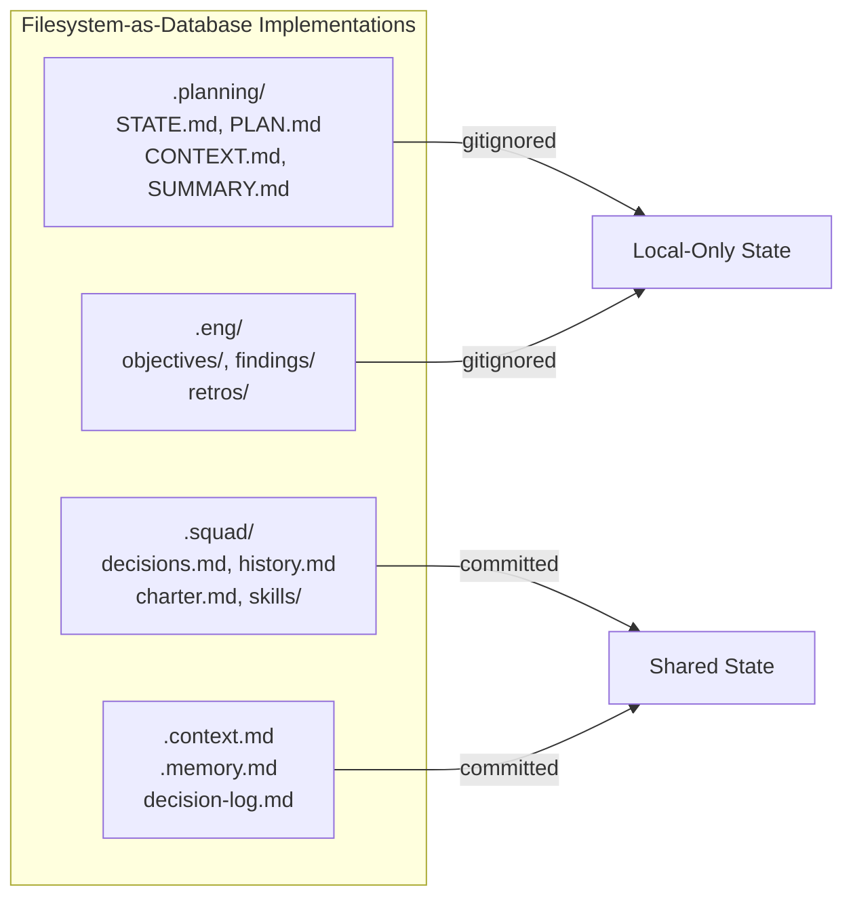
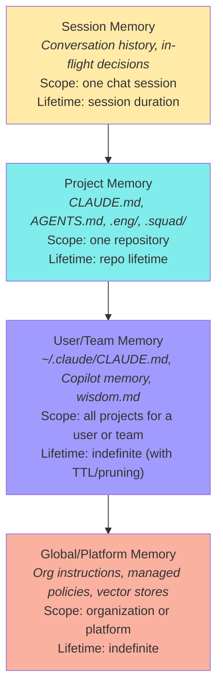
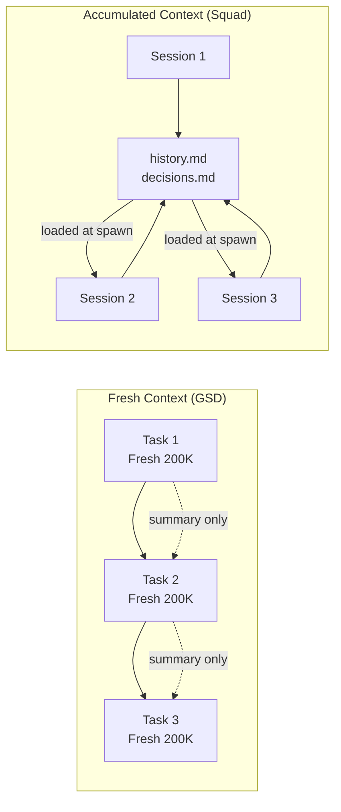

# Context and Persistence

> Cross-framework patterns for how AI coding agents persist state, manage context windows, handle session handoffs, and maintain memory across interactions — from filesystem-as-database conventions to context budget monitoring and compression strategies.
>
> **Key concepts:** filesystem as database, section-level mutability, context health curve, memory hierarchy layers, `.continue-here.md` handoff, cross-tool compatibility matrix, freshness vs accumulation trade-off, context compression

## Overview

Every AI coding agent faces the same fundamental problem: **context is ephemeral, but work is not.** A coding session produces decisions, discoveries, and progress that must survive beyond the current context window. (For the complementary problem — what to load *into* the context window and how to keep it healthy within a session — see [Context Engineering](context-engineering.md).)

Across the frameworks surveyed (GSD, Squad, Claude Code, Copilot, Cursor, Windsurf, Cline, LangGraph, CrewAI, AutoGPT, and community projects like shariqriazz and dhar174), context persistence falls into five categories:

| Category | What persists | Typical format | Examples |
|---|---|---|---|
| **Project instructions** | Coding standards, architecture rules, agent behavior | Markdown + YAML frontmatter | `CLAUDE.md`, `AGENTS.md`, `.cursorrules`, `.clinerules/` |
| **Session state** | Conversation history, task progress, decisions | JSON, SQLite, Postgres | Claude Code sessions, LangGraph checkpoints, AutoGPT `state.json` |
| **Learned memory** | Facts, patterns, preferences extracted during work | Markdown, vector DB, key-value store | Claude auto-memory, Copilot memory, CrewAI unified memory |
| **Knowledge/RAG** | Embeddings of documents for retrieval | Vector DB (ChromaDB, LanceDB, Pinecone) | CrewAI knowledge, LangMem, AutoGPT Mem0 |
| **Working documents** | Plans, research, findings, objective tracking | Structured Markdown | GSD `.planning/`, EngAgent `.eng/`, Squad `.squad/` |

The first two categories are infrastructure — handled by the platform. The last three are where framework design choices diverge, and where the interesting patterns live.


## The Filesystem-as-Database Pattern

The most universal pattern across surveyed frameworks is using the **filesystem as a structured database**. Rather than SQLite, Postgres, or vector stores, coding agents persist state as Markdown files in a project directory — readable by humans, parseable by agents, versionable with git.



Every IDE-integrated agent framework (Copilot, Claude Code, Cursor, Windsurf, Cline, Aider) uses Markdown files for project instructions. Every working-document framework (GSD, Squad, EngAgent, dhar174) uses Markdown files for dynamic state. The result is a de facto standard: **Markdown + YAML frontmatter, organized in a project-level directory**.

Why filesystem over databases?

- **Transparency.** Developers can read, edit, and audit state files directly. No query layer required.
- **Portability.** Files travel with the repo. Clone the project and you have the state.
- **Git integration.** State changes show in diffs. History comes free. Branching gives you state branching.
- **No infrastructure.** No database server, no connection strings, no schema migrations.

The pattern breaks down for high-volume structured data (CrewAI uses LanceDB for embeddings, LangGraph uses Postgres for checkpoints), but for the working-document use case — decisions, plans, progress tracking, handoff context — filesystem persistence is sufficient and strictly simpler.

**Platform agents (LangGraph, CrewAI, AutoGPT)** use databases because they serve multi-user, multi-project, cloud-deployed scenarios where file-based state doesn't scale. **Coding agents (GSD, Squad, Copilot, Claude Code)** use files because they operate in a single-project, single-developer context where transparency matters more than query performance.


## State File Conventions

Each framework defines its own state file vocabulary. The file names differ, but the underlying concerns are remarkably consistent:

| Concern | GSD | Squad | dhar174 | Claude Code |
|---|---|---|---|---|
| **Current focus** | `STATE.md` (YAML frontmatter + body) | `now.md` (focus area + active issues) | — | Auto-memory topic files |
| **Decisions** | `STATE.md` decisions field | `decisions.md` (team-wide) + `decisions/inbox/` | `decision-log.md` (numbered, with Context/Consequences) | `CLAUDE.md` (manual) |
| **Learned patterns** | `{phase}-CONTEXT.md` | `{agent}/history.md` + `wisdom.md` | `.memory.md` (gotchas, patterns) | `~/.claude/projects/<proj>/memory/MEMORY.md` |
| **Plans** | `{phase}-{N}-PLAN.md` (XML tasks) | — (delegation via coordinator) | `spec.md` (contracts) | — |
| **Results** | `{phase}-{N}-SUMMARY.md` | `log/` (session history) | — | Session DB |
| **Project context** | `PROJECT.md` + `REQUIREMENTS.md` | Agent charters + `decisions.md` | `repo-profile.md` | `CLAUDE.md` hierarchy |

### What the names reveal

- **GSD** is phase-centric: files are scoped to workflow phases (`phase-1-PLAN.md`, `phase-1-SUMMARY.md`). State flows forward through phases.
- **Squad** is agent-centric: files are scoped to team members (`lead/history.md`, `frontend/charter.md`). State accumulates per agent.
- **dhar174** is concern-centric: each file type has a single purpose (`.context.md` for stable facts, `.memory.md` for learned patterns, `decision-log.md` for choices). No scoping by phase or agent.
- **Claude Code** is layer-centric: `CLAUDE.md` at different directory depths creates a cascading hierarchy from org-wide to file-specific.

No single approach is superior — each optimizes for a different workflow model. The practical takeaway: pick a naming convention that matches how your agent thinks about work (phases, agents, concerns, or scoping hierarchy) and stick with it.


## Memory Hierarchy Layers

Across the ecosystem, memory consistently organizes into four layers — from ephemeral session state to durable global knowledge:



| Layer | Example implementations | Shared? | Typical storage |
|---|---|---|---|
| **Session** | LangGraph checkpoints, Claude conversation DB, in-memory buffers | No | RAM, SQLite, Postgres |
| **Project** | `CLAUDE.md`, `.squad/decisions.md`, GSD `STATE.md`, `.eng/objectives/` | Via git (if committed) | Filesystem |
| **User/Team** | `~/.claude/CLAUDE.md`, Copilot memory (28-day TTL), Squad `wisdom.md` | Personal or team-scoped | Filesystem, cloud API |
| **Global** | Org-level instructions (GitHub, Claude managed policies), CrewAI knowledge stores | Org-wide | Cloud, vector DB |

**Claude Code's hierarchy** is the most explicit implementation. It defines six distinct layers from managed org policy down to project-local instructions, each with clear override semantics. Broader layers set defaults; narrower layers override.

**Squad** implements three layers explicitly: charter (identity), history (learned knowledge), decisions (team policy). The Scribe agent maintains consistency across layers by merging parallel writes.

**LangGraph** separates the hierarchy into infrastructure: checkpointers (session-scoped, per-thread) and Store (cross-session, namespaced by arbitrary tuples like `(user_id, "memories")`). LangMem adds a third tier with semantic, episodic, and procedural memory types drawn from the CoALA research paper.

The general principle: **the narrower the scope, the higher the priority.** This mirrors CSS specificity — and like CSS, conflicts between layers at the same specificity level are the primary source of bugs.


## Section-Level Mutability Rules

GSD introduced an elegant pattern for preventing state corruption: **tagging each section of a state file with a mutation policy.**

| Policy | Meaning | Example sections |
|---|---|---|
| **OVERWRITE** | Always reflects latest state. Previous value is replaced. | Status, current focus, active task |
| **APPEND-only** | New entries added; existing entries never modified or removed. | Evidence log, eliminated hypotheses, timeline, decisions |
| **IMMUTABLE** | Set once, never changed. Serves as a fixed reference point. | Original trigger, symptoms, spec once finalized |

This prevents a common failure mode: an agent updating a state file and accidentally rewriting history. When the timeline section is APPEND-only, the agent can't silently drop earlier entries.

The pattern applies beyond GSD. Any framework using structured state files benefits from declaring which sections overwrite, which accumulate, and which are locked:

- **Squad's** `decisions.md` is effectively APPEND-only (the Scribe adds entries, never removes them). Agent charters are near-IMMUTABLE (identity is stable).
- **EngAgent's** objective files have implicit mutability: Status is OVERWRITE, Decisions is APPEND-only, Timeline is APPEND-only, Tasks toggle checkboxes but text is IMMUTABLE once in-progress.
- **dhar174's** `decision-log.md` entries have a Status field (Accepted/Deprecated/Superseded) — entries are never deleted, only status-transitioned.

Codifying these implicit rules as explicit conventions is low-effort, high-value. One line per section in a template comment is sufficient.


## Context Health Monitoring

Context windows are finite, and quality degrades as they fill. GSD provides the most explicit model for this, using *remaining* context percentage:

| Remaining Context | Quality | Recommended Action |
|---|---|---|
| >35% remaining | **Normal** | Proceed without modification |
| ≤35% remaining | **Warning** | Compress context, use outlines |
| ≤25% remaining | **Critical** | Mandatory state dump, fresh session |

The DEBUG.md template advises: "If evidence grows very large (10+ entries), consider whether you're going in circles" — encouraging agents to recognize circular debugging loops.

**Squad** takes a different approach — context is managed architecturally rather than monitored. Each specialist agent gets its own 200K-token window. The coordinator consumes ~13.2% of context; each agent spawn uses ~0.4–6%. Available working context per agent: ~78–83%.

Squad's v0.4.0 context audit is instructive: `decisions.md` had bloated to ~80K tokens (40% of context). Three optimizations — decisions pruning (251→78 blocks), spawn template deduplication, init mode compression — dropped per-agent spawn cost from 41–46% to 17–23%. The lesson: **even well-designed memory systems bloat over time. Active pruning is necessary, not optional.**

**Claude Code** manages context implicitly: auto-memory is capped at 200 lines loaded at session start, with topic files loaded on-demand. The 200-line limit is a form of context engineering — it forces the memory system to stay concise.

**The GSD-Antigravity port** added dedicated tooling: `token-budget` (track usage), `context-compressor` (compress for efficiency), `context-fetch` (search-first loading), and `context-health-monitor` (detect degradation). These skills make context management an explicit, observable concern rather than a background worry.


## Session Handoff Patterns

Session handoff — persisting enough state to resume work in a new context window — is one of the hardest problems in agent persistence. The challenge: capture everything a fresh agent needs without capturing so much that context is wasted on stale information.

### GSD: STATE.md + .continue-here.md

GSD uses `STATE.md` as the persistent cross-session bridge, with YAML frontmatter kept in sync with the document body. The session handoff flow:

- **`/pause-work`** creates a structured snapshot: current position, completed work, remaining work, decisions, blockers, next action
- **`/resume-work`** loads the snapshot to restore context in a new session

The GSD-for-Copilot port extended this with `.continue-here.md` — a richer per-phase handoff file:

```markdown
## Current State
What's happening right now.
## Completed Work
What's done.
## Remaining Work
What's left.
## Decisions Made
Context that would be lost across sessions.
## Blockers
What's stuck and why.
## Context
One-line "vibe" — the mood of the work.
## Next Action
Exactly what to do first when resuming.
```

The "Next Action" field is the key innovation — it eliminates the cold-start problem of returning to a session and not knowing where to begin.

### Squad: Persistent Agents + decisions.md

Squad sidesteps the handoff problem by making agents persistent. Each specialist writes learned knowledge to `{agent}/history.md` after every session. Team decisions accumulate in `decisions.md`. When an agent spawns in a new session, it reads its charter, history, and team decisions — effectively "resuming" with accumulated knowledge.

The trade-off: Squad's approach compounds knowledge but also compounds noise. The v0.4.0 bloat incident (decisions.md at 80K tokens) shows that persistent accumulation requires active curation.

### Claude Code: Built-in Resume

Claude Code provides infrastructure-level session resume: `claude --continue` picks up the last session, `claude --resume` lets you choose from recent sessions. Named sessions via `/rename`. Auto-cleanup after 30 days. No user-managed state files needed.

### LangGraph: Checkpointing

LangGraph saves full `StateSnapshot` objects at every super-step, scoped by `thread_id`. Backends range from `InMemorySaver` (dev) to `PostgresSaver` (prod). This enables not just resume but **time travel** — rewinding to any previous state and forking execution. The most powerful resume mechanism surveyed, but also the heaviest.


## The Freshness vs Accumulation Trade-off

The most interesting philosophical divide in the ecosystem is between frameworks that treat fresh context as an asset (GSD) and those that treat accumulated context as an asset (Squad).



| Dimension | Fresh (GSD) | Accumulated (Squad) |
|---|---|---|
| **Core belief** | Context rot is the primary failure mode | Knowledge loss is the primary failure mode |
| **How tasks get context** | Exactly what they need, nothing more | Everything the agent has ever learned |
| **Quality curve** | Consistently peak (always 0–30% usage) | Starts good, degrades without pruning |
| **Knowledge transfer** | Via structured summaries between tasks | Via persistent files read at spawn |
| **Failure mode** | Summaries lose nuance | History bloats and degrades context |
| **Best for** | Long projects with many phases | Projects where domain knowledge compounds |
| **Mitigation** | Rich summaries, explicit handoff docs | Active pruning, context audits, archiving |

Neither approach is universally better. GSD is right that quality degrades with context usage — the data is clear. Squad is right that some knowledge (architectural decisions, domain gotchas, team conventions) genuinely compounds and shouldn't be discarded.

The practical synthesis: **use fresh context for execution, accumulated context for knowledge.** Give each task a clean window for implementation, but load it with curated project knowledge (decisions, conventions, learned patterns) from a pruned persistent store. This is roughly what Claude Code does with its auto-memory system: 200 lines of curated knowledge loaded into a fresh session context.


## Context Compression Strategies

When context budget runs low, frameworks employ several compression techniques:

| Strategy | Used by | Mechanism |
|---|---|---|
| **Progressive summarization** | Squad, GSD | Replace detailed history with summaries. Squad's `history.md` gets progressively compressed. |
| **Section pruning** | Squad (v0.4.0) | Remove less-relevant blocks from `decisions.md` (251→78 blocks). |
| **Outline mode** | GSD (50–70% usage) | Replace full content with structural outlines. |
| **Search-first loading** | GSD-Antigravity | Don't load files speculatively — search for relevant content, load only matches. |
| **Auto-memory cap** | Claude Code | Hard limit (200 lines) on auto-loaded memory. Topic files loaded on-demand. |
| **Fresh context spawn** | GSD, Squad | When context is full, spawn a new agent with only essential state. |
| **Template deduplication** | Squad (v0.4.0) | Remove repeated boilerplate from spawn templates. |

The most effective strategy is also the simplest: **don't load what you don't need.** GSD-Antigravity's search-first approach and Claude Code's on-demand topic loading both embody this principle. Speculative loading ("include everything just in case") is the primary cause of premature context exhaustion.


## Cross-Framework Compatibility Matrix

One practical question: which instruction/memory files are recognized by which tools? This matters for teams using multiple AI coding tools.

| File/Convention | Copilot | Claude Code | Cursor | Windsurf | Cline | Aider | GSD |
|---|---|---|---|---|---|---|---|
| `AGENTS.md` | ✅ | — | ✅ | — | ✅ | — | ✅ |
| `CLAUDE.md` | ✅ | ✅ | — | — | — | — | ✅ |
| `.cursorrules` / `.cursor/rules/` | — | — | ✅ | — | ✅ | — | — |
| `.windsurfrules` / `.windsurf/rules/` | — | — | — | ✅ | ✅ | — | — |
| `.clinerules/` | — | — | — | — | ✅ | — | — |
| `.github/copilot-instructions.md` | ✅ | — | — | — | — | — | — |
| `*.instructions.md` (with `applyTo`) | ✅ | — | — | — | — | — | — |
| Agent Skills (`SKILL.md`) | ✅ | ✅ | ✅ | ✅ | ✅ | — | — |
| Auto-generated memories | ✅ (preview) | ✅ | — | ✅ | — | — | — |

**Key observations:**

- **`AGENTS.md`** has the broadest support among IDE agents (Copilot, Cursor, Cline, GSD). It's the closest thing to a universal instruction file.
- **`SKILL.md`** (via [agentskills.io](https://agentskills.io/)) is the most portable structured format — recognized by Copilot, Claude Code, Cursor, Windsurf, and Cline.
- **Cline is the most promiscuous reader** — it auto-detects `.cursorrules`, `.windsurfrules`, `AGENTS.md`, and its own `.clinerules/`.
- **No single file works everywhere.** Teams using multiple tools need 2–3 instruction files, or a build step that generates tool-specific files from a canonical source.
- **Auto-memory is converging** — Claude Code, Copilot, and Windsurf all auto-extract and persist learnings, though the storage formats and scoping differ.


## Platform Agent Persistence (CrewAI, LangGraph, AutoGPT)

Platform agent frameworks (designed for multi-user deployment rather than single-developer IDE use) take different approaches:

**CrewAI** uses a unified `Memory` class with hierarchical scoping (filesystem-like paths: `/project/alpha`, `/agent/researcher`). The LLM analyzes content on save, inferring scope, categories, and importance. Retrieval uses composite scoring: semantic similarity + recency decay + importance weighting. Default backend: LanceDB at `./.crewai/memory/`. Task persistence via SQLite enables `crewai replay -t <task_id>` for mid-workflow resume.

**LangGraph** separates short-term (checkpointers: `InMemorySaver`, `SqliteSaver`, `PostgresSaver`) from long-term (Store: namespaced key-value with optional semantic search). LangMem adds three memory types from the CoALA paper: Semantic (facts), Episodic (experiences), Procedural (behavior/prompts). The most architecturally sophisticated memory system surveyed — and the most complex to configure.

**AutoGPT** split into Classic (file-based `state.json` + workspace files) and Platform (PostgreSQL + Redis + vector stores). The Platform architecture uses PostgreSQL with Prisma for structured data, Redis for session cache (12h TTL), and Mem0 or Pinecone for semantic memory. The Classic `state.json` approach — serialize the entire agent state to a file, deserialize to resume — is the simplest possible persistence, though it doesn't scale.

These platforms demonstrate that **as agent systems scale to multi-user and multi-project, file-based persistence gives way to database-backed systems.** But for single-developer coding agents, the added infrastructure complexity isn't worth it.


## Quick Reference

| Pattern | What it is | Who uses it | When to apply |
|---|---|---|---|
| Filesystem as database | Markdown files in a project directory as structured state | GSD, Squad, EngAgent, Claude Code, dhar174 | Single-project coding agents; transparency matters |
| Session handoff docs | Structured snapshot for resuming in a new session | GSD (`STATE.md`, `.continue-here.md`), Squad (persistent agents) | Any multi-session workflow |
| Section mutability | OVERWRITE / APPEND-only / IMMUTABLE per section | GSD, EngAgent (implicit) | Any state file with mixed concerns |
| Context health curve | Quality monitoring by remaining %, with tier-based actions | GSD (>35%/≤35%/≤25% remaining), GSD-Antigravity | Long sessions, complex tasks |
| Memory hierarchy | Session → Project → User → Global, narrower overrides broader | Claude Code (6 layers), Squad (3 layers), LangGraph (2 tiers) | Any system with multiple instruction sources |
| Fresh context per task | Spawn new agent with clean window for each unit of work | GSD, Squad (per-agent windows) | Tasks degrading from accumulated context |
| Active pruning | Periodically audit and compress persistent memory | Squad (v0.4.0 audit), Claude Code (200-line cap) | Accumulated memory systems |
| Search-first loading | Don't load speculatively — search for relevant content first | GSD-Antigravity, Claude Code (on-demand topics) | Context budget is tight |
| Portable instruction files | Use `AGENTS.md` + `SKILL.md` for cross-tool compatibility | Copilot, Cursor, Cline, Claude Code | Teams using multiple AI coding tools |

## References

- [agentskills.io](https://agentskills.io/) — Agent Skills open standard (`SKILL.md`)
- [AGENTS.md specification](https://github.com/agentsmd/agents.md) — open standard for agent instruction files
- CoALA paper — Cognitive Architectures for Language Agents (LangMem's theoretical basis)

## See Also

- [GSD](../projects/gsd.md) — GSD's `STATE.md`, context budget monitoring, and fresh-context-per-task model
- [Squad](../projects/squad.md) — Squad's layered memory system and accumulated knowledge philosophy
- [Instructions and Skills](../platforms/copilot/instructions-and-skills.md) — VS Code Copilot's instruction persistence and activation models
- [Delegation and Subagents](delegation-and-subagents.md) — delegation patterns and context isolation between parent/child agents
- [Behavioral Rules](behavioral-rules.md) — behavioral constraints including deviation rules and autonomy zones
- [Context Engineering](context-engineering.md) — principles for what goes into the context window and why, including budget management and the summarization trap
