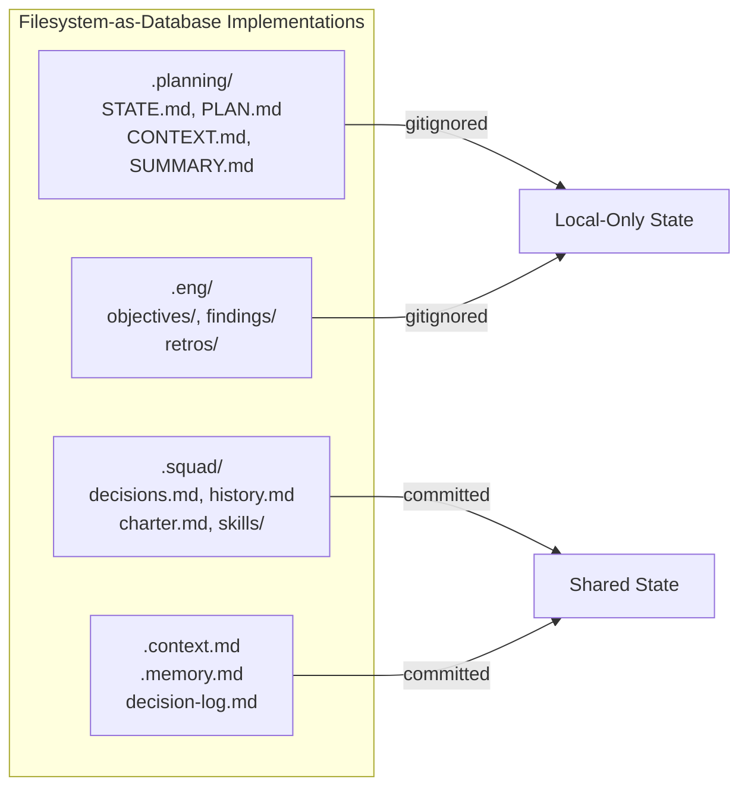
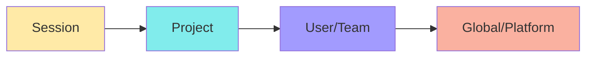
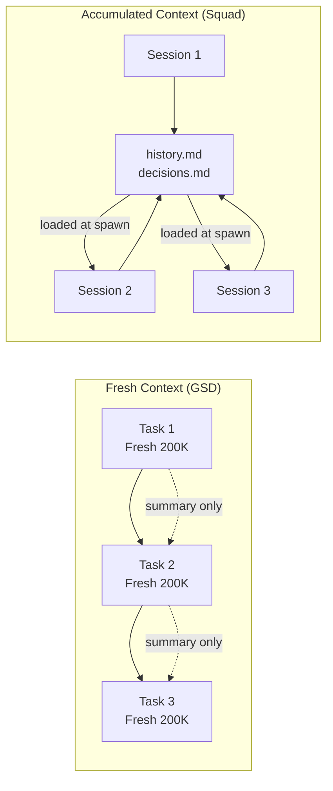

# Context and Persistence

> Cross-framework patterns for how AI coding agents persist state, manage context windows, handle session handoffs, and maintain memory across interactions — from filesystem-as-database conventions to context budget monitoring and compression strategies.
>
> **Key concepts:** filesystem as database, section-level mutability, context health curve, memory hierarchy layers, `.continue-here.md` handoff, cross-tool compatibility matrix, freshness vs accumulation trade-off, context compression

## Overview

Every AI coding agent faces the same fundamental problem: **context is ephemeral, but work is not.** A coding session produces decisions, discoveries, and progress that must survive beyond the current context window.

Across the frameworks surveyed (GSD, Squad, Claude Code, Copilot, Cursor, Windsurf, Cline, LangGraph, CrewAI, AutoGPT, and community projects like shariqriazz and dhar174), context persistence falls into five categories:

| Category | What persists | Typical format | Examples |
|---|---|---|---|
| **Project instructions** | Coding standards, architecture rules, agent behavior | Markdown + YAML frontmatter | `CLAUDE.md`, `AGENTS.md`, `.cursorrules`, `.clinerules/` |
| **Session state** | Conversation history, task progress, decisions | JSON, SQLite, Postgres | Claude Code sessions, LangGraph checkpoints, AutoGPT `state.json` |
| **Learned memory** | Facts, patterns, preferences extracted during work | Markdown, vector DB, key-value store | Claude auto-memory, Copilot memory, CrewAI unified memory |
| **Knowledge/RAG** | Embeddings of documents for retrieval | Vector DB (ChromaDB, LanceDB, Pinecone) | CrewAI knowledge, LangMem, AutoGPT Mem0 |
| **Working documents** | Plans, research, findings, objective tracking | Structured Markdown | GSD `.planning/`, EngAgent `.eng/`, Squad `.squad/` |

The first two categories are infrastructure — handled by the platform. The last three are where framework design choices diverge, and where the interesting patterns live.

## The Filesystem-as-Database Pattern

The most universal pattern across surveyed frameworks is using the **filesystem as a structured database**. Rather than SQLite, Postgres, or vector stores, coding agents persist state as Markdown files in a project directory — readable by humans, parseable by agents, versionable with git.

Every IDE-integrated agent framework (Copilot, Claude Code, Cursor, Windsurf, Cline, Aider) uses Markdown files for project instructions. Every working-document framework (GSD, Squad, EngAgent, dhar174) uses Markdown files for dynamic state. The result is a de facto standard: **Markdown + YAML frontmatter, organized in a project-level directory**.

Why filesystem over databases?

- **Transparency.** Developers can read, edit, and audit state files directly. No query layer required.
- **Portability.** Files travel with the repo. Clone the project and you have the state.
- **Git integration.** State changes show in diffs. History comes free. Branching gives you state branching.
- **No infrastructure.** No database server, no connection strings, no schema migrations.

The pattern breaks down for high-volume structured data (embeddings, checkpoints), where platform agents use databases — but for working documents (decisions, plans, progress, handoff context), filesystem persistence is sufficient and strictly simpler. See [GSD](../projects/gsd.md), [Squad](../projects/squad.md), and individual project docs for framework-specific file layouts.

## State File Conventions

Each framework defines its own state file vocabulary. The file names differ, but the underlying concerns are remarkably consistent: current focus, decisions, learned patterns, plans, results, and project context. Each framework's project doc lists its specific files; the pattern insight is in what the naming conventions reveal.

### What the names reveal

- **GSD** is phase-centric: files are scoped to workflow phases (`phase-1-PLAN.md`, `phase-1-SUMMARY.md`). State flows forward through phases.
- **Squad** is agent-centric: files are scoped to team members (`lead/history.md`, `frontend/charter.md`). State accumulates per agent.
- **dhar174** is concern-centric: each file type has a single purpose (`.context.md` for stable facts, `.memory.md` for learned patterns, `decision-log.md` for choices). No scoping by phase or agent.
- **Claude Code** is layer-centric: `CLAUDE.md` at different directory depths creates a cascading hierarchy from org-wide to file-specific.

No single approach is superior — each optimizes for a different workflow model. The practical takeaway: pick a naming convention that matches how your agent thinks about work (phases, agents, concerns, or scoping hierarchy) and stick with it.

## Memory Hierarchy Layers

Across the ecosystem, memory consistently organizes into four layers — from ephemeral session state to durable global knowledge:

Each layer typically moves from ephemeral/private (session) to durable/shared (global), with storage ranging from RAM and SQLite at the session level, through filesystem at the project level, to cloud APIs and vector DBs at the global level. Implementations vary widely — see [GSD](../projects/gsd.md), [Squad](../projects/squad.md), and the [Claude Code docs](../projects/anthropic-skills.md) for specific layer mappings.

The general principle: **the narrower the scope, the higher the priority.** This mirrors CSS specificity — and like CSS, conflicts between layers at the same specificity level are the primary source of bugs.

## Section-Level Mutability Rules

GSD introduced an elegant pattern for preventing state corruption: **tagging each section of a state file with a mutation policy.**

| Policy | Meaning | Example sections |
|---|---|---|
| **OVERWRITE** | Always reflects latest state. Previous value is replaced. | Status, current focus, active task |
| **APPEND-only** | New entries added; existing entries never modified or removed. | Evidence log, eliminated hypotheses, timeline, decisions |
| **IMMUTABLE** | Set once, never changed. Serves as a fixed reference point. | Original trigger, symptoms, spec once finalized |

This prevents a common failure mode: an agent updating a state file and accidentally rewriting history. When the timeline section is APPEND-only, the agent can't silently drop earlier entries.

The pattern applies beyond GSD. Any framework using structured state files benefits from declaring which sections overwrite, which accumulate, and which are locked. Most frameworks implement these rules implicitly (e.g., append-only decision logs, immutable charters) — codifying them as explicit conventions is low-effort, high-value. See individual project docs for framework-specific mutability mappings.

## Context Health Monitoring

Context windows are finite, and quality degrades as they fill. The core pattern: define threshold tiers (e.g., normal / warning / critical based on remaining context percentage) and prescribe actions at each tier — compress, outline, or dump state and start fresh.

Two key principles emerge across frameworks:

1. **Even well-designed memory systems bloat over time. Active pruning is necessary, not optional.** Accumulated state (decision logs, history files) grows silently until it degrades context quality. Periodic audits and compression are essential.
2. **Don't load what you don't need.** Search-first loading (fetch relevant content on demand) and hard caps on auto-loaded memory both prevent premature context exhaustion.

See [GSD](../projects/gsd.md) for threshold tables and context health tooling, [Squad](../projects/squad.md) for the v0.4.0 context audit case study.

## Session Handoff Patterns

Session handoff — persisting enough state to resume work in a new context window — is one of the hardest problems in agent persistence. The challenge: capture everything a fresh agent needs without capturing so much that context is wasted on stale information.

Across frameworks, three handoff patterns emerge:

### Explicit Handoff File

A structured snapshot written at pause time and read at resume time. The snapshot captures current state, completed work, remaining work, decisions, blockers, and — critically — a **"Next Action" field** that eliminates the cold-start problem of not knowing where to begin. This is the most common pattern among file-based coding agents. See [GSD](../projects/gsd.md) for `STATE.md` and `.continue-here.md` implementations.

### Persistent Agent State

Instead of writing a handoff doc, each agent persistently accumulates knowledge (history, decisions, conventions) across sessions. On spawn, the agent reads its accumulated state and effectively "resumes" with everything it has ever learned. The trade-off: knowledge compounds but so does noise — persistent accumulation requires active curation. See [Squad](../projects/squad.md) for this approach.

### Checkpoint/Resume

Infrastructure-level persistence of full execution state — either conversation history (Claude Code's `--continue`/`--resume`) or complete state snapshots at every step (LangGraph checkpointers). The most powerful variant enables time travel (rewinding to any previous state and forking), but requires database infrastructure. See [Claude Code docs](../projects/anthropic-skills.md) and LangGraph documentation for details.

## The Freshness vs Accumulation Trade-off

The most interesting philosophical divide in the ecosystem is between frameworks that treat fresh context as an asset (GSD) and those that treat accumulated context as an asset (Squad).

| Dimension | Fresh (GSD) | Accumulated (Squad) |
|---|---|---|
| **Core belief** | Context rot is the primary failure mode | Knowledge loss is the primary failure mode |
| **How tasks get context** | Exactly what they need, nothing more | Everything the agent has ever learned |
| **Quality curve** | Consistently peak (always 0–30% usage) | Starts good, degrades without pruning |
| **Knowledge transfer** | Via structured summaries between tasks | Via persistent files read at spawn |
| **Failure mode** | Summaries lose nuance | History bloats and degrades context |
| **Best for** | Long projects with many phases | Projects where domain knowledge compounds |
| **Mitigation** | Rich summaries, explicit handoff docs | Active pruning, context audits, archiving |

Neither approach is universally better. GSD is right that quality degrades with context usage — the data is clear. Squad is right that some knowledge (architectural decisions, domain gotchas, team conventions) genuinely compounds and shouldn't be discarded.

The practical synthesis: **use fresh context for execution, accumulated context for knowledge.** Give each task a clean window for implementation, but load it with curated project knowledge (decisions, conventions, learned patterns) from a pruned persistent store. This is roughly what Claude Code does with its auto-memory system: 200 lines of curated knowledge loaded into a fresh session context.

## Context Compression Strategies

When context budget runs low, frameworks employ several compression techniques:

| Strategy | Used by | Mechanism |
|---|---|---|
| **Progressive summarization** | Squad, GSD | Replace detailed history with summaries. Squad's `history.md` gets progressively compressed. |
| **Section pruning** | Squad (v0.4.0) | Remove less-relevant blocks from `decisions.md` (251→78 blocks). |
| **Outline mode** | GSD (50–70% usage) | Replace full content with structural outlines. |
| **Search-first loading** | GSD-Antigravity | Don't load files speculatively — search for relevant content, load only matches. |
| **Auto-memory cap** | Claude Code | Hard limit (200 lines) on auto-loaded memory. Topic files loaded on-demand. |
| **Fresh context spawn** | GSD, Squad | When context is full, spawn a new agent with only essential state. |
| **Template deduplication** | Squad (v0.4.0) | Remove repeated boilerplate from spawn templates. |

The most effective strategy is also the simplest: **don't load what you don't need.** GSD-Antigravity's search-first approach and Claude Code's on-demand topic loading both embody this principle. Speculative loading ("include everything just in case") is the primary cause of premature context exhaustion.

## Cross-Framework Compatibility

No single instruction file works across all AI coding tools. Key observations (derived from comparing 7+ platforms):

- **`AGENTS.md`** has the broadest support among IDE agents — it's the closest thing to a universal instruction file.
- **`SKILL.md`** (via [agentskills.io](https://agentskills.io/)) is the most portable structured format, recognized by five major tools.
- **No single file works everywhere.** Teams using multiple tools need 2–3 instruction files, or a build step that generates tool-specific files from a canonical source.
- **Auto-memory is converging** — multiple platforms now auto-extract and persist learnings, though storage formats and scoping differ.

See [Instructions and Skills](../vscode/instructions-and-skills.md) for Copilot-specific file conventions.

## Platform Agent Persistence

As agent systems scale to multi-user and multi-project deployment, file-based persistence gives way to database-backed state management (SQLite, Postgres, Redis, vector stores). Platform frameworks like CrewAI, LangGraph, and AutoGPT each implement this differently, but the transferable insight is the same: the filesystem-as-database pattern works well for single-developer coding agents, but doesn't scale to concurrent multi-user scenarios where query performance and transactional consistency matter.

## Quick Reference

| Pattern | What it is | Who uses it | When to apply |
|---|---|---|---|
| Filesystem as database | Markdown files in a project directory as structured state | GSD, Squad, EngAgent, Claude Code, dhar174 | Single-project coding agents; transparency matters |
| Session handoff docs | Structured snapshot for resuming in a new session | GSD (`STATE.md`, `.continue-here.md`), Squad (persistent agents) | Any multi-session workflow |
| Section mutability | OVERWRITE / APPEND-only / IMMUTABLE per section | GSD, EngAgent (implicit) | Any state file with mixed concerns |
| Context health curve | Quality monitoring by remaining %, with tier-based actions | GSD (>35%/≤35%/≤25% remaining), GSD-Antigravity | Long sessions, complex tasks |
| Memory hierarchy | Session → Project → User → Global, narrower overrides broader | Claude Code (6 layers), Squad (3 layers), LangGraph (2 tiers) | Any system with multiple instruction sources |
| Fresh context per task | Spawn new agent with clean window for each unit of work | GSD, Squad (per-agent windows) | Tasks degrading from accumulated context |
| Active pruning | Periodically audit and compress persistent memory | Squad (v0.4.0 audit), Claude Code (200-line cap) | Accumulated memory systems |
| Search-first loading | Don't load speculatively — search for relevant content first | GSD-Antigravity, Claude Code (on-demand topics) | Context budget is tight |
| Portable instruction files | Use `AGENTS.md` + `SKILL.md` for cross-tool compatibility | Copilot, Cursor, Cline, Claude Code | Teams using multiple AI coding tools |

## References

- [agentskills.io](https://agentskills.io/) — Agent Skills open standard (`SKILL.md`)
- [AGENTS.md specification](https://github.com/agentsmd/agents.md) — open standard for agent instruction files
- CoALA paper — Cognitive Architectures for Language Agents (LangMem's theoretical basis)

## See Also

- [GSD](../projects/gsd.md) — GSD's `STATE.md`, context budget monitoring, and fresh-context-per-task model
- [Squad](../projects/squad.md) — Squad's layered memory system and accumulated knowledge philosophy
- [Instructions and Skills](../vscode/instructions-and-skills.md) — VS Code Copilot's instruction persistence and activation models
- [Delegation and Subagents](delegation-and-subagents.md) — delegation patterns and context isolation between parent/child agents
- [Behavioral Rules](behavioral-rules.md) — behavioral constraints including deviation rules and autonomy zones
