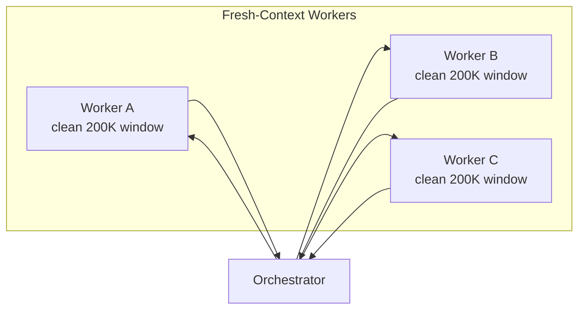
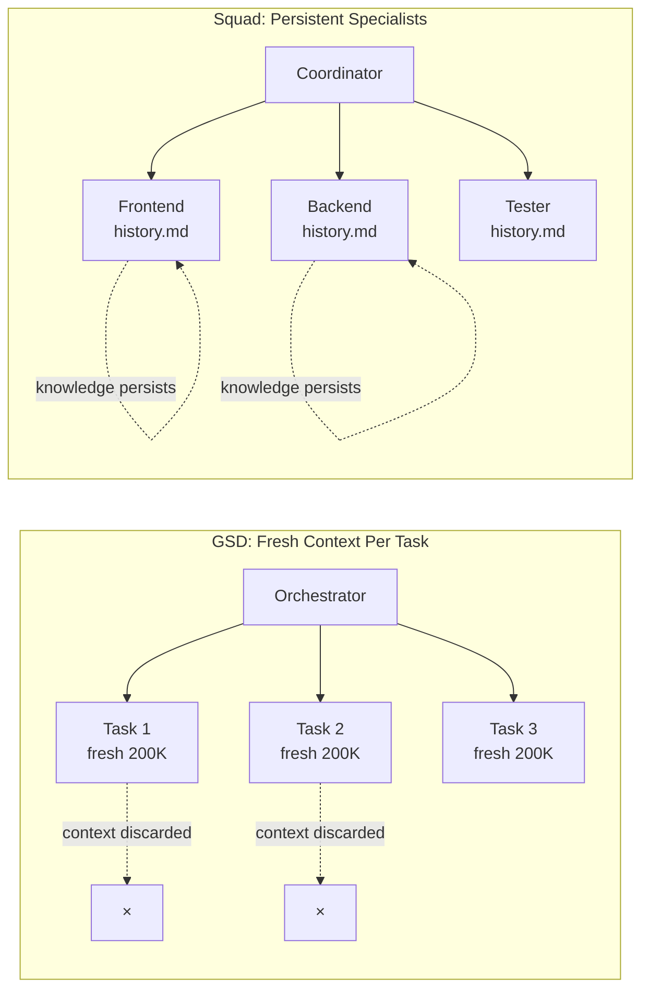

# Delegation and Subagents

> Cross-framework patterns for multi-agent delegation — thin orchestrators, context isolation, structured returns, prompt design, parallel fan-out, tool restriction cascading, and anti-patterns. Grounded in GSD, Squad, Anthropic, and VS Code Copilot implementations.
>
> **Key concepts:** thin orchestrator, fat workers, context isolation boundary, structured status protocol (COMPLETE/PARTIAL/BLOCKED), delegation prompt template, response mode tiering, wave-based execution, file authorization, tool restriction cascading

## Overview

Every multi-agent framework faces the same core question: **when should an agent do work itself, and when should it delegate?** The ecosystem has converged on a small set of patterns that answer this question, differing mainly in how aggressively they delegate and how they manage context across the delegation boundary.

This document catalogs cross-framework delegation patterns grounded in concrete implementations. The patterns come from five primary sources:

- **GSD** (~25k stars) — fresh-context-per-task execution with thin orchestrators and wave-based parallelism. See [GSD](../projects/gsd.md).
- **Squad** (~660 stars) — persistent specialist teams coordinated by a thin routing layer. See [Squad](../projects/squad.md).
- **Anthropic** ("Building Effective Agents") — architectural patterns for routing, parallelization, and orchestrator-workers.
- **VS Code Copilot** — the `agent/runSubagent` tool, context isolation boundary, and hook-based context injection. See [Subagents and Delegation](../vscode/subagents-and-delegation.md).
- **CrewAI** (v1.10) — typed state pipelines, `@router` runtime classification, and hierarchical process orchestration.

The patterns cluster into three areas: **coordinator models** (how the orchestrator relates to its workers), **context management** (what crosses the delegation boundary), and **execution strategies** (when and how to fan out work).

## The Thin-Orchestrator Pattern

The highest-signal pattern across the ecosystem: **the orchestrator routes and synthesizes but never does heavy work itself.**



The orchestrator holds routing logic, delegates work, and synthesizes results. It consumes minimal context — Squad's coordinator is deliberately lightweight, leaving the bulk of the 200K window for workers. Workers are specialized agents, each with a clean context window. The heavy implementation work always happens in worker contexts.

GSD keeps orchestrators at 15–40% context; workers get fresh 200K windows in dependency-ordered waves ([GSD](../projects/gsd.md)). Squad routes through seven rules to named specialists, effectively multiplying total context ([Squad](../projects/squad.md)). Anthropic frames this as the orchestrator-workers pattern, one of five architectural patterns in "Building Effective Agents."

**The threshold rule.** GSD's practical heuristic: "For tasks with 3+ distinct subtasks, consider spawning subagents with fresh context." This isn't a hard rule — it's a signal. The stronger signal that you *should* have delegated: the parent starts forgetting earlier decisions, repeating research, or producing lower-quality output (context degradation at 50–70% usage).

### Thin Routing vs. Fat Orchestration

Not all coordinator patterns are thin. The ecosystem shows two distinct models:

| Model | Context cost | Who does the thinking | Frameworks |
|---|---|---|---|
| **Thin routing** | ~13–15% | Workers hold domain expertise | Squad, GSD, Anthropic |
| **Fat orchestration** | ~40–60% | Orchestrator holds expertise, delegates execution | shariqriazz, dhar174 |

In **thin routing**, the coordinator is a switchboard — it matches tasks to agents and merges results. In **fat orchestration**, the coordinator reasons about the problem, generates detailed task prompts, and controls the workflow end-to-end. Workers are mechanized: they execute what they're told.

The ecosystem consensus favors thin routing. Fat orchestrators accumulate context faster, degrade earlier, and create a single point of failure. The trade-off: thin routing requires more upfront agent design (charters, tool restrictions, clear boundaries) because the coordinator can't compensate at runtime.

**Warning against over-orchestration.** For single-developer workflows on short tasks, the coordination overhead of a full multi-agent system often exceeds the benefit. Start with behavioral rules in a single agent ("delegate when you have 3+ independent subtasks"), add a dedicated research subagent, and only build full coordinator patterns when the simpler approaches prove insufficient.

## Context Isolation

The delegation boundary is a **hard context wall**. Understanding what crosses it — and what doesn't — is fundamental to writing effective delegation prompts.

### What Crosses the Boundary

The delegation boundary is a hard context wall. Subagents receive only what the parent explicitly provides and return summaries, not exploration noise — a subagent that explores 50 files returns a 200-token summary, not 50K tokens. See [Subagents and Delegation](../vscode/subagents-and-delegation.md) for VS Code-specific boundary mechanics.

### Fresh Context Per Task (GSD) vs. Persistent Specialists (Squad)

The two dominant context models in the ecosystem represent opposing philosophies:



**GSD** treats accumulated context as a liability — each executor starts fresh. **Squad** treats it as an asset — specialists persist knowledge across sessions. Both models work. GSD optimizes against **context rot**; Squad optimizes against **cold starts**. Choose based on your dominant failure mode. See [GSD](../projects/gsd.md) and [Squad](../projects/squad.md) for implementation mechanics.

### Context Injection via Hooks

**Context must be explicitly injected at delegation time.** Every framework solves this differently — hooks, pre-loaded documents, plan-as-prompt — but the principle is universal: relying on inherited context or "the agent will figure it out" produces hallucinations. See [Subagents and Delegation](../vscode/subagents-and-delegation.md) for VS Code's hook-based approach and [GSD](../projects/gsd.md) / [Squad](../projects/squad.md) for structural alternatives.

## Structured Returns

No framework enforces structure on subagent output. The fix is a **prompt convention** that every framework has independently converged on.

### The Status Protocol

GSD's convention, widely adopted across the ecosystem:

```
## COMPLETE
## BLOCKED: {reason}
## NEEDS REVIEW: {what}
```

The parent checks for this status line to decide next steps without re-reading the full report. EngAgent extends this to a three-value protocol:

| Status | Meaning | Parent's response |
|---|---|---|
| `COMPLETE` | Task finished, results reliable | Accept, proceed |
| `PARTIAL: {what's missing}` | >66% confident, some gaps | Accept with noted gaps |
| `BLOCKED: {reason}` | Cannot proceed | Spawn refined sub (never retry same prompt) |

GSD uses phase-specific headers (`PLANNING COMPLETE`, `VERIFICATION PASSED`, `ISSUES FOUND`) that the orchestrator pattern-matches for routing. Squad relies on the coordinator interpreting results in context. CrewAI uses typed Pydantic `BaseModel` outputs — the most structured approach, but requiring code infrastructure.

### Aggregation After Parallel Execution

When multiple subagents return results, the parent must aggregate. Three models from the ecosystem:

| Model | Source | Mechanism |
|---|---|---|
| **Programmatic merge** | Anthropic | Parent code stitches results or votes across them. No LLM involved in aggregation. |
| **Dedicated synthesizer** | GSD | A synthesizer agent consumes all parallel results and produces unified output. Intermediate file artifacts serve as structured interchange. |
| **Typed state accumulation** | CrewAI | Pydantic `BaseModel` state flows through a pipeline. `and_` operator waits for all parallel results. Each step's output is typed and accessible. |

The practical protocol after all subagents report: (a) identify agreements across results, (b) flag contradictions, (c) note gaps no subagent covered. This applies regardless of which mechanical aggregation model you use.

## Delegation Prompt Structure

The hardest part of delegation is writing prompts that work without shared context. The ecosystem has converged on a five-part template:

### The Template

```
1. Task:         What to investigate or produce
2. Entry points: Relevant file paths, URLs, or starting locations
3. Context:      Key facts the subagent needs (conventions, constraints, active objective)
4. Deliverable:  Expected output format and sections
5. Budget:       Tool call limit (5-15 for research subtasks)
```

**Entry points** replace implicit references. Instead of "research the auth pattern we discussed earlier" (the subagent has no "earlier"), you say "research the authentication pattern in `src/auth/`, specifically how JWT tokens are validated in `middleware/auth.ts`."

**File authorization** scopes the subagent's attention. Squad's orchestration log includes "Files authorized to read" and "Files agent must produce." GSD's XML task plans use `<files>` tags listing exactly which files each task touches. Both are behavioral — no framework enforces file-level access control at runtime — but they sharply reduce scope wandering.

**Budget** is a self-reporting convention. No framework implements per-agent tool call budgets mechanically. The convention: "Use 5–15 tool calls. If you hit 15 without high confidence, report what you found and what's uncertain — don't keep going." This is ahead of the ecosystem — most frameworks use the context window itself as the implicit budget.

### Example Delegation Prompt

```markdown
**Task:** Investigate how the codebase handles error propagation from API
routes to the client.

**Entry points:**
- `src/api/routes/` — route handlers
- `src/middleware/error.ts` — error middleware
- `src/types/errors.ts` — error type definitions

**Context:** The project uses Express with TypeScript. Errors should use
the `AppError` class from `src/types/errors.ts`. We suspect some routes
throw raw strings instead.

**Deliverable:** Return with sections:
- ## Summary (3-5 sentences)
- ## Findings (file-by-file analysis with evidence)
- ## Violations (routes not using AppError, with line numbers)
- ## Status: COMPLETE | BLOCKED: {reason}

**Budget:** 10 tool calls maximum.
```

## Response Mode Tiering

Not every request deserves a full multi-agent spawn. The critical insight: **match delegation depth to request complexity.** Don't spawn an agent for something the coordinator already knows. Anthropic achieves this via routing classifiers; Squad via four explicit tiers; GSD via a "quick mode" opt-out.

| Classification | Workflow | Subagents |
|---|---|---|
| **Straightforward** | Answer directly, no artifacts | 0 (0–2 tool calls) |
| **Depth-first** | Standard investigation | 1–2 (5–10 tool calls total) |
| **Breadth-first** | Parallel fan-out, comprehensive | 3–5 (15+ tool calls across subs) |

See [behavioral-rules.md](behavioral-rules.md) for the autonomy zone patterns that govern when agents should escalate vs. act.

## Parallel Execution Models

### Wave-Based Execution (GSD)

**Conservative parallelism:** analyze dependencies upfront, group independent tasks into ordered waves, serialize when uncertain. Each executor gets a fresh context window — a 5-plan wave effectively uses ~1M total tokens with zero shared context bloat. It sacrifices some throughput for safety. See [GSD](../projects/gsd.md) for wave grouping mechanics and dependency analysis.

### Eager Fan-Out (Squad)

Squad defaults to launching all independent agents simultaneously without upfront wave analysis. The coordinator does live dependency analysis, fans out independent work immediately, and serializes only when data dependencies exist. Deadlock detection catches circular dependencies.

Eager fan-out is **aggressive parallelism**: start everything that *could* be independent, handle conflicts as they arise. It maximizes throughput but requires reliable structured returns and conflict resolution (Squad's decisions inbox handles concurrent writes).

### Multi-Perspective Fan-Out (Anthropic / VS Code)

Multiple subagents analyze the same artifact from different perspectives (correctness, security, architecture, etc.) with no anchoring between them. Context isolation is a feature: each reviewer starts fresh, with no bias from other reviewers' findings. The orchestrator synthesizes independent results into a prioritized summary. This pattern works for research fan-out and document review. See [Subagents and Delegation](../vscode/subagents-and-delegation.md) for VS Code agent configuration.

## Tool Restriction Cascading

**Permissions flow downward through the delegation hierarchy.** Read-only workers can't accidentally modify files during research; workers with narrow scope can use faster, cheaper models. GSD maps this to model profiles (Opus for planning, Haiku for verification). The same principle applies to agent spawning: coordinators restrict which named agents they can delegate to.

**No file-level enforcement exists.** All surveyed frameworks use behavioral file authorization — the delegation prompt says which files to touch, but nothing prevents the subagent from reading or writing elsewhere. File authorization is guidance, not a security boundary. See [Subagents and Delegation](../vscode/subagents-and-delegation.md) for VS Code-specific tool and agent field configuration.

## Nesting Depth

**Consensus: two levels maximum.** All frameworks avoid deep recursion:

| Framework | Maximum depth | Mechanism |
|---|---|---|
| GSD | 2 (orchestrator → executor) | Architectural — never nests deeper |
| CrewAI | 2–3 (Flow → Crew → agents) | Flat by design, no depth limit |
| Anthropic | 1 (all patterns single-level) | Documented patterns are flat |
| VS Code | Undocumented | No stated limit, but nesting is untested |

The practical rule: coordinator → worker is the standard pattern. Worker → sub-worker adds uncontrolled depth, makes debugging difficult, and compounds context isolation problems. If a worker's task is too complex for a single agent, decompose it at the coordinator level, not the worker level.

## Delegation Trigger Heuristics

When should a coordinator delegate instead of doing work inline? Four tests from the ecosystem:

| Test | Question | Source |
|---|---|---|
| **Subtask count** | Are there 3+ distinct independent subtasks? | GSD threshold rule |
| **Context budget** | Would this task exceed 30–40% of the parent's remaining context? | GSD quality curve, Squad context audit |
| **Independence** | Can subtasks be enumerated upfront? Are they independent? | Anthropic predictability test |
| **Perspective** | Does this benefit from multiple independent viewpoints? | Anthropic parallelization pattern |

If any test returns yes, delegation is likely the right call. If all return no, do the work inline.

**GSD's always-delegate philosophy:** GSD delegates by default. Quick mode (skip research/planning/verification) is the opt-out. This works because GSD is designed around delegation — the entire framework is orchestration infrastructure.

**Squad's quick-facts exception:** Rule 3 — "don't spawn an agent for 'what port does the server run on?'" The coordinator answers from memory when delegation overhead exceeds task complexity.

## Anti-Patterns

### Over-Delegation

**Symptom:** Every request spawns subagents, even trivial ones. Simple factual questions take 30+ seconds because they route through the full multi-agent pipeline.

**Root cause:** No response tiering. The coordinator treats all requests as complex.

**Fix:** Implement the quick-facts rule: if the coordinator can answer in 2–3 seconds from existing context, answer directly. Only delegate when the task genuinely benefits from context isolation or parallel processing.

### Under-Contexting

**Symptom:** Subagents produce hallucinated results, ignore project conventions, or explore irrelevant code. The parent has to discard results and retry.

**Root cause:** Delegation prompts use implicit references ("fix the bug we discussed") or omit conventions, file paths, and constraints. The subagent fills gaps with guesses.

**Fix:** Use the five-part delegation prompt template. Every delegation prompt must include task, entry points, context, deliverable format, and budget. If a SubagentStart hook is available, inject project conventions there as a supplementary layer.

### Circular Delegation

**Symptom:** Agent A delegates to Agent B, which delegates back to Agent A (or to Agent C which delegates to Agent A). Context is consumed with no progress.

**Root cause:** No nesting depth cap. Workers can spawn their own subagents without constraint.

**Fix:** Cap nesting at two levels. Leaf-level workers should have `agents: []` in their frontmatter (no subagent spawning allowed). Only coordinators should have the `agent` tool.

### Retry-Same-Prompt

**Symptom:** A subagent returns BLOCKED. The parent retries with the identical prompt. The subagent hits the same block.

**Root cause:** No error handling protocol for delegation failures.

**Fix:** GSD's pattern: on failure, a debugger agent diagnoses the problem and produces a fix plan. The executor retries with the *new* plan, not the original. Squad's variant: rejected work routes to a *different* agent. The minimum viable protocol: if BLOCKED, spawn a second sub with a *refined* question incorporating what the first sub reported. Never retry the exact same prompt.

### Orchestrator Bloat

**Symptom:** The coordinator's context fills up because it holds too much state — detailed task histories, full subagent results, accumulated decisions. Quality degrades.

**Root cause:** The orchestrator is fat, not thin. It retains information that should stay in workers' contexts.

**Fix:** Keep the orchestrator thin: routing logic + result summaries only. Full exploration, file contents, and intermediate reasoning stay in worker contexts and are discarded. Squad's coordinator targets 13% of the 200K context window. GSD's orchestrators target 30–40%.

## Quick Reference

| Pattern | What it is | Key frameworks |
|---|---|---|
| Thin orchestrator | Coordinator routes and synthesizes, never does heavy work | GSD, Squad, Anthropic |
| Fresh context per task | Each worker gets a clean context window | GSD, VS Code subagents |
| Persistent specialists | Workers accumulate knowledge across sessions | Squad |
| Structured status returns | `COMPLETE` / `BLOCKED` / `PARTIAL` ending every subagent response | GSD, EngAgent |
| Five-part delegation prompt | Task, entry points, context, deliverable, budget | GSD (XML plans), Squad (orchestration log) |
| Response mode tiering | Direct / lightweight / standard / full based on request weight | Squad |
| Wave-based execution | Dependency-ordered parallel waves | GSD |
| Eager fan-out | Spawn all independent agents immediately | Squad |
| Multi-perspective fan-out | Parallel subagents with independent viewpoints, no anchoring | Anthropic, VS Code |
| Tool restriction cascading | Read-only workers, edit workers, coordinator with `agent` tool | VS Code, GSD (model profiles) |
| File authorization | Behavioral file-level scoping in delegation prompts | Squad, GSD |
| Two-level nesting cap | Coordinator → worker maximum depth | GSD, ecosystem consensus |
| Quick-facts direct answer | Coordinator answers trivially from memory, no delegation | Squad Rule 3 |

## References

- [Anthropic, "Building Effective Agents"](https://anthropic.com/engineering/building-effective-agents) — architectural patterns for routing, parallelization, and orchestrator-workers
- [GSD repository](https://github.com/gsd-build/get-shit-done) — fresh-context execution framework (~25k stars, MIT)
- [Squad repository](https://github.com/bradygaster/squad) — persistent specialist teams for GitHub Copilot (~660 stars, MIT)
- [CrewAI documentation](https://docs.crewai.com/concepts/flows) — Flows, Crews, `@router`, typed state pipelines
- [VS Code Subagents documentation](https://code.visualstudio.com/docs/copilot/agents/subagents) — official docs for the `agent/runSubagent` tool
- [VS Code Custom Agents](https://code.visualstudio.com/docs/copilot/customization/custom-agents) — agent frontmatter, `agents` field, `tools` field

## See Also

- [GSD](../projects/gsd.md) — deep dive on fresh-context-per-task execution, wave parallelism, deviation rules, and model profiles
- [Squad](../projects/squad.md) — deep dive on persistent specialists, memory system, reviewer protocol, and Ralph
- [Subagents and Delegation](../vscode/subagents-and-delegation.md) — VS Code Copilot-specific mechanics: `runSubagent` tool, hook integration, scope control
- [context-and-persistence.md](context-and-persistence.md) — how frameworks handle state across sessions and delegation boundaries
- [behavioral-rules.md](behavioral-rules.md) — autonomy zones, deviation rules, and constraint patterns that govern delegated agents
- [Claude Cookbooks](../projects/claude-cookbooks.md) — Anthropic's cookbook with sub-agent patterns, tool restrictions, and prompt caching
