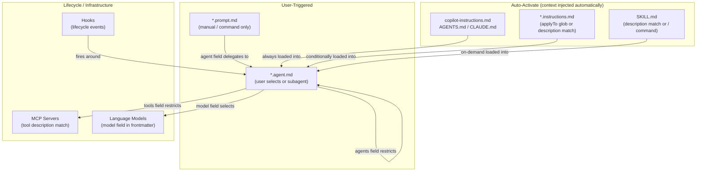

# VS Code Copilot Customization Overview

> The complete architecture of VS Code's Copilot customization system — building blocks, activation semantics, directory conventions, instruction cascading, and non-obvious behaviors. Covers agents, instructions, skills, prompts, hooks, MCP servers, plugins, and language models as of March 2026.
>
> **Key concepts:** activation model (auto / manual / lifecycle / user-selected), instruction cascade, description-as-trigger, tool priority chain, progressive disclosure, handoffs vs subagents

## Overview

VS Code's AI customization system is a set of building blocks that control what the AI knows (instructions), what it can do (tools, MCP servers), how it behaves (agents), and what automations run around it (hooks). As of March 2026 (VS Code 1.109/1.110), there are **eight building blocks**, each with distinct activation semantics:

| Building Block | What It Does | When It Activates |
|---|---|---|
| **Custom Instructions** | Coding standards, architectural context | Auto: always-on or file-pattern/description match |
| **Agent Skills** | Specialized capabilities with scripts/resources | Auto: description match, or manual `/` command |
| **Prompt Files** | Reusable task prompts (slash commands) | Manual: `/command` invocation only |
| **Custom Agents** | Specialized personas with tool restrictions | User-selected or subagent delegation |
| **MCP Servers** | External service connections | Auto: tool description match |
| **Hooks** | Deterministic lifecycle automation (preview) | Auto: lifecycle event triggers |
| **Agent Plugins** | Pre-packaged customization bundles (preview) | On install — installs agents, skills, prompts, hooks |
| **Language Models** | Model selection per task/agent | Per-agent or per-prompt frontmatter config |

**The core design axis is activation.** Instructions and skills auto-activate via glob patterns or semantic description matching. Prompts are always manual. Agents are user-selected (or delegated to as subagents). Hooks fire deterministically on lifecycle events. Understanding which activation model fits your knowledge is the primary design decision.



The entire system runs on **plain Markdown files with YAML frontmatter** — no proprietary formats, no build steps for individual files, no SDKs. VS Code detects files by naming convention and location.

## How It Works

### Instructions: Passive Context

Instructions are context that loads into every (or matching) chat interaction. They don't do anything themselves — they shape how the AI responds.

**Always-on instructions** apply to every request in the workspace:

| File | Location | Notes |
|---|---|---|
| `copilot-instructions.md` | `.github/copilot-instructions.md` | Primary project-wide file. `/init` generates it. |
| `AGENTS.md` | Workspace root | Cross-agent compatible. Also supports subfolder scoping (experimental). |
| `CLAUDE.md` | Root, `.claude/`, or `~/` | Claude Code compatibility. Also supports `CLAUDE.local.md` (uncommitted). |

**File-based instructions** (`*.instructions.md`) activate conditionally. The frontmatter controls when:

- **`applyTo` present** — loads when the agent works on files matching the glob pattern
- **`description` present** (no `applyTo`) — loads via semantic matching against the current task
- **Both** — dual activation: glob catches file edits, description catches conversational references
- **Neither** — only loads when manually attached by the user

Default locations: `.github/instructions/` (workspace), profile `prompts/` folder (user-level). Additional locations configurable via `chat.instructionsFilesLocations`. Also detects `.claude/rules/` (uses `paths` array instead of `applyTo`).

**Instruction priority** (highest → lowest): personal (user-level) → repository (`copilot-instructions.md`, `AGENTS.md`) → organization. When multiple files exist at the same level, VS Code combines them with **no guaranteed order**.

### Skills: Capabilities with Resources

Skills look like instructions but are fundamentally different — they're **portable capabilities** (not just context) that include scripts, examples, and reference docs alongside the instructions. Skills follow the [Agent Skills open standard](https://agentskills.io/) and work across VS Code, Copilot CLI, and the GitHub Copilot coding agent.

Each skill is a directory with a `SKILL.md` at its root:

```
.github/skills/my-skill/
├── SKILL.md              # Required — YAML frontmatter + instructions
├── scripts/              # Optional — executable code
├── references/           # Optional — docs loaded when relevant
└── assets/               # Optional — files for output
```

Skills use **three-level progressive disclosure**:

1. **Discovery** — Copilot always sees `name` + `description` (lightweight metadata scan)
2. **Instructions** — when a request matches, the full `SKILL.md` body loads
3. **Resources** — additional files load only when Copilot references them

This means you can install many skills with minimal context cost.

Visibility is controlled by two frontmatter fields: `user-invokable` (show in `/` menu, default `true`) and `disable-model-invocation` (prevent auto-loading, default `false`). Setting `user-invokable: false` with default `disable-model-invocation` creates **invisible background knowledge** — skills that auto-load but never appear in the UI.

Default locations: `.github/skills/` (workspace), `~/.copilot/skills/` (user-level). Also detects `.claude/skills/` and `.agents/skills/`.

### Prompts: Manual Task Triggers

Prompt files (`*.prompt.md`) are slash commands invoked with `/command-name` in chat. **They cannot auto-activate** — this is by design. They're for repeatable tasks (scaffolding, reviews, deploy checklists) that the user explicitly triggers.

Key frontmatter fields: `description`, `tools` (override agent tools), `agent` (target a specific agent — `ask`, `agent`, `plan`, or custom), `model` (override model). Prompts support variables (`${file}`, `${selection}`, `${input:name}`) for dynamic context.

Default locations: `.github/prompts/` (workspace), profile `prompts/` folder (user-level).

### Agents: Personas with Tool Restrictions

Custom agents (`*.agent.md`) define specialized AI personas — security reviewer, planner, implementer — each with their own instructions, tools, and model preferences. Previously called "custom chat modes" (renamed in VS Code 1.106; rename `.chatmode.md` → `.agent.md` to migrate).

The `tools` field is the critical differentiator: it defines **which tools the agent can access**. A planning agent might get only `search` and `fetch` (read-only); an implementation agent gets everything. If a listed tool isn't available, it's silently ignored.

The `agents` field controls subagent access: `*` = all (default), `[]` = none. In practice, listing an agent explicitly in the `agents` array appears to override `disable-model-invocation: true` on the target — enabling a "protected subagent" pattern where an agent is only accessible when explicitly listed by a parent. (Note: this override interaction is not explicitly documented in VS Code's official docs.)

**Handoffs** create guided sequential workflows between agents. After a response completes, buttons appear for transitioning to the next agent with pre-filled context. Handoffs transfer control to the user → target agent (history carries forward). Subagents, by contrast, run under parent control in clean isolated context.

Default locations: `.github/agents/` (workspace), profile folder (user-level). VS Code also detects any `.md` file in `.github/agents/`, not just `.agent.md` files. Also detects `.claude/agents/` with Claude-specific frontmatter.

**Tool priority chain:** prompt file tools → agent tools → default tools. This means prompt files can override agent tool restrictions.

### MCP Servers: External Service Connections

MCP (Model Context Protocol) servers connect Copilot to external services — databases, APIs, issue trackers. Configured in `mcp.json` or `.vscode/mcp.json`. Tools activate based on description matching against the current task. MCP Apps extend this with rich UI (dashboards, forms).

### Hooks: Lifecycle Automation (Preview)

Hooks execute shell commands at lifecycle events — `SessionStart`, `UserPromptSubmit`, `PreToolUse`, `PostToolUse`, `PreCompact`, `SubagentStart`, `SubagentStop`, `Stop`. They're deterministic (not AI-prompted), can inject context, block actions, or modify tool inputs.

Configured in `.github/hooks/*.json` (workspace) or `~/.claude/settings.json` (user). Commands receive JSON on stdin, return JSON on stdout. Exit code 2 = blocking error.

The most powerful hook pattern: `PreToolUse` can approve, deny, or modify any tool call — enabling security guardrails that work regardless of what the agent is prompted to do.

### Agent Plugins (Preview)

Plugins are the **distribution format** for Copilot customizations — prepackaged bundles that can include custom agents, skills, prompt files, hooks, and MCP server configurations [1]. A single `plugin.json` manifest defines all bundled resources. Launched in preview with VS Code 1.110 (February 2026) [7], the plugin system is shared across VS Code, Copilot CLI, and the Copilot coding agent [2].

**`plugin.json` format.** The manifest requires only a `name` field. Optional fields include `description`, `version`, `author`, `homepage`, `repository`, `license`, `keywords`, `category`, and `tags`. Path fields — `agents`, `skills`, `commands`, `hooks`, `mcpServers` — default to conventional subdirectories but can point to custom paths or arrays of paths [3][4]:

```json
{
  "name": "my-plugin",
  "description": "Workflow automation tools",
  "version": "1.0.0",
  "agents": "agents/",
  "skills": ["skills/", "extra-skills/"],
  "hooks": "hooks.json",
  "mcpServers": ".mcp.json"
}
```

The CLI searches for `plugin.json` in three locations: `.github/plugin/plugin.json`, `.claude-plugin/plugin.json`, and the repository root [4].

**Three installation methods:**

1. **CLI direct install** — `copilot plugin install owner/repo` clones and registers any GitHub repo containing a `plugin.json`. Subdirectory plugins use colon syntax: `owner/repo:path/to/plugin` [2].
2. **VS Code local registration** — `chat.plugins.paths` in settings maps local directory paths to enabled/disabled state [1].
3. **Marketplace registries** — `chat.plugins.marketplaces` points to Git repos containing a `marketplace.json` registry file that lists multiple plugins [6]. Default marketplaces include `github/copilot-plugins` and `github/awesome-copilot`. VS Code also supports `@agentPlugins` search in the Extensions view [1].

**Relationship to other building blocks.** Plugins are a packaging layer, not a new primitive — they bundle existing building blocks (agents, skills, prompts, hooks, MCP configs) into installable units. Deduplication follows **first-found-wins** for agents and skills (project-level files override plugin-provided ones) and **last-wins** for MCP servers [4]. VS Code extensions can also contribute skills via the `chatSkills` contribution point in `package.json`, providing an alternative distribution vector through the VS Code Marketplace [1].

**Plugin management** (CLI): `copilot plugin list`, `copilot plugin update NAME`, `copilot plugin uninstall NAME` [2].

### Directory Convention Summary

All workspace-level customizations live under `.github/`:

```
.github/
├── copilot-instructions.md        # Always-on instructions
├── instructions/                  # File-based instructions (*.instructions.md)
├── agents/                        # Custom agents (*.agent.md or any .md)
├── prompts/                       # Prompt files (*.prompt.md)
├── skills/                        # Agent skills (name/SKILL.md)
└── hooks/                         # Hooks (*.json)
```

User-level equivalents live in the VS Code profile's `prompts/` folder (instructions + prompts) and `~/.copilot/skills/` (skills). Cross-tool compatibility paths: `.claude/rules/`, `.claude/agents/`, `.claude/skills/`.

### CLI Portability

Copilot CLI (GA February 25, 2026) shares the `.github/` configuration layer — instructions, agents, skills, and hooks defined in `.github/` work across both VS Code and the standalone CLI [5]. User-level configuration diverges: the CLI uses `~/.copilot/` while VS Code uses its profile system [5]. The CLI also supports plugin installation via `copilot plugin install owner/repo` [2], making plugins the most practical way to share customizations across environments. For full details on cross-platform portability, path differences, and workarounds, see [cli-and-portability.md](cli-and-portability.md).

## What We Learned

### Non-obvious behaviors

**`description` is the semantic matching surface.** For both instructions and skills, the `description` field isn't just documentation — it's what Copilot matches against to decide whether to load the file. Writing descriptions with explicit trigger phrases ("Load when user mentions Azure Cosmos DB, Cosmos DB, Cosmos DB NoSQL") is the highest-leverage technique for reliable auto-loading. Vague descriptions = unreliable activation.

**Dual activation is the strongest coverage pattern.** Using both `applyTo` and `description` on an instruction file means it loads when the agent edits matching files (glob) *and* when the conversation mentions related topics (semantic). Either alone leaves gaps.

**No guaranteed order for combined instructions.** When multiple instruction files load, VS Code combines them but doesn't guarantee ordering. Don't write instructions that depend on being processed before or after another file.

**Tools listed in `tools` that don't exist are silently ignored.** This is intentional — it means the same agent file works across different environments where different tools are available. But it also means typos in tool names fail silently.

**Prompt files can override agent tool restrictions.** Because tool priority is prompt > agent > default, a prompt file with a `tools` field will replace the agent's tool list for that invocation. This is useful (specialized prompts within a constrained agent) but can be a footgun if unintentional.

**`disable-model-invocation: true` appears to be overridden by explicit `agents` lists** (observed behavior, not officially documented). If agent A lists agent B in its `agents` array, B can be invoked as a subagent even if B has `disable-model-invocation: true`.

### Effective patterns

**Start with `/init`, expand incrementally.** The recommended progression: `copilot-instructions.md` → targeted `.instructions.md` with `applyTo` globs → prompt files for workflows → custom agents + skills for specialization.

**Scope instructions with multiple files, not one monolith.** Several focused `.instructions.md` files with specific `applyTo` patterns outperform a single large instruction document. Each file loads only when relevant, preserving context budget.

**Use `argument-hint` on skills, prompts, and agents** to provide guidance in the chat input field. Small touch, noticeable improvement in discoverability.

**Hooks for guardrails, not features.** Hooks shine at enforcement (blocking dangerous commands, running formatters after edits, audit trails) rather than feature work. `PreToolUse` with `permissionDecision: deny` is a hard block the AI can't talk its way around.

**Keep subagent-only agents invisible.** Set `user-invokable: false` on agents designed only for subagent delegation. Keeps the agents dropdown clean.

### Historical context

The system evolved rapidly: custom instructions shipped first (simple `.md` files), then prompt files and skills added on-demand activation, then "chat modes" shipped for persona switching (VS Code 1.99), then were renamed to "custom agents" (1.106) with expanded frontmatter (`tools`, `agents`, handoffs). Hooks arrived in preview. Agent plugins are the latest addition. The `infer` frontmatter field was split into `user-invokable` + `disable-model-invocation` for finer control. Claude Code compatibility (`.claude/` paths, format translation) was added throughout 2026.

### Gotchas

- **Instructions don't affect inline completions** — only chat interactions. Completions use a separate pipeline.
- **Nested `AGENTS.md` (subfolder scoping) is experimental.** Don't rely on it for production workflows yet.
- **Hook `Stop` event blocking keeps the agent running and consuming premium requests.** Always check `stop_hook_active` to prevent infinite loops.
- **Settings-based instructions may be removed.** The docs warn to migrate to file-based instructions.
- **Organization-level sharing requires GitHub organization access** and enabling `github.copilot.chat.organizationInstructions.enabled`.

## Quick Reference

| What You Want | Use This | File | Activation |
|---|---|---|---|
| Project-wide coding standards | `copilot-instructions.md` | `.github/copilot-instructions.md` | Always-on |
| Rules for specific file types | File-based instruction | `.github/instructions/*.instructions.md` | `applyTo` glob match |
| Reusable task automation | Prompt file | `.github/prompts/*.prompt.md` | Manual `/command` |
| Specialized AI persona | Custom agent | `.github/agents/*.agent.md` | User selection |
| Portable capability with resources | Agent skill | `.github/skills/name/SKILL.md` | Description match |
| External service connection | MCP server | `.vscode/mcp.json` | Tool description match |
| Lifecycle enforcement | Hook | `.github/hooks/*.json` | Event trigger |
| Pre-packaged bundle | Plugin (preview) | `plugin.json` | On install |
| Model override | `model` field | Any agent/prompt frontmatter | Per-file config |

**Diagnostics:** Configure Chat (gear icon) → Diagnostics shows all loaded customizations and errors. The References section in chat responses shows which instruction files were used for that response.

## References

All URLs verified against official VS Code documentation as of March 2026.

- [Customize AI in VS Code — Overview](https://code.visualstudio.com/docs/copilot/customization/overview)
- [Custom Instructions](https://code.visualstudio.com/docs/copilot/customization/custom-instructions)
- [Agent Skills](https://code.visualstudio.com/docs/copilot/customization/agent-skills)
- [Prompt Files](https://code.visualstudio.com/docs/copilot/customization/prompt-files)
- [Custom Agents](https://code.visualstudio.com/docs/copilot/customization/custom-agents)
- [MCP Servers](https://code.visualstudio.com/docs/copilot/customization/mcp-servers)
- [Hooks](https://code.visualstudio.com/docs/copilot/customization/hooks)
- [Agent Plugins](https://code.visualstudio.com/docs/copilot/customization/agent-plugins) · [1]
- [Language Models](https://code.visualstudio.com/docs/copilot/customization/language-models)
- [Agent Skills Open Standard](https://agentskills.io/)
- [Awesome Copilot — Community Customizations](https://github.com/github/awesome-copilot)

**New sources (numbered citations for expanded content):**

- [2] [Finding and Installing Plugins for GitHub Copilot CLI](https://docs.github.com/en/copilot/how-tos/copilot-cli/customize-copilot/plugins-finding-installing) · GitHub Docs
- [3] [Creating a Plugin for GitHub Copilot CLI](https://docs.github.com/en/copilot/how-tos/copilot-cli/customize-copilot/plugins-creating) · GitHub Docs
- [4] [GitHub Copilot CLI Plugin Reference](https://docs.github.com/en/copilot/reference/cli-plugin-reference) · GitHub Docs
- [5] [GitHub Copilot CLI Is Now Generally Available](https://github.blog/changelog/2026-02-25-github-copilot-cli-is-now-generally-available/) · GitHub Changelog, February 25, 2026
- [6] [Creating a Plugin Marketplace for GitHub Copilot CLI](https://docs.github.com/en/copilot/how-tos/copilot-cli/customize-copilot/plugins-marketplace) · GitHub Docs
- [7] [GitHub Copilot in VS Code v1.110 — February Release](https://github.blog/changelog/2026-03-06-github-copilot-in-visual-studio-code-v1-110-february-release/) · GitHub Changelog, March 6, 2026

## See Also

- [instructions-and-skills.md](instructions-and-skills.md) — detailed instruction/skill mechanics
- [hooks-and-lifecycle.md](hooks-and-lifecycle.md) — hooks system deep dive
- [subagents-and-delegation.md](subagents-and-delegation.md) — subagent mechanics
- [../projects/copilot-awesome.md](../projects/copilot-awesome.md) — community resource collection
- [../projects/anthropic-skills.md](../projects/anthropic-skills.md) — Anthropic skills standard (cross-platform)
- [../projects/spec-kit.md](../projects/spec-kit.md) — agent-agnostic specification tool with hierarchical instruction patterns
- [cli-and-portability.md](cli-and-portability.md) — Copilot CLI, cross-platform portability, and path configuration
