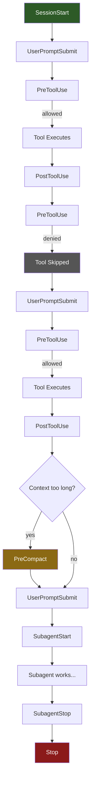

# Hooks and Lifecycle

> VS Code Copilot's hook system — deterministic shell commands that fire at 8 lifecycle events during agent sessions, enabling security policy enforcement, automated code quality workflows, audit trails, and context injection. Preview as of March 2026.
>
> **Key concepts:** 8 lifecycle events, JSON stdin/stdout protocol, exit code semantics, permission decisions (allow/deny/ask), most-restrictive-wins, PreCompact limitations, matcher-less tool scoping, cross-tool format compatibility

## Overview

Hooks are shell commands that execute at specific lifecycle points during VS Code Copilot agent sessions. They are **deterministic** — unlike instructions that influence the model's behavior probabilistically, hooks run your code with guaranteed execution and predictable outcomes. They communicate via JSON on stdin/stdout and can block operations, inject context, modify tool inputs, and control session flow.

As of March 2026, hooks are **Preview**. The configuration format and behavior may change.

Hooks span 8 lifecycle events from `SessionStart` through `Stop`, each providing structured JSON input/output.

Hooks are designed to work across agent types — local agents, background agents, and cloud agents. They share configuration format compatibility with Claude Code and Copilot CLI, though tool names, property casing, and matcher behavior differ across platforms.

## How It Works

### The Session Lifecycle

An agent session flows through lifecycle events in a predictable sequence. Hooks fire at each event, executing in the order they appear in configuration files.



### The 8 Lifecycle Events

| Event | When It Fires | What It Can Do | Context | Permission | Input Mod | Block Stop | Extra Input |
|---|---|---|---|---|---|---|---|
| **SessionStart** | First prompt of a new session | Inject context, validate state | ✅ | — | — | — | `source` |
| **UserPromptSubmit** | User submits any prompt | Audit requests, inject reminders | — | — | — | — | `prompt` |
| **PreToolUse** | Before agent invokes any tool | Block/allow/ask, modify input, add context | ✅ | ✅ | ✅ | — | `tool_name`, `tool_input`, `tool_use_id` |
| **PostToolUse** | After tool completes | Run formatters, log results, block processing | ✅ | — | — | ✅ | `tool_name`, `tool_input`, `tool_use_id`, `tool_response` |
| **PreCompact** | Before context compaction | Export state, log warnings | — | — | — | — | `trigger` |
| **SubagentStart** | Subagent is spawned | Inject context into subagent | ✅ | — | — | — | `agent_id`, `agent_type` |
| **SubagentStop** | Subagent completes | Block stop, aggregate results | — | — | — | ✅ | `agent_id`, `agent_type`, `stop_hook_active` |
| **Stop** | Agent session ends | Generate reports, cleanup, block stop | — | — | — | ✅ | `stop_hook_active` |

**Column legend:** Context = `additionalContext` output · Permission = `permissionDecision` (allow/deny/ask) · Input Mod = `updatedInput` · Block Stop = `decision: "block"` to force continuation

### Configuration Format

Hooks are configured in JSON files. Each file contains a `hooks` object where event names map to arrays of hook commands:

```json
{
  "hooks": {
    "SessionStart": [
      {
        "type": "command",
        "command": "./scripts/inject-context.sh",
        "timeout": 10
      }
    ],
    "PreToolUse": [
      {
        "type": "command",
        "command": "./scripts/validate-tool.sh",
        "timeout": 15
      }
    ],
    "PostToolUse": [
      {
        "type": "command",
        "command": "npx prettier --write \"$TOOL_INPUT_FILE_PATH\""
      }
    ]
  }
}
```

#### Hook Command Properties

| Property | Type | Default | Notes |
|---|---|---|---|
| `type` | string | — | Must be `"command"` |
| `command` | string | — | Default command (cross-platform fallback) |
| `windows` | string | — | Windows-specific override |
| `linux` | string | — | Linux-specific override |
| `osx` | string | — | macOS-specific override |
| `cwd` | string | repo root | Working directory (relative to repository root) |
| `env` | object | `{}` | Additional environment variables |
| `timeout` | number | `30` | Timeout in seconds |

OS-specific commands are selected based on the **extension host platform**, not the local OS. In remote development scenarios (SSH, Containers, WSL), this may differ from your local machine.

### File Locations and Precedence

VS Code searches these locations for hook configuration, with workspace hooks taking precedence over user hooks for the same event:

| Location | Scope | Shared via Git? |
|---|---|---|
| `.github/hooks/*.json` | Workspace | Yes |
| `.claude/settings.local.json` | Workspace | No (local only) |
| `.claude/settings.json` | Workspace | Yes |
| `~/.claude/settings.json` | User (all workspaces) | No |

Custom locations can be added via the `chat.hookFilesLocations` setting:

```json
"chat.hookFilesLocations": {
  ".github/hooks": true,
  "custom/hooks": true,
  ".claude/settings.json": false
}
```

Set a path to `false` to disable loading from that location, including default locations.

### The JSON Protocol

Hooks receive structured JSON via **stdin** and return JSON via **stdout**.

#### Input (Common Fields)

Every hook receives these fields:

```json
{
  "timestamp": "2026-02-09T10:30:00.000Z",
  "cwd": "/path/to/workspace",
  "sessionId": "session-identifier",
  "hookEventName": "PreToolUse",
  "transcript_path": "/path/to/transcript.json"
}
```

Each event adds event-specific fields (documented per-event below).

#### Output (Common Fields)

All hooks can return:

```json
{
  "continue": true,
  "stopReason": "Security policy violation",
  "systemMessage": "Warning: operation flagged for review"
}
```

| Field | Type | Effect |
|---|---|---|
| `continue` | boolean | `false` stops the entire agent session |
| `stopReason` | string | Reason shown to user when `continue` is false |
| `systemMessage` | string | Warning displayed in chat regardless of other decisions |

#### Exit Codes

| Code | Meaning |
|---|---|
| **0** | Success — VS Code parses stdout as JSON |
| **2** | Blocking error — stop processing, stderr shown to model |
| **Other** | Non-blocking warning — show warning, continue processing |

#### Control Mechanism Priority

When multiple control mechanisms are used together, the **most restrictive wins**:
- Exit code 2 blocks the specific operation (simplest blocking mechanism)
- `continue: false` stops the entire session (more drastic than blocking one tool call)
- `hookSpecificOutput` provides fine-grained per-event control (e.g., deny a single tool call without stopping the session)
- Multiple hooks on the same event: most restrictive `permissionDecision` wins (`deny` > `ask` > `allow`)

### Event-Specific Details

#### SessionStart

Extra input: `{ "source": "new" }` (currently always `"new"`).

Output can inject initial context into the agent conversation:

```json
{
  "hookSpecificOutput": {
    "hookEventName": "SessionStart",
    "additionalContext": "Project: my-app v2.1.0 | Branch: main | Active plan: feature-auth"
  }
}
```

**Use cases:** Load active plans, inject environment info, validate project state before the agent starts working.

#### PreToolUse — The Highest-Leverage Hook

Extra input:

```json
{
  "tool_name": "editFiles",
  "tool_input": { "files": ["src/main.ts"] },
  "tool_use_id": "tool-123"
}
```

Output provides the most control surface of any hook:

```json
{
  "hookSpecificOutput": {
    "hookEventName": "PreToolUse",
    "permissionDecision": "deny",
    "permissionDecisionReason": "Production files are read-only",
    "updatedInput": { "files": ["src/safe.ts"] },
    "additionalContext": "Check coding standards before editing"
  }
}
```

| Field | Values | Effect |
|---|---|---|
| `permissionDecision` | `"allow"`, `"deny"`, `"ask"` | Controls whether the tool executes |
| `permissionDecisionReason` | string | Reason shown to user |
| `updatedInput` | object | Modified tool input (must match tool's JSON schema or it's silently ignored) |
| `additionalContext` | string | Extra context injected for the model |

To determine the expected `updatedInput` format, open the agent logs (Chat Debug View) and inspect the tool schema.

**Use cases:** Block dangerous operations (rm -rf, DROP TABLE), auto-approve safe read-only tools, inject conventions when editing specific paths, modify tool inputs to enforce guardrails.

#### PostToolUse

Extra input: same as PreToolUse plus `tool_response` field containing the tool's output.

Output:

```json
{
  "decision": "block",
  "reason": "Lint errors detected",
  "hookSpecificOutput": {
    "hookEventName": "PostToolUse",
    "additionalContext": "The edited file has 3 ESLint errors"
  }
}
```

**Use cases:** Run formatters/linters after file edits, validate output structure, log tool results for auditing.

#### SubagentStart

Extra input: `agent_id` and `agent_type` (the agent's name).

Output can inject context into the subagent:

```json
{
  "hookSpecificOutput": {
    "hookEventName": "SubagentStart",
    "additionalContext": "Follow project coding guidelines in .github/instructions/"
  }
}
```

**Use cases:** Inject key preferences and active context into subagents that don't inherit full parent context.

#### Stop

Extra input: `stop_hook_active` (same loop-prevention boolean).

Output: `decision: "block"` + `reason` forces the agent to continue. **Warning:** blocking stop causes additional turns that consume premium requests. Always check `stop_hook_active`.

```json
{
  "hookSpecificOutput": {
    "hookEventName": "Stop",
    "decision": "block",
    "reason": "Run the test suite before finishing"
  }
}
```

#### Minor Events

- **UserPromptSubmit** — Receives the user's `prompt` text. Uses common output only (no `additionalContext`). Useful for auditing requests, detecting keywords, or enforcing prompt policies.
- **PreCompact** — Fires when conversation exceeds the prompt budget (`trigger: "auto"`). Uses common output only — there is no mechanism to control what survives compaction (see [PreCompact: The Compaction Blindspot](#precompact-the-compaction-blindspot)). Useful for exporting state to external files before compaction.
- **SubagentStop** — Receives `agent_id`, `agent_type`, and `stop_hook_active`. Can block the subagent from stopping (`decision: "block"`). Check `stop_hook_active` to prevent infinite loops.

### Matchers: A Cross-Platform Gap

VS Code **ignores matcher values** on hooks. In Claude Code, you can scope a `PreToolUse` hook to specific tools (e.g., `"Edit|Write"`). In VS Code, all `PreToolUse` hooks fire on every tool invocation regardless of any matcher configuration.

This means the hook script itself must check `tool_name` from stdin and decide whether to act:

```bash
#!/bin/bash
INPUT=$(cat)
TOOL_NAME=$(echo "$INPUT" | jq -r '.tool_name')

# Only act on file-editing tools
case "$TOOL_NAME" in
  editFiles|create_file|replace_string_in_file)
    # Run validation logic
    ;;
  *)
    # No-op: output empty JSON to allow
    echo '{}'
    ;;
esac
```

### Cross-Tool Compatibility

VS Code reads hook configurations from Claude Code and Copilot CLI formats with automatic conversion:

| Aspect | Claude Code | Copilot CLI | VS Code |
|---|---|---|---|
| Event names | PascalCase | lowerCamelCase → auto-converted | PascalCase |
| Tool names | `Write`, `Edit` | varies | `create_file`, `replace_string_in_file` |
| Property names | `snake_case` (`file_path`) | varies | `camelCase` (`filePath`) |
| Matchers | Supported | Supported | **Parsed but ignored** |
| Settings files | `.claude/settings.json` | CLI config | `.github/hooks/*.json` |

When adapting hooks across platforms, update tool name checks and property name references in your scripts.

## What We Learned

### PreToolUse Is the Power Hook

Of all 8 events, `PreToolUse` has the largest control surface. It's the only event that can:
- **Allow, deny, or prompt** for a specific tool invocation without stopping the session
- **Modify tool inputs** before execution (e.g., redirect file paths, add parameters)
- **Inject context** that the model sees alongside the tool call

The deny→ask→allow priority system with most-restrictive-wins means you can layer multiple hooks: a permissive "allow all reads" hook and a strict "deny production writes" hook compose correctly without coordination.

### PreCompact: The Compaction Blindspot {#precompact-the-compaction-blindspot}

PreCompact fires when the conversation context is about to be compacted (truncated/summarized to fit the prompt budget). The natural assumption is that this hook lets you control what survives compaction. **It does not.** PreCompact only supports common output — `continue`, `stopReason`, `systemMessage`. There is no `additionalContext` field, no way to flag important content for preservation, no mechanism to influence the compactor's decisions.

Compaction is a black box. No hook can influence what it preserves.

**The workaround:** write important state to external files (plans, findings, status docs) so the agent can re-read them after compaction rather than relying on conversation memory. If you're building agent workflows that run long enough to trigger compaction, design for external state persistence from the start.

### The Matcher Gap Is a Real Problem

Because VS Code ignores matchers, every `PreToolUse` hook fires on every tool call. For a hook that validates file edits, this means it runs on `semantic_search`, `grep_search`, `list_dir`, and every other tool — not just `editFiles`. At 8+ tool calls per turn, a 15-second-timeout hook could add significant latency.

The mitigation is simple but manual: your hook script must check `tool_name` and exit immediately for irrelevant tools. Keep irrelevant-tool paths fast — parse the tool name, skip, exit 0.

### The Governance Tiering Pattern

The community's [awesome-copilot](https://github.com/github/awesome-copilot) governance-audit hook demonstrates a reusable pattern: **configure the enforcement level per environment rather than hard-coding policy.** Four governance tiers control response severity:

| Tier | Behavior |
|---|---|
| **open** | Log only — threats recorded, never blocked |
| **standard** | Block high-severity threats |
| **strict** | Block medium+ severity threats |
| **locked** | Block all detected threats |

Set the tier via the hook's `env` property, so the same hook script works in development (open) and production (strict) without modification. The implementation uses pure shell scripts with no external dependencies and an append-only JSON audit log — air-gapped safe, compliance-friendly.

This pattern generalizes beyond security: any policy that varies by environment (formatting strictness, test requirements, approval workflows) benefits from tiered configuration over binary on/off.

### Hooks Can Modify Themselves

If the agent has write access to hook scripts (which it typically does), it can modify its own hooks during a session. A PreToolUse hook that validates edits could be rewritten by the agent to always return `"allow"`. This is a real security surface.

**Mitigation:** Use `chat.tools.edits.autoApprove` to disallow the agent from editing hook scripts without manual user approval. Place hook scripts in a protected directory and treat their modification as a sensitive operation.

### SubagentStart Solves the Context Inheritance Problem

Subagents don't inherit full parent context — they start with a focused prompt and limited information. This causes subagents to miss project conventions, active plans, and accumulated decisions. The `SubagentStart` hook directly addresses this: inject critical context (coding standards, active plan summary, key constraints) into every subagent as it spawns.

This is more reliable than relying on the parent agent to include all relevant context in the delegation prompt, because the hook fires deterministically regardless of how the subagent was spawned.

### Stop Hooks: Powerful but Risky

Blocking the agent from stopping (`decision: "block"` on Stop) forces additional turns that consume premium requests. Without checking `stop_hook_active`, a Stop hook can create an infinite loop. The practical sweet spot: use Stop hooks for lightweight cleanup (logging, status updates) rather than forcing substantial additional work. If you need enforcement (e.g., "run tests before finishing"), PreToolUse or PostToolUse hooks on the relevant tools are safer — they operate within the normal flow rather than extending it.

### Debugging and Diagnostics

Two diagnostic surfaces:

1. **Hook diagnostics:** Right-click the Chat view → Diagnostics → hooks section. Shows loaded hooks and configuration errors.
2. **Hook output:** Output panel → "GitHub Copilot Chat Hooks" channel. Shows hook execution results, errors, and timing.

The `/hooks` slash command provides an interactive UI for configuring hooks. `/create-hook` uses AI to generate hook configurations from natural language descriptions.

## Quick Reference

| Aspect | Detail |
|---|---|
| **Status** | Preview (March 2026) |
| **Lifecycle events** | 8: SessionStart, UserPromptSubmit, PreToolUse, PostToolUse, PreCompact, SubagentStart, SubagentStop, Stop |
| **Configuration** | JSON files in `.github/hooks/`, `.claude/settings*.json`, `~/.claude/settings.json` |
| **Settings** | `chat.hookFilesLocations` (customize locations) |
| **Protocol** | JSON via stdin (input) / stdout (output) |
| **Exit codes** | 0 = success, 2 = blocking error, other = warning |
| **Default timeout** | 30 seconds |
| **Permission model** | PreToolUse: allow / deny / ask (most restrictive wins) |
| **Matcher support** | Parsed but **ignored** — all hooks fire on all tools |
| **Cross-tool compat** | Reads Claude Code and Copilot CLI formats with auto-conversion |
| **Safety setting** | `chat.tools.edits.autoApprove` — protect hook scripts from agent edits |
| **Diagnostics** | Chat view → Diagnostics; Output panel → "GitHub Copilot Chat Hooks" |
| **UI commands** | `/hooks` (configure), `/create-hook` (generate with AI) |
| **Org control** | Organizations can disable hooks via enterprise policies |

## References

- [VS Code Hooks Documentation](https://code.visualstudio.com/docs/copilot/customization/hooks) — official reference (March 2026)
- [VS Code Copilot Customization Overview](https://code.visualstudio.com/docs/copilot/copilot-customization) — the 7 building blocks
- [awesome-copilot governance-audit hook](https://github.com/github/awesome-copilot) — community governance tiering pattern
- [VS Code Enterprise Policies](https://code.visualstudio.com/docs/enterprise/policies) — organization-level hook controls
- [Chat Debug View](https://code.visualstudio.com/docs/copilot/chat/chat-debug-view#_agent-logs) — tool schema inspection for updatedInput

## See Also

- [customization-overview.md](customization-overview.md) — the full VS Code customization paradigm
- [instructions-and-skills.md](instructions-and-skills.md) — instructions and skills (the probabilistic complement to deterministic hooks)
- [subagents-and-delegation.md](subagents-and-delegation.md) — subagent mechanics (SubagentStart/Stop hooks in context)
- [../projects/copilot-awesome.md](../projects/copilot-awesome.md) — community hooks and governance-audit pattern
- [../patterns/behavioral-rules.md](../patterns/behavioral-rules.md) — behavioral constraint patterns (constraint > capability)
- [../projects/claude-cookbooks.md](../projects/claude-cookbooks.md) — Anthropic's cookbook with lifecycle patterns and tool restrictions
