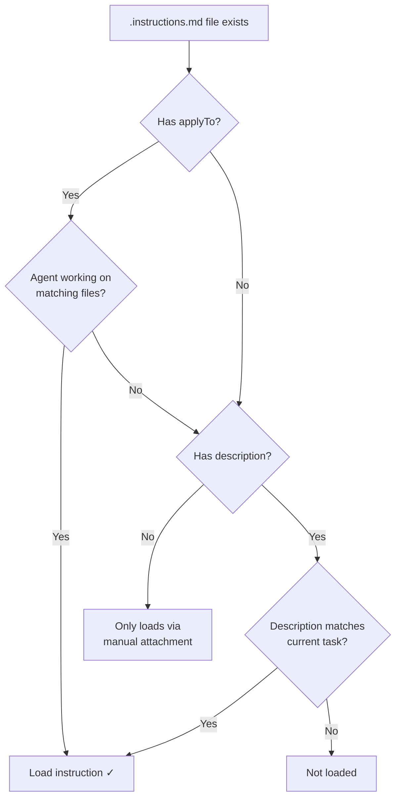
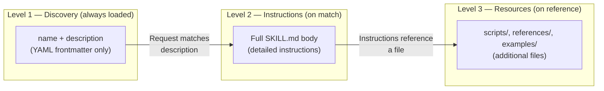

# Instructions and Skills

> How VS Code Copilot's instruction and skill systems work — activation models, layering cascade, SKILL.md anatomy, progressive disclosure, content-based resolution, and hard-won patterns for making each effective.
>
> **Key concepts:** always-on vs file-based instructions, dual activation, instruction priority cascade, SKILL.md three-level loading, `description` as trigger surface, visibility matrix, path resolution order

## Overview

VS Code Copilot's customization system separates _what the agent should know_ from _how it gets loaded_. Instructions and skills are two sides of this: instructions define coding standards and guidelines that the agent applies passively; skills define specialized capabilities and workflows that the agent can invoke actively. Both can auto-activate based on context, but through different mechanisms and with different trade-offs.

The core design axis is **activation** — when and why a piece of knowledge enters the agent's context window:

| Mechanism | What it carries | How it activates | Portability |
|---|---|---|---|
| **Always-on instructions** | Project-wide standards | Every request, unconditionally | VS Code + GitHub.com |
| **File-based instructions** | Scoped rules (language, framework, directory) | `applyTo` glob match OR `description` semantic match | VS Code + GitHub.com |
| **Agent skills** | Capabilities, workflows, scripts, resources | `description` semantic match OR `/` slash command | VS Code, Copilot CLI, coding agent (open standard) |

Instructions are the simpler primitive: a Markdown file with optional YAML frontmatter, injected into context when conditions match. Skills are richer: a directory containing a `SKILL.md` plus optional scripts, examples, and reference docs, loaded progressively to minimize context cost.

## How It Works

### Instruction Types and Locations

VS Code recognizes two categories of instructions: **always-on** (applied to every chat request) and **file-based** (applied conditionally).

#### Always-On Instructions

Always-on instructions inject into every request unconditionally. See [Customization Overview](customization-overview.md) § Always-on instructions for the full table of sources, locations, and priority order. Key additions beyond the core `copilot-instructions.md` and `AGENTS.md`: nested `AGENTS.md` in subfolders (experimental, setting: `chat.useNestedAgentsMdFiles`) and organization-level instructions (setting: `github.copilot.chat.organizationInstructions.enabled`).

#### File-Based Instructions (`.instructions.md`)

File-based instructions live in designated directories and activate conditionally:

| Scope | Default Location |
|---|---|
| Workspace | `.github/instructions/` |
| User profile | `prompts/` folder of current VS Code profile |
| Claude compat | `.claude/rules/` (workspace), `~/.claude/rules/` (user) |

Additional directories can be configured via `chat.instructionsFilesLocations`:

```json
"chat.instructionsFilesLocations": {
  ".github/instructions": true,
  ".claude/rules": true,
  "~/.copilot/instructions": false,
  "~/.claude/rules": false
}
```

#### Instruction Frontmatter

```yaml
---
name: 'Python Standards'           # Optional. Display name. Defaults to filename.
description: 'Python conventions'  # Optional. Hover text + semantic matching signal.
applyTo: '**/*.py'                 # Optional. Glob pattern, relative to workspace root.
---
```

The `description` field does double duty: it's shown as hover text in the Chat view, and it's used for semantic matching against the current task. This is intentional — the description is written _for the agent_, telling it when to load the file.

### The Activation Decision Tree

How VS Code decides whether to load a `.instructions.md` file:



Four cases:

| `applyTo` | `description` | Activation behavior |
|---|---|---|
| Present | Absent | Loads when agent works on matching files |
| Absent | Present | Loads via semantic matching against current task |
| Present | Present | **Dual activation** — glob catches file edits, description catches conversational references |
| Absent | Absent | Only loads when user manually attaches it |

**Dual activation** is the strongest coverage pattern. Example:

```yaml
---
description: >
  Load when editing objective files in .eng/objectives/.
  Enforces section mutability: Timeline and Decisions are APPEND-ONLY.
applyTo: '**/.eng/objectives/**'
---
```

This fires both when the agent edits files in `.eng/objectives/` (glob match) and when the user asks about objective mutation rules (description match).

The setting `chat.includeApplyingInstructions` controls whether pattern/description-based activation happens at all. If disabled, only always-on and manually-attached instructions apply.

### Instruction Priority Cascade

When multiple instruction sources conflict, priority resolves top-down:

```
1. Personal instructions (user-level)       ← highest
2. Repository instructions (copilot-instructions.md, AGENTS.md)
3. Organization instructions                 ← lowest
```

Within a level, multiple files are combined but ordering is **not guaranteed**. If two instruction files at the same level contradict each other, the agent sees both and makes a judgment call. This means overlapping instructions should be complementary, not conflicting.

### Skill Anatomy

Skills are directories with a `SKILL.md` and optional supporting files:

```
.github/skills/
└── webapp-testing/
    ├── SKILL.md              # Required — frontmatter + instructions
    ├── scripts/              # Optional — executable code
    ├── references/           # Optional — docs loaded on demand
    ├── examples/             # Optional — example files
    └── assets/               # Optional — templates, images (not loaded into context)
```

The `SKILL.md` frontmatter:

```yaml
---
name: webapp-testing          # Required. Lowercase + hyphens. Must match directory name.
description: >                # Required. Max 1024 chars. The trigger surface.
  Run and debug integration tests for the web application.
  Use when fixing test failures, adding test coverage, or
  setting up new test suites.
argument-hint: '[test file] [options]'  # Optional. Hint in chat input.
user-invokable: true                     # Optional. Show in / menu? Default: true.
disable-model-invocation: false          # Optional. Allow auto-loading? Default: false.
---

# Webapp Testing

[Detailed instructions, procedures, examples...]
```

**Naming rule:** The `name` field must exactly match the parent directory name. If the directory is `skills/webapp-testing/`, the name must be `webapp-testing`. Mismatch = skill not loaded.

#### Skill Locations

| Scope | Paths |
|---|---|
| Project | `.github/skills/`, `.claude/skills/`, `.agents/skills/` |
| Personal | `~/.copilot/skills/`, `~/.claude/skills/`, `~/.agents/skills/` |

Additional paths via `chat.agentSkillsLocations`. Extensions contribute skills via the `chatSkills` contribution point in `package.json`.

### Progressive Disclosure: Three-Level Loading

Skills use a tiered loading system to minimize context cost:



| Level | What loads | When | Context cost |
|---|---|---|---|
| **1 — Discovery** | `name` + `description` from frontmatter | Always — Copilot sees all installed skills | Minimal (~50 tokens per skill) |
| **2 — Instructions** | Full `SKILL.md` body | Request matches description, or user invokes `/` command | Medium (skill-dependent) |
| **3 — Resources** | Files in skill directory (scripts, docs, examples) | Copilot references them from instructions | Variable |

**Key implication:** You can install dozens of skills with negligible context cost. Only skills relevant to the current task consume meaningful context. This is why `description` quality matters so much — it's the gate between "installed but dormant" and "loaded and active."

### Skill Visibility Matrix

Two frontmatter fields control who can invoke a skill and how:

| `user-invokable` | `disable-model-invocation` | In `/` menu? | Auto-loads on match? | Use case |
|---|---|---|---|---|
| `true` (default) | `false` (default) | Yes | Yes | General-purpose skills |
| `false` | `false` | No | Yes | **Background knowledge** — invisible to user, auto-loads when relevant |
| `true` | `true` | Yes | No | On-demand only — user must invoke explicitly |
| `false` | `true` | No | No | Effectively disabled |

The "background knowledge" pattern (`user-invokable: false`, default `disable-model-invocation`) is the skill equivalent of a description-only instruction file. The skill is invisible in the UI but loads when the agent decides it's relevant. This is useful for guardrails, conventions, and domain knowledge that should apply automatically without cluttering the user's `/` menu.

### Instructions vs Skills: Decision Framework

| Question | If yes → Instructions | If yes → Skills |
|---|---|---|
| Is this coding standards or conventions? | ✓ | |
| Should it always apply (or glob-match)? | ✓ | |
| Does it need scripts, examples, or templates? | | ✓ |
| Should it work in Copilot CLI and coding agent too? | | ✓ |
| Is it a capability or workflow (not just rules)? | | ✓ |
| Is it short (< 50 lines) and self-contained? | ✓ | |
| Does it need progressive loading to manage context? | | ✓ |

**In practice, they're complementary.** A project might have `.instructions.md` files for coding standards (always loaded, low context cost) and skills for specialized workflows (loaded on demand, higher context cost). The instruction tells the agent _how to write code_; the skill tells it _how to accomplish a task_.

### How Sources Are Searched

Both instructions and skills are collected from multiple locations with a consistent priority order: **personal (user-level) → project (workspace) → organization**. All matching files at every level are loaded — there's no shadowing. Priority resolves conflicts in interpretation, not in discovery.

### Diagnostics

When instructions or skills aren't loading as expected:

1. **Configure Chat > Diagnostics** in the Chat view — shows all loaded agents, prompts, instructions, skills, and errors
2. **References** section in chat responses — shows which instruction files were used for that response
3. **Chat Debug View** (`Show Chat Debug View` command) — inspect full language model request/response
4. Relevant settings: `chat.includeApplyingInstructions`, `chat.includeReferencedInstructions`, `chat.useAgentsMdFile`

## What We Learned

### The `description` field is the highest-leverage customization surface

Both instructions and skills use the `description` field for semantic matching, but most people treat it as UI metadata. It's not — it's a **prompt to the agent** telling it when to activate. The Azure Cosmos DB extension exemplifies this:

```yaml
---
description: >
  **CRITICAL**: Read this file FIRST before answering ANY Azure Cosmos DB-related
  questions. This file must be loaded as context whenever Azure Cosmos DB is
  explicitly mentioned. **MUST** be read when user mentions: Azure Cosmos DB,
  Cosmos DB, Cosmos DB NoSQL. Load this instruction file ONLY for Azure
  Cosmos DB-related requests.
---
```

The description uses strong language ("CRITICAL", "MUST"), lists explicit trigger phrases, and includes a negative boundary ("ONLY for"). This isn't documentation — it's a system prompt for the discovery mechanism. Writing descriptions this way dramatically improves activation reliability.

**Pattern: Write descriptions for the agent, not the user.** Think of the description as answering: "Under what conditions should this content load?" List trigger phrases. Set boundaries. Be explicit.

### Dual activation catches what single mechanisms miss

Dual activation (both `applyTo` and `description`) provides the strongest coverage:

- **Glob catches edits** — agent opens a `.py` file, Python conventions load
- **Description catches conversation** — user asks about Python testing, Python conventions load

The cost is minimal: adding a `description` to a glob-matched instruction is a one-line YAML change.

### "Not loaded" and "loaded but ignored" are different failures

When an instruction file doesn't take effect, diagnose which failure mode you're hitting:

1. **Not discovered** — file isn't in a recognized location, or the location is disabled in settings
2. **Not activated** — file was discovered but neither `applyTo` nor `description` matched the current task
3. **Loaded but ignored** — file was injected into context, but the agent didn't follow the instruction (an LLM instruction-following problem, not an activation problem)

The diagnostics view distinguishes cases 1–2. Case 3 requires checking the Chat Debug View to confirm the instruction was in the prompt, then improving the instruction's clarity or strength.

### Progressive disclosure changes how you design skills

Because skill bodies only load after matching — and resources only load when referenced — you can be generous with content. This inverts the usual instruction-file advice ("keep it short"):

| Asset | Context cost model | Guidance |
|---|---|---|
| Instructions | Paid on every matching request | Keep short, self-contained |
| Skill descriptions | Always paid (Level 1) | Keep concise but specific (~100-200 chars) |
| Skill bodies | Paid only on activation (Level 2) | Can be comprehensive — detailed procedures, examples, decision trees |
| Skill resources | Paid only on reference (Level 3) | Use freely — scripts, templates, reference docs |

**Pattern: Put trigger information in the description, detailed guidance in the body, and heavy content in reference files.** This maximizes the ratio of "knowledge available" to "context consumed."

### `name` must match the directory — no exceptions

If your skill directory is `skills/my-skill/` but the `SKILL.md` says `name: mySkill`, the skill silently fails to load. No error, no warning. This is the most common "skill not working" issue and the hardest to diagnose.

**Pattern: Name the directory first, then copy that exact string into the frontmatter.** Never the reverse.

### Always-on instructions compound across a session

Every always-on instruction loads on every request. A project with 5 always-on files totaling 2,000 tokens pays that cost on every interaction. Over a 50-turn session, that's 100,000 tokens of repeated context. This is usually fine — the context budget is large — but it becomes visible when:

- Multiple `copilot-instructions.md` + `AGENTS.md` + `CLAUDE.md` files all say similar things (redundant cost)
- Instructions are verbose when they could be terse
- The project has both always-on and glob-matched instructions covering the same rules

**Pattern: Use always-on for universal rules only. Move language-specific, framework-specific, or directory-specific rules to `.instructions.md` files with `applyTo` globs.** This keeps per-request context cost proportional to what the agent is actually working on.

### The `.claude/rules/` format uses `paths`, not `applyTo`

For Claude Code compatibility, VS Code supports instructions in `.claude/rules/`. But these files use a `paths` property (array of globs) instead of `applyTo` (single glob string). If you use `applyTo` in a `.claude/rules/` file, it's ignored. The `paths` property defaults to `**` (all files) when omitted.

### Extension-contributed instructions are invisible by default

VS Code extensions can contribute instruction files that load automatically. These appear in Configure Chat > Chat Instructions but are easy to miss because they blend in with user-created instructions. The diagnostics view shows their source, which is the best way to discover what extensions are injecting.

### Skills are an open standard — instructions are not

Skills follow the [Agent Skills specification](https://agentskills.io/) and work across VS Code, Copilot CLI, Copilot coding agent, Claude Code, Cursor, Roo Code, and others. Instructions are VS Code-specific (with GitHub.com support). If you're building knowledge assets that need to be portable across tools, skills are the right choice. If you're targeting a single VS Code workspace, instructions are simpler.

## References

- [VS Code — Custom Instructions](https://code.visualstudio.com/docs/copilot/customization/custom-instructions) — official docs for instruction types, format, and activation
- [VS Code — Agent Skills](https://code.visualstudio.com/docs/copilot/customization/agent-skills) — official docs for skill creation, format, and progressive disclosure
- [VS Code — Customize AI overview](https://code.visualstudio.com/docs/copilot/copilot-customization) — overview of all 7 customization building blocks
- [Agent Skills specification](https://agentskills.io/) — the open standard adopted by VS Code, Claude Code, Cursor, and others
- [github/awesome-copilot](https://github.com/github/awesome-copilot) — community collection of instructions, skills, agents, hooks, and plugins
- [anthropics/skills](https://github.com/anthropics/skills) — Anthropic's reference skill implementations

## See Also

- [customization-overview.md](customization-overview.md) — the big picture of VS Code's 7-part customization system
- [hooks-and-lifecycle.md](hooks-and-lifecycle.md) — deterministic lifecycle hooks (the other half of "auto-activating" customization)
- [subagents-and-delegation.md](subagents-and-delegation.md) — how skills interact with subagent context and delegation
- [../projects/anthropic-skills.md](../projects/anthropic-skills.md) — Anthropic's skill patterns, including anti-slop philosophy and the description-as-trigger paradigm
- [../projects/copilot-awesome.md](../projects/copilot-awesome.md) — community-curated marketplace of instructions, skills, and plugins
- [../projects/spec-kit.md](../projects/spec-kit.md) — agent-agnostic specification tool with instruction scaffolding
- [../patterns/context-and-persistence.md](../patterns/context-and-persistence.md) — cross-framework state persistence and context management patterns
