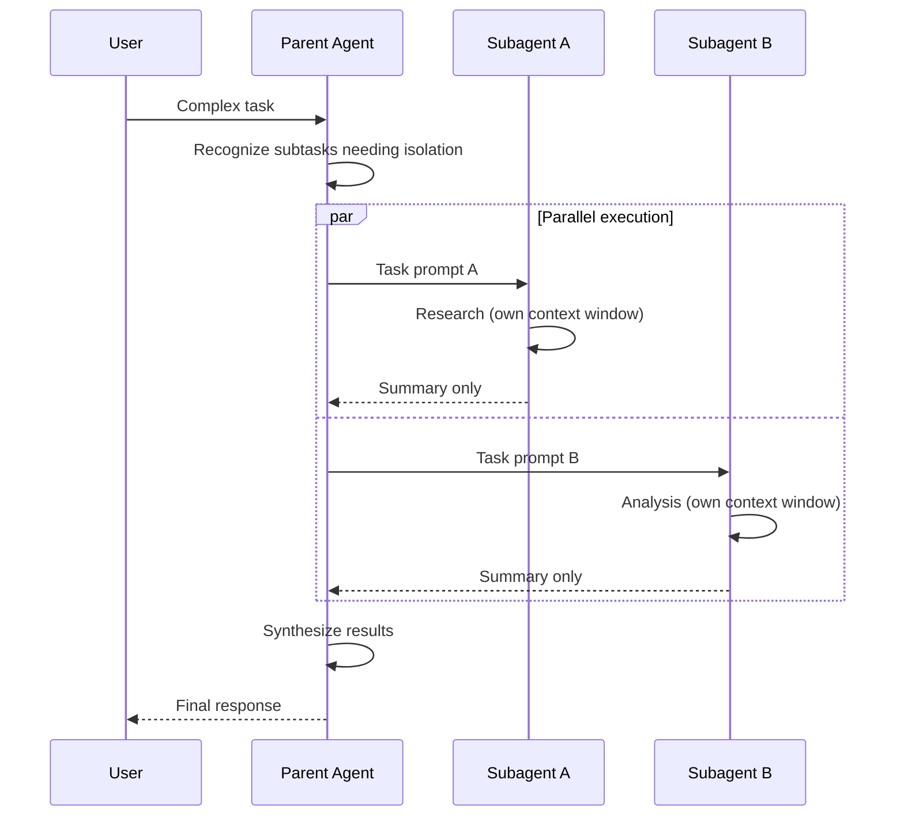
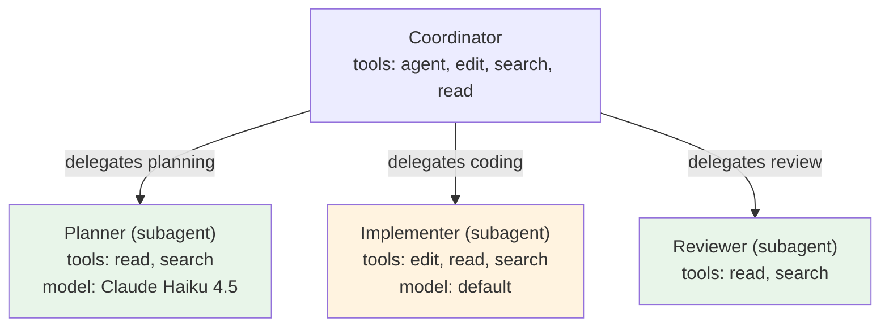
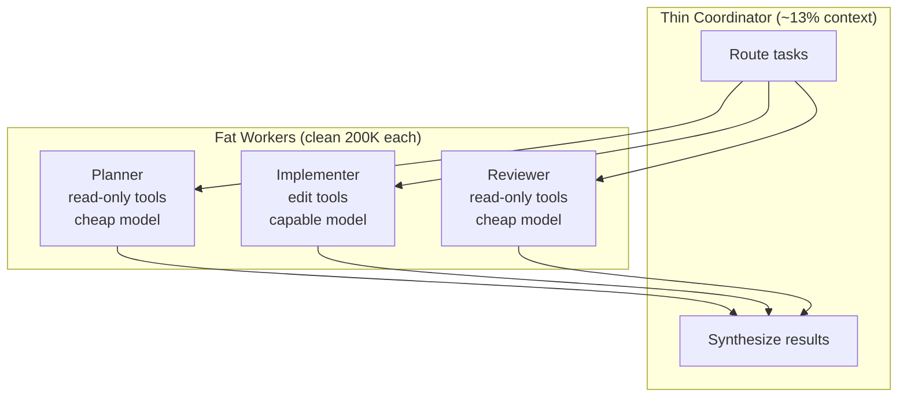

# Subagents and Delegation

> How VS Code Copilot's subagent system works — the runSubagent tool, context isolation, tool restrictions, orchestration patterns, and practical lessons for building delegation workflows.
>
> **Key concepts:** `agent/runSubagent` tool, context isolation boundary, instruction non-inheritance, `agents` field, `user-invocable`/`disable-model-invocation`, SubagentStart hook, coordinator-worker pattern, structured returns

## Overview

VS Code Copilot supports **subagents** — independent AI agents spawned by a parent agent to perform focused work in isolated context windows. The parent delegates a subtask, the subagent works autonomously, and only the final result summary crosses back. All intermediate exploration (tool calls, dead ends, research tangents) stays in the subagent's context and is discarded.

This is a two-party delegation system: parent sends a prompt, subagent returns findings. The hard context boundary is both the primary feature (clean context per subtask) and the primary constraint (subagents are blind to everything the parent knows unless explicitly told).

Subagents are the mechanism behind VS Code's built-in Plan agent (which spawns subagents for research before creating implementation plans) and behind custom orchestration patterns like multi-perspective code review, parallel research fan-out, and phased feature development.

The tool is called `agent/runSubagent` (aliased as `agent` in frontmatter). Any custom agent can serve as a subagent target. Ad-hoc subagents (no named agent, just a task prompt) also work — the model decides when context isolation would help.

**Subagents vs handoffs.** Subagents keep the parent in control — the parent blocks, receives results, and continues. Handoffs transfer control entirely — the user moves to a new agent with conversation history carried forward. Use subagents for research and analysis where the parent needs results. Use handoffs for sequential human-reviewed workflows where the user decides when to proceed.

## How It Works

### The Execution Model



**Synchronous and blocking.** The parent waits for all subagent results before continuing. This is intentional — subagent findings typically inform the next step.

**Parallel execution supported.** VS Code can spawn multiple subagents concurrently when the task calls for it (e.g., "analyze security, performance, and accessibility simultaneously"). All must complete before the parent continues. There is no documented limit on concurrent subagents.

**Clean context window.** Each subagent starts fresh. It receives only the task prompt — not the parent's conversation history, not the parent's instructions, not results from sibling subagents running in parallel.

**Result flow.** Only the final result summary returns to the parent's context. The full intermediate exploration stays in the subagent's window and is discarded — a subagent that explores 50 files and hits 3 dead ends returns a 200-token summary, not 50K tokens of exploration noise.

**What the user sees.** Subagent execution appears as a collapsible tool call in the chat. Collapsed by default, showing the agent name and current activity ("Reading file...", "Searching codebase..."). Expandable to see all tool calls, the prompt passed, and the returned result.

### Context Isolation: What Crosses the Boundary

The context boundary is **hard**:

| Crosses to subagent | Does NOT cross |
|---|---|
| The task prompt from the parent | Conversation history |
| `additionalContext` from SubagentStart hook (if configured) | Parent agent's `.agent.md` instructions |
| Custom agent's own instructions (if using a named agent) | `.instructions.md` files from the parent session |
| Custom agent's own tool/model config | `copilot-instructions.md` from the workspace |
| | Results from sibling subagents |
| | Tool call history from the parent |

| Crosses back to parent | Does NOT cross back |
|---|---|
| Final result summary | Intermediate tool calls |
| | Files read during exploration |
| | Dead ends and failed approaches |
| | The subagent's reasoning process |

**This means delegation prompts must be self-contained.** You cannot say "research the auth pattern we discussed earlier" — the subagent has no "earlier." You must say "research the authentication pattern in `src/auth/`, specifically how JWT tokens are validated in `middleware/auth.ts`."

### Tool and Model Inheritance

By default, subagents inherit the main chat session's model and tool set. When a custom agent is used as a subagent, its own `model`, `tools`, and instructions **override** the defaults.

This creates a natural access control pattern:



Workers with read-only tools (`read`, `search`) can't accidentally modify files during research. Workers with narrow scope can use faster, cheaper models (e.g., `Claude Haiku 4.5 (copilot)`) since they have focused tasks.

### Scope Control: The `agents` Field

The `agents` frontmatter property on an `.agent.md` file restricts which custom agents it can invoke as subagents:

| Value | Effect |
|---|---|
| `*` (default) | All available agents can be used as subagents |
| `['Planner', 'Reviewer']` | Only named agents available |
| `[]` | No subagent spawning allowed |

**Override behavior (observed, not officially documented):** Explicitly listing an agent in the `agents` array appears to override `disable-model-invocation: true` on that agent. This enables \"protected\" agents \u2014 hidden from general use but accessible to specific coordinators.

```yaml
# Coordinator — can use protected workers
---
name: Feature Builder
tools: ['agent', 'edit', 'search', 'read']
agents: ['Planner', 'Implementer', 'Reviewer']
---
```

```yaml
# Protected worker — only accessible via explicit listing
---
name: Planner
user-invocable: false
disable-model-invocation: true
tools: ['read', 'search']
---
```

Here, `Planner` is invisible in the agents dropdown (`user-invocable: false`) and blocked from general subagent use (`disable-model-invocation: true`). But `Feature Builder` can still spawn it because it's explicitly listed in `agents`.

### Invocation Methods

**1. Agent-initiated (most common).** The parent recognizes when a subtask benefits from context isolation and spawns a subagent automatically. Users can hint at this with phrasing like "research X before implementing" or "analyze these three things simultaneously."

**2. Prompt file declaration.** Include `agent` or `runSubagent` in the `tools` frontmatter:

```yaml
---
name: document-feature
tools: ['agent', 'read', 'search', 'edit']
---
Run a subagent to research the feature implementation details...
```

**3. Named agent as subagent.** Prompt the AI to use a specific custom agent:

> "Run the Research agent as a subagent to research the best auth methods."

When a named agent is used, its instructions, tools, and model override the session defaults. This is how you get specialized behavior per subtask.

### Hook Integration

The **SubagentStart** hook (Preview) fires when a subagent is spawned. It can inject `additionalContext` — a string added to the subagent's context alongside the task prompt. This is the primary mechanism for bridging the context isolation gap.

```json
{
  "hookSpecificOutput": {
    "hookEventName": "SubagentStart",
    "additionalContext": "Active project: my-app v2.1.0. Key conventions: use ESM imports, follow existing patterns in src/utils/. Active objective: migrate auth to OAuth2."
  }
}
```

The hook receives `agent_id` and `agent_type`, so the script can tailor injected context per subagent type.

The **SubagentStop** hook (Preview) fires when a subagent completes. It can `decision: "block"` to force the subagent to continue (e.g., if results are incomplete). Must check `stop_hook_active` to prevent infinite loops — blocking stop causes additional turns that consume premium requests.

Other hooks fire normally during subagent execution: `PreToolUse`/`PostToolUse` for tool calls made by the subagent, `PreCompact` if the subagent's context needs compaction.

## What We Learned

### When to Delegate vs. Do Yourself

The ecosystem converges on a simple heuristic:

**Use subagents when:**
- The task involves exploration with potential dead ends (research, option analysis) — dead ends stay in the subagent's context, not yours
- You need parallel independent analysis (multi-perspective review, fan-out research) — no anchoring bias between parallel subagents
- The parent's context is already heavy and would degrade with more content — offload to a clean window
- The subtask has a clear, isolatable scope with a defined deliverable
- You want cost-effective processing — delegate bulk work to cheaper model workers

**Do inline when:**
- The task is simple and sequential
- Results from step N directly feed step N+1 with no branching
- The parent context is fresh and the task is small
- You need to reference conversation history or earlier decisions

**GSD's threshold rule:** "For tasks with 3+ distinct subtasks, consider spawning subagents with fresh context." This is a practical heuristic, not a hard rule. The signal that you *should* have delegated: the parent starts forgetting earlier decisions, repeating research, or producing lower-quality output (context degradation).

### The Self-Contained Prompt Problem

The hardest part of delegation is writing prompts that work without shared context. Common pitfalls:

1. **Implicit references.** "Fix the bug we discussed" → the subagent has no "we." Include the specific bug description, file path, and expected behavior.

2. **Missing conventions.** The subagent doesn't know your coding conventions, naming patterns, or project structure. Either state them in the prompt or rely on SubagentStart hook injection.

3. **Vague deliverables.** "Research auth options" produces unfocused results. "Research OAuth2 vs API key auth for `src/api/`, comparing implementation complexity, security properties, and compatibility with our Express middleware in `src/middleware/auth.ts`. Return with sections: Summary, Options Compared, Recommendation, Status." produces focused results.

4. **Over-stuffing.** Passing too much context defeats the purpose. Give it entry points and a focused question.

### Structured Returns Are Essential

Subagents return free text — no tooling enforces structure on the output. The fix is a **prompt convention**: instruct every subagent to end with a structured status line.

The GSD convention, widely adopted in the ecosystem:

```
## COMPLETE
## BLOCKED: {reason}
## NEEDS REVIEW: {what}
```

The parent checks for this status line to decide next steps without re-reading the full report. This is the single cheapest improvement to any delegation workflow — one line in the subagent prompt.

For richer structured returns, specify the section format: "Return with sections: ## Summary (3-5 sentences), ## Findings (detailed, with evidence), ## Conclusions (actionable recommendations), ## Status."

### The Coordinator Pattern: Thin Orchestrator, Fat Workers

The most effective orchestration pattern across the ecosystem is **thin coordinator, fat workers**:

- The **coordinator** holds routing logic, delegates work, and synthesizes results. It consumes minimal context (Squad measures 13% of the context window for its coordinator). It never does implementation work itself.
- The **workers** are specialized agents with restricted tools, focused instructions, and often cheaper models. Each gets a clean 200K-token context window — the heavy work happens here.



This pattern maps naturally to VS Code's subagent model: the coordinator is the parent agent (custom `.agent.md` with `agents` field restricting workers), and workers are `user-invocable: false` agents with tailored tool sets.

The official docs provide the canonical example — the Feature Builder pattern:

```yaml
---
name: Feature Builder
tools: ['agent', 'edit', 'search', 'read']
agents: ['Planner', 'Plan Architect', 'Implementer', 'Reviewer']
---
```

With iteration loops: Planner ↔ Plan Architect until the plan converges, then Implementer ↔ Reviewer until the code passes review.

**Warning against over-orchestration.** For single-developer workflows on short tasks, the coordination overhead of a full multi-agent system often exceeds the benefit. Start with behavioral rules in a single agent ("delegate when you have 3+ independent subtasks"), add a dedicated research subagent, and only build full coordinator patterns when the simpler approaches prove insufficient.

### Parallel Fan-Out for Research

The multi-perspective pattern is the most immediately useful subagent pattern. Each subagent approaches the same problem independently — no anchoring by what other perspectives found.

```yaml
---
name: Thorough Reviewer
tools: ['agent', 'read', 'search']
---
Run each perspective as a parallel subagent:
- Correctness reviewer: logic errors, edge cases, type issues
- Code quality reviewer: readability, naming, duplication
- Security reviewer: input validation, injection risks, data exposure
- Architecture reviewer: codebase patterns, design consistency
```

This works because context isolation is a feature here: each reviewer starts fresh, with no bias from other reviewers' findings. The orchestrator synthesizes the independent results into a prioritized summary.

The same pattern applies to research fan-out:

```
Parent receives "Plan migration from Express to Fastify"
  ├── Subagent 1: Research current Express architecture
  ├── Subagent 2: Research Fastify migration patterns
  └── Subagent 3: Identify risk areas (tests, integrations)
All complete → Parent synthesizes into migration plan
```

### Context Injection via Hooks

The SubagentStart hook is the escape hatch for context isolation. A hook script can read project state (active objectives, coding conventions, SDK versions) and inject a summary into every subagent via `additionalContext`. This directly addresses the "subagent hallucination problem" — subagents making decisions without project context.

Practical injection might include:
- Active project/objective name and status
- Key coding conventions (import style, error handling patterns)
- File paths the subagent is authorized to work with
- Constraints or boundaries ("do not modify `src/core/`")

Caveat: SubagentStart hooks are Preview status. They work, but the API may change. Design delegation prompts to be self-contained as the primary mechanism, with hook injection as a supplementary layer.

### Known Gaps and Unknowns

These are confirmed gaps — searched across all official documentation pages:

| Question | Status |
|---|---|
| `runSubagent` tool parameter schema (exact fields) | Undocumented |
| Return format constraints (token limit, structure) | Undocumented |
| Maximum nesting depth (subagents spawning subagents) | No guidance |
| Failure/timeout behavior on crash or token limit | Undocumented |
| Token/cost attribution per subagent | Undocumented |
| Maximum concurrent subagents | No stated limit |
| File attachment forwarding to subagents | Undocumented |

## Quick Reference

### Enabling Subagents

Add `agent` or `agent/runSubagent` to your agent's `tools` list:

```yaml
---
name: my-coordinator
tools: ['agent', 'read', 'search', 'edit']
agents: ['Worker-A', 'Worker-B']  # restrict available subagents
---
```

### Creating a Subagent-Only Worker

```yaml
---
name: my-worker
user-invocable: false        # hidden from agents dropdown
tools: ['read', 'search']    # read-only access
model: ['Claude Haiku 4.5 (copilot)']  # cheaper model for focused work
---
Focused worker instructions here.
```

### Subagent Prompt Template

When spawning a subagent, include:

1. **Task:** What to investigate or produce
2. **Entry points:** Relevant file paths, URLs, or starting locations
3. **Context:** Key facts the subagent needs (conventions, constraints)
4. **Output format:** Expected sections and structure
5. **Status line:** Require `## COMPLETE` / `## BLOCKED: {reason}` / `## NEEDS REVIEW: {what}`

### Handoff vs Subagent Decision

| | Subagent | Handoff |
|---|---|---|
| **Control** | Parent stays in control | Control transfers to user/target agent |
| **Context** | Isolated (clean window) | History carries forward |
| **Interaction** | One-shot (no follow-up) | Multi-turn with the new agent |
| **Use when** | Research, analysis, parallel work | Sequential workflows with human review |

## References

- [Subagents in Visual Studio Code](https://code.visualstudio.com/docs/copilot/agents/subagents) — official documentation (verified 2026-03-04)
- [Custom agents in VS Code](https://code.visualstudio.com/docs/copilot/customization/custom-agents) — agent file format, frontmatter properties, handoffs
- [Agents overview](https://code.visualstudio.com/docs/copilot/agents/overview) — built-in agents and agent types

## See Also

- [customization-overview.md](customization-overview.md) — the big picture of VS Code Copilot customization
- [instructions-and-skills.md](instructions-and-skills.md) — how instructions and skills work (and don't flow to subagents)
- [hooks-and-lifecycle.md](hooks-and-lifecycle.md) — SubagentStart/SubagentStop hooks in detail
- [../projects/gsd.md](../projects/gsd.md) — GSD's fresh-context-per-task model and thin-orchestrator approach
- [../projects/squad.md](../projects/squad.md) — Squad's coordinator pattern and persistent agent teams
- [../patterns/delegation-and-subagents.md](../patterns/delegation-and-subagents.md) — cross-framework delegation patterns and conventions
