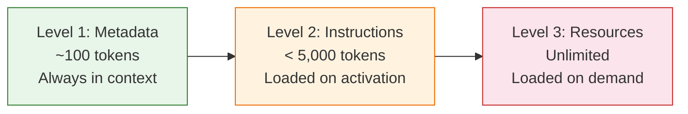
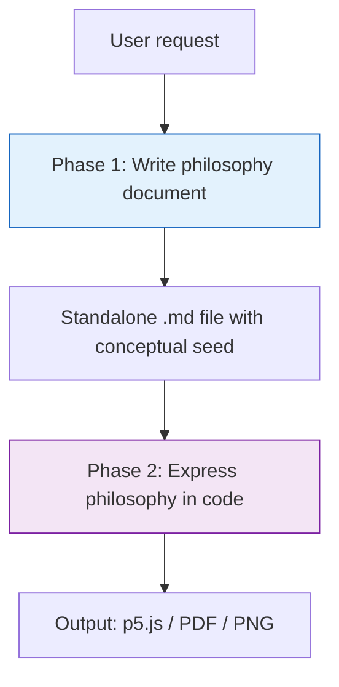

# Anthropic Skills

[`anthropics/skills`](https://github.com/anthropics/skills) | ~85k stars | Skills Repository
Platforms: Claude Code, Claude.ai, Claude API, Cursor, GitHub Copilot, Roo Code

> Anthropic's official reference skill implementations for Claude — patterns, anatomy, anti-slop philosophy, and 6 skill design archetypes across 17+ example and production skills.
>
> **Key concepts:** SKILL.md, description-as-trigger, three-level progressive disclosure, constraint-based creativity, forced refinement, marketplace.json, scripts-as-black-boxes

## Overview

[`anthropics/skills`](https://github.com/anthropics/skills) is Anthropic's official public repository of Agent Skills for Claude. It contains 17+ skill implementations ranging from creative applications (algorithmic art, canvas design) to production document capabilities (PDF, DOCX, PPTX, XLSX) to development tools (MCP server builder, webapp testing) [1]. The repo serves three purposes:

1. **Reference implementations** — show how to build skills that work across Claude Code, Claude.ai, and the Claude API [1]
2. **Production skills** — the document skills (docx, pdf, pptx, xlsx) are the actual source-available implementations powering Claude's document creation capabilities [1]
3. **Open standard showcase** — demonstrates the [Agent Skills specification](https://agentskills.io/specification) adopted by Claude Code, Cursor, Mistral AI Vibe, Snowflake, TRAE, Spring AI, OpenHands, OpenAI, and others (see [agentskills.io](https://agentskills.io/) for the full adopter list) [2] [3]

The repo also includes a `template/SKILL.md` with the absolute minimum starting point (name + description frontmatter, one heading) and a `spec/` directory pointing to the full specification at agentskills.io [1] [5].

Skills are distributed through Claude Code's plugin marketplace, direct upload to Claude.ai, or the Claude API [1]. In Claude Code:

```bash
/plugin marketplace add anthropics/skills
/plugin install example-skills@anthropic-agent-skills
```

## Skill Anatomy

Every skill is a self-contained directory. The only required file is `SKILL.md` — everything else is optional and loaded on demand [2].

```
skill-name/
├── SKILL.md              # Required — YAML frontmatter + markdown instructions
├── scripts/              # Optional — executable code (Python/Bash/JS)
├── references/           # Optional — docs loaded into context when relevant
└── assets/               # Optional — files used in output (not loaded into context)
```

### SKILL.md Format

```yaml
---
name: skill-name              # Required. 1-64 chars, lowercase + hyphens only
description: >                # Required. 1-1024 chars. PRIMARY triggering mechanism.
  What it does, when to use it, specific trigger keywords.
license: Apache-2.0           # Optional
compatibility: Claude Code    # Optional. Environment requirements
metadata:                     # Optional. Arbitrary key-value pairs
  author: example-org
  version: "1.0"
allowed-tools: Bash(git:*) Read  # Optional. Experimental. Pre-approved tools
---

# Skill Title

[Markdown instructions — loaded only after the skill triggers]
```

Naming rules: lowercase alphanumeric + hyphens only, no leading/trailing hyphens, no consecutive `--`, must match the parent directory name, max 64 characters [2].

### Resource Directory Conventions

| Directory | Purpose | Loaded into context? |
|---|---|---|
| `scripts/` | Executable code for deterministic, repeatable tasks | No — executed directly, read only for patching |
| `references/` | Documentation Claude reads when relevant | Yes, on demand |
| `assets/` | Templates, images, fonts used in output | No — used in output, not read |

The skill-creator meta-skill states the principle explicitly: **"Scripts should be executed directly via `--help`, not read into the context window."** Scripts are black boxes [4].

## Description as Primary Trigger

The `description` field is the single most important design decision in a skill. It serves as the **primary triggering mechanism** — Claude's skill discovery system matches user requests against installed skill descriptions to decide which skill to activate [4].

From the skill-creator [4]:
> The description is the PRIMARY triggering mechanism. Don't put "when to use" in the body (which is only loaded after triggering).

The metadata (name + description) budget is approximately 100 tokens per skill. All installed skills' metadata lives in context permanently, so descriptions must be dense with trigger keywords while staying under 1,024 characters [2] [4].

### Detection Mechanism: LLM Reasoning, Not Retrieval

A common misconception is that skill detection uses embedding-based retrieval or keyword matching. It does not. At startup, the agent pre-loads every installed skill's `name` and `description` into the system prompt [17]. When a user sends a message, the model reasons about whether any skill's description is relevant to the current task — then invokes it if so. Skill selection works identically to tool selection in the Claude API: the model reads textual descriptions during its forward pass and decides relevance. There is no separate ML classifier, embedding index, or keyword-matching layer [17] [18].

One important nuance: agents typically only consult skills for tasks that require knowledge or capabilities beyond what they can handle alone. A simple, one-step request like "read this PDF" may not trigger a PDF skill even if the description matches perfectly, because the agent can handle it with basic tools [18].

Internally, skill metadata is compiled into the tools array alongside Claude's other tools (Read, Write, Bash, etc.). The model's standard tool-selection reasoning then applies: it reads descriptions, evaluates relevance, and invokes if appropriate. This means description quality directly determines selection quality — with all the same dynamics that affect tool selection in the Claude API [17].

### Skill Budget Constraint

All installed skill descriptions share a character budget that scales at **2% of the context window**, with a fallback of approximately 16,000 characters. This budget is configurable via the `SLASH_COMMAND_TOOL_CHAR_BUDGET` environment variable. With typical descriptions averaging ~250–300 characters, roughly **40–50 skills** fit within the default budget. When the budget is exceeded, excess skills are silently excluded — the model cannot discover or invoke them [2] [4].

This is a **context budget problem**, not a classification accuracy problem. Having too many skills doesn't "confuse" the model in the traditional sense — skills past the budget simply become invisible. The practical implication: teams must be selective about what they install, and consolidating related operations into fewer, well-described skills is preferred over many narrow skills [4] [18].

### Under-Triggering and Description Optimization

The known failure mode is **under-triggering** — Claude tends to err toward not activating skills rather than over-activating them. The agentskills.io guide explicitly advises: *"Err on the side of being pushy. Explicitly list contexts where the skill applies, including cases where the user doesn't name the domain directly"* [18]. Anthropic's own skill-creator meta-skill follows this advice, using assertive phrasing like *"Use this skill whenever the user wants to do anything with PDF files"* [4].

Anthropic ran the skill-creator's description optimization against their document-creation skills and reported **improved triggering on 5 out of 6 public skills** [19]. Community practitioners have reported significant activation rate improvements (from roughly half to over 80%) after optimizing descriptions, though specific numbers vary by skill and workload.

#### The Eval-Driven Optimization Loop

The agentskills.io guide documents a systematic approach to description optimization [18]:

1. **Design eval queries** — ~20 realistic user prompts, split between should-trigger (~10) and should-not-trigger (~10) scenarios. The most valuable should-trigger queries are ones where the connection isn't obvious from the query alone. The most valuable should-not-trigger queries are near-misses sharing keywords with the skill.
2. **Test triggering** — run each query through the agent 3+ times (model behavior is nondeterministic) and compute trigger rates. A query passes if it triggers above a threshold (0.5 default) for should-trigger, or below for should-not-trigger.
3. **Split train/validation** — use ~60% of queries for training (guiding changes) and ~40% for validation (checking generalization). This prevents overfitting to specific phrasings.
4. **Revise the description** — broaden if should-trigger queries fail; add negative boundaries if should-not-trigger queries false-fire. Avoid adding specific keywords from failed queries (that's overfitting); instead address the general category.
5. **Iterate** — repeat until all train queries pass or improvement plateaus. Five iterations is usually enough [18].

The skill-creator meta-skill automates this loop end-to-end: it splits the eval set, evaluates trigger rates in parallel using independent agents, proposes description improvements using extended thinking, and generates a live HTML report [18] [19]. The skill-creator blog describes additional capabilities: benchmark mode for tracking pass rates across model updates, and comparator agents for A/B testing skill versions [19].

**Key description-writing principles** synthesized from official guidance [4] [17] [18]:

- Use imperative phrasing: *"Use this skill when…"* rather than *"This skill does…"*
- List edge cases where the skill should activate, even if the user doesn't explicitly ask
- Include negative triggers to prevent over-triggering: *"Do NOT use for simple data exploration"*
- Mention relevant file types if applicable (`.pdf`, `.xlsx`, `.fig`)
- Include specific phrases users would say
- Debug by asking Claude: *"When would you use the [skill-name] skill?"* — it will quote the description back, revealing gaps
- Target 1–3 dense sentences within the 1,024-character limit

## Progressive Disclosure

Skills use a three-level loading model that treats the context window as a shared resource [2] [4]:



| Level | Content | Budget | When loaded |
|---|---|---|---|
| **Metadata** | `name` + `description` | ~100 tokens | Always — for every installed skill |
| **Instructions** | SKILL.md body | < 5,000 tokens (< 500 lines) | When skill triggers |
| **Resources** | scripts/, references/, assets/ | Unlimited | On demand, by Claude's judgment |

The guiding principle — that the context window is a shared resource — means every token in a skill must justify its cost against system prompt, conversation history, other skills' metadata, and user requests. The skill-creator instructs authors to challenge each piece of information: *"Does this paragraph justify its token cost?"** [4]

The `template/SKILL.md` demonstrates the minimal form — just frontmatter and a heading. Start there; add resources only when the body approaches 500 lines or when deterministic operations need scripts [5].

## Six Skill Design Patterns

The repo contains 17+ skills (13 example + 4 production document skills) organized into two distribution groups via `marketplace.json` [1] [6]. The four document skills (`docx`, `pdf`, `pptx`, `xlsx`) are the source-available implementations powering Claude.ai's document capabilities — the most mature skill patterns at production scale [1].

Four exemplar skills illustrate the range of design archetypes: `algorithmic-art` (two-phase creative), `doc-coauthoring` (multi-stage with sub-agent testing), `frontend-design` (anti-pattern enforcement), and `skill-creator` (meta-skill). See [the repo](https://github.com/anthropics/skills) for the full catalog.

### Pattern 1: Two-Phase Creative

**Skills:** `algorithmic-art`, `canvas-design`



Claude writes a design philosophy as a standalone markdown file first ("Organic Turbulence", "Quantum Harmonics", "Chromatic Language"), then executes it in code [7]. The philosophy must embed a **"conceptual seed"** — a subtle niche reference that connects the art to its underlying concept, forcing creative depth beyond surface-level generation [8].

Fixed vs variable constraints prevent drift: templates define what NEVER changes (branding, layout structure) and what ALWAYS varies (algorithm, parameters, UI controls) [7] [8].

### Pattern 2: Multi-Stage with Sub-Agent Testing

**Skill:** `doc-coauthoring`

Three-stage workflow [9]:
1. **Context gathering** — questions → info dump → clarifying questions
2. **Refinement** — per section: brainstorm 5–20 options → curate → gap check → draft → iterate
3. **Reader testing** — predict reader questions → spawn a fresh Claude instance (no context) to simulate a naive reader → iterate on findings

The sub-agent reader test is evaluation-by-proxy: a fresh instance with zero context reveals what the document fails to communicate [9]. After 3 consecutive iterations with no changes, the skill prompts: *"Is there anything we can remove?"* [9]

### Pattern 3: Anti-Pattern Enforcement

**Skills:** `frontend-design`, `web-artifacts-builder`

Instead of recommending what to do, these skills define **what is forbidden** [10] [11]:

| Skill | Forbidden Patterns |
|---|---|
| `frontend-design` | Inter/Roboto/Arial fonts. Purple gradients on white. Predictable layouts. Converging on common choices [10]. |
| `web-artifacts-builder` | Excessive centered layouts. Purple gradients. Uniform rounded corners. Inter font [11]. |

From `frontend-design`: *"Pick an extreme for tone. Never converge on common choices across generations."* [10]

This is behavioral constraint as design philosophy — preferences encoded as prohibitions. See the Anti-AI-Slop Philosophy section below for the deeper rationale.

### Pattern 4: Toolkit

**Skill:** `slack-gif-creator`

Provides building blocks rather than templates [12]:

- `GIFBuilder` — frame construction API
- `Validators` — constraint checking (size, FPS, color count)
- `Easing functions` — linear, ease_in, bounce_out, elastic_out, etc.
- `Animation Concepts` — Shake, Pulse, Bounce, Spin, Fade, Slide, Zoom, Explode

From the skill: *"Provides knowledge + utilities + flexibility, NOT rigid templates."* [12]

Platform-specific constraints are baked in: 128×128 for Slack emoji, 480×480 for messages, 10–30 FPS, 48–128 colors, <3 seconds. Uses PIL/Pillow [12].

### Pattern 5: Preset Library

**Skill:** `theme-factory`

Ten pre-built themes (Ocean Depths, Sunset Boulevard, Arctic Frost, Midnight Galaxy, etc.) stored in a `themes/` directory with hex codes and font pairings. A `theme-showcase.pdf` enables visual selection. Custom themes can be created on the fly [13].

The skill is a curated catalog with an escape hatch — structured enough for quick selection, flexible enough for one-off needs.

### Pattern 6: Delegation

**Skill:** `internal-comms`

The SKILL.md body is a thin routing layer. All knowledge lives in reference files [14]:

- `examples/3p-updates.md`
- `examples/company-newsletter.md`
- `examples/faq-answers.md`
- `examples/general-comms.md`

Content types: third-party updates, newsletters, FAQs, status reports, leadership updates, incident reports [14]. This is maximum progressive disclosure — the SKILL.md is minimal, and the references carry all domain weight.

## The Anti-AI-Slop Philosophy

A cross-cutting theme across multiple skills: Anthropic actively fights generic, recognizable AI output. This isn't a style preference — it's a deliberate design philosophy that **default LLM outputs are unacceptable** for creative skills.

The approach: encode taste as prohibitions rather than aspirations.

| Skill | Anti-Slop Mechanism |
|---|---|
| `frontend-design` | Banned fonts (Inter, Roboto, Arial), banned color schemes (purple gradients on white), mandate extreme tone choices [10] |
| `web-artifacts-builder` | Banned layouts (excessive centering), banned visual patterns (uniform rounded corners, purple gradients), banned fonts (Inter) [11] |
| `canvas-design` | Require a "conceptual seed" — subtle niche reference per piece; no surface-level generation [8] |
| `algorithmic-art` | Force specific philosophy names ("Organic Turbulence", "Quantum Harmonics") — never generic titles [7] |

The pattern works because LLMs have strong defaults. Left unconstrained, Claude (like any LLM) gravitates toward the same fonts, color palettes, and layouts. By explicitly prohibiting the most common defaults, skills force divergent output — each generation must find its own aesthetic.

## Forced Refinement Pattern

The `canvas-design` skill builds iteration into its workflow: the final step **assumes the user said "it isn't perfect enough"** and forces a refinement pass [8]. The workflow expects iteration by default rather than treating first-pass output as final.

This pairs with `doc-coauthoring`'s rule that after 3 iterations with no changes, the prompt shifts to *"is there anything we can remove?"* [9] — moving from additive refinement to subtractive editing.

Together these encode a philosophy: **assume the first output needs work, and know when to stop.**

## The Skill-Creator Meta-Skill

`skill-creator` is the most complex skill in the repo. It teaches Claude to create other skills through a multi-step workflow [4]:

1. **Capture Intent** — understand what the user wants to build
2. **Interview and Research** — ask questions, gather context
3. **Write the SKILL.md** — draft the skill file
4. **Test Cases** — create and run test prompts
5. **Improving** — refine based on feedback
6. **Package** — run `scripts/package_skill.py <path>` to create distributable `.skill` zip [4]

### Reference Documents

Two reference files capture reusable structural patterns:

**`references/workflows.md`** [15] — Two workflow types:
- **Sequential**: numbered steps with tool names (deterministic order)
- **Conditional**: branching logic with decision points (context-dependent)

**`references/output-patterns.md`** [16] — Two output strategies:
- **Template pattern**: strict (fill-in-the-blank) vs flexible (structural guidance)
- **Examples pattern**: input/output pairs demonstrating desired style

Key insight from output-patterns: *"Examples help Claude understand the desired style and level of detail more clearly than descriptions alone."* [16]

### Core Principles Embedded in skill-creator

These principles apply to all skill design, not just skills created by this meta-skill [4]:

- **Treat the context window as a shared resource** — only add what Claude doesn't already know
- **"Claude is already very smart"** — challenge each piece of information for token cost
- **"Prefer concise examples over verbose explanations"** — show, don't tell
- **Match freedom to fragility** — high freedom for flexible tasks, low freedom (specific scripts) for fragile operations
- **No extraneous files** — no README, CHANGELOG, INSTALLATION_GUIDE; skills contain only what an agent needs
- **Flat references** — avoid deeply nested reference hierarchies; all reference files link directly from SKILL.md (one level deep)

## Plugin Marketplace and Distribution

Skills are grouped into plugins via `.claude-plugin/marketplace.json`:

```json
{
  "plugins": [
    {
      "name": "document-skills",
      "strict": false,
      "skills": ["./skills/xlsx", "./skills/docx", "./skills/pptx", "./skills/pdf"]
    },
    {
      "name": "example-skills",
      "strict": false,
      "skills": ["./skills/algorithmic-art", "./skills/brand-guidelines", "..."]
    }
  ]
}
```

The `strict` field controls plugin boundaries: when `false` (both plugins use this), the boundary is permissive. When `true`, only listed resources are accessible [6].

The **production vs example separation** is a deliberate distribution strategy [1] [6]:
- `document-skills` — production capabilities that power Claude.ai's document features
- `example-skills` — creative and development skills for learning and demonstration

Skills can also be packaged as `.skill` zip files (via `scripts/package_skill.py`) for distribution outside the marketplace — uploaded to Claude.ai or sent through the API [4].

## Quick Reference

| Concept | Detail |
|---|---|
| **Repo** | [anthropics/skills](https://github.com/anthropics/skills) — ~85k stars |
| **Standard** | [Agent Skills spec](https://agentskills.io/specification) — open, multi-platform |
| **Required files** | `SKILL.md` only (frontmatter: `name` + `description`) |
| **Optional dirs** | `scripts/`, `references/`, `assets/` |
| **Description limit** | 1–1,024 characters; serves as primary trigger |
| **Body limit** | < 5,000 tokens / < 500 lines recommended |
| **Name format** | Lowercase + hyphens, matches directory name, max 64 chars |
| **Metadata budget** | ~100 tokens per skill (always in context) |
| **Context budget** | 2% of context window (env: `SLASH_COMMAND_TOOL_CHAR_BUDGET`) |
| **Distribution** | Plugin marketplace, `.skill` zips, Claude.ai upload, API |
| **Design patterns** | Two-phase creative, multi-stage+testing, anti-pattern, toolkit, preset library, delegation |
| **Key principle** | Context window is a shared resource — minimize token cost |
| **Install (Claude Code)** | `/plugin marketplace add anthropics/skills` |

## References

- [1] [anthropics/skills repository](https://github.com/anthropics/skills) — Anthropic's official skills repo
- [2] [Agent Skills specification](https://agentskills.io/specification) — open standard for agent skills
- [3] [agentskills.io](https://agentskills.io/) — Agent Skills ecosystem and adopter list
- [4] [skill-creator SKILL.md](https://github.com/anthropics/skills/blob/main/skills/skill-creator/SKILL.md) — meta-skill for creating skills
- [5] [template/SKILL.md](https://github.com/anthropics/skills/blob/main/template/SKILL.md) — minimal skill template
- [6] [marketplace.json](https://github.com/anthropics/skills/blob/main/.claude-plugin/marketplace.json) — plugin distribution configuration
- [7] [algorithmic-art SKILL.md](https://github.com/anthropics/skills/blob/main/skills/algorithmic-art/SKILL.md) — two-phase creative pattern
- [8] [canvas-design SKILL.md](https://github.com/anthropics/skills/blob/main/skills/canvas-design/SKILL.md) — canvas design with conceptual seeds
- [9] [doc-coauthoring SKILL.md](https://github.com/anthropics/skills/blob/main/skills/doc-coauthoring/SKILL.md) — multi-stage coauthoring with sub-agent testing
- [10] [frontend-design SKILL.md](https://github.com/anthropics/skills/blob/main/skills/frontend-design/SKILL.md) — anti-pattern enforcement for frontend
- [11] [web-artifacts-builder SKILL.md](https://github.com/anthropics/skills/blob/main/skills/web-artifacts-builder/SKILL.md) — web artifacts with anti-slop rules
- [12] [slack-gif-creator SKILL.md](https://github.com/anthropics/skills/blob/main/skills/slack-gif-creator/SKILL.md) — toolkit pattern for GIF creation
- [13] [theme-factory SKILL.md](https://github.com/anthropics/skills/blob/main/skills/theme-factory/SKILL.md) — preset library pattern
- [14] [internal-comms SKILL.md](https://github.com/anthropics/skills/blob/main/skills/internal-comms/SKILL.md) — delegation pattern for communications
- [15] [skill-creator references/workflows.md](https://github.com/anthropics/skills/blob/main/skills/skill-creator/references/workflows.md) — workflow type patterns
- [16] [skill-creator references/output-patterns.md](https://github.com/anthropics/skills/blob/main/skills/skill-creator/references/output-patterns.md) — output strategy patterns
- [17] [Equipping agents for the real world with Agent Skills](https://claude.com/blog/equipping-agents-for-the-real-world-with-agent-skills) — Anthropic engineering blog (October 2025, updated December 2025)
- [18] [Optimizing skill descriptions](https://agentskills.io/skill-creation/optimizing-descriptions) — agentskills.io guide on testing and improving description triggering
- [19] [Improving skill-creator: Test, measure, and refine Agent Skills](https://claude.com/blog/improving-skill-creator-test-measure-and-refine-agent-skills) — Anthropic blog on eval framework and description optimization (March 2026)
- [Agent Skills overview](https://agentskills.io) — standard homepage
- [What are skills?](https://support.claude.com/en/articles/12512176-what-are-skills) — Anthropic support article
- [Using skills in Claude](https://support.claude.com/en/articles/12512180-using-skills-in-claude) — usage guide
- [Creating custom skills](https://support.claude.com/en/articles/12512198-creating-custom-skills) — authoring guide
- [Equipping agents for the real world with Agent Skills](https://anthropic.com/engineering/equipping-agents-for-the-real-world-with-agent-skills) — engineering blog post
- [Skills API Quickstart](https://docs.claude.com/en/api/skills-guide) — API integration guide

## See Also

- [copilot-awesome.md](copilot-awesome.md) — awesome-copilot community collection of agents, prompts, skills
- [claude-cookbooks.md](claude-cookbooks.md) — Claude cookbooks with slash commands, agents, and tool-restricted workflows
- [spec-kit.md](spec-kit.md) — Spec Kit agent-agnostic project specification
- [../platforms/copilot/instructions-and-skills.md](../platforms/copilot/instructions-and-skills.md) — VS Code skills system (GitHub Copilot's `.github/skills/` convention)
- [../patterns/behavioral-rules.md](../patterns/behavioral-rules.md) — behavioral constraint patterns (related to anti-slop enforcement)
- [../platforms/copilot/customization-overview.md](../platforms/copilot/customization-overview.md) — VS Code Copilot customization architecture (agents, instructions, skills, hooks)
