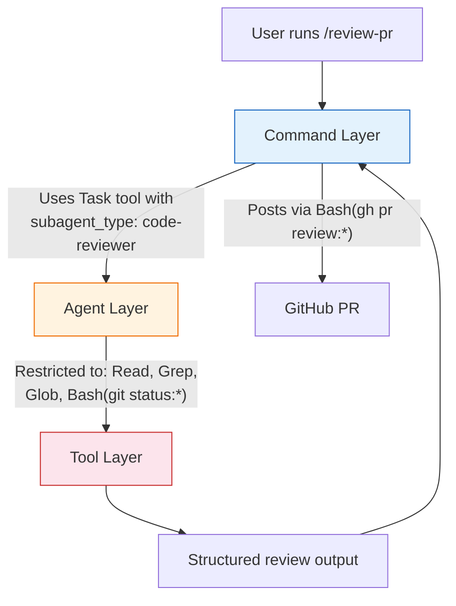
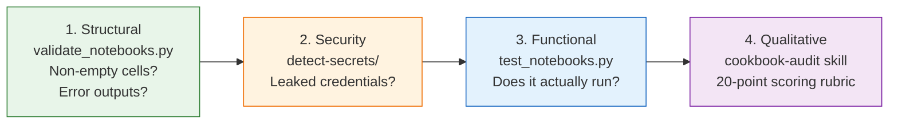

# Claude Cookbooks

[`anthropics/claude-cookbooks`](https://github.com/anthropics/claude-cookbooks) | ~34k stars | MIT | Cookbook
Platforms: Claude Code, Claude API, Claude.ai

> Anthropic's official tutorial and reference cookbook for Claude — agentic patterns, tool use, context management, and how Anthropic configures Claude Code for their own repo with slash commands, tool-restricted agents, and a four-layer validation hierarchy.
>
> **Key concepts:** Bash glob tool restrictions, three-level delegation chain, interactive vs CI command split, issue triage taxonomy, OODA loop, research budgets, four-layer validation hierarchy, registry system, XML tags as structured output

## Overview

[`anthropics/claude-cookbooks`](https://github.com/anthropics/claude-cookbooks) is Anthropic's official cookbook of tutorials and reference implementations for Claude. The repo covers the Claude API surface: agentic patterns, tool use, context management, extended thinking, multimodal capabilities, and third-party integrations.

The repo serves two distinct purposes:

1. **Tutorial collection** — copy-paste-ready notebooks teaching Claude API patterns, from basic tool calling to multi-agent orchestration
2. **Self-referential production example** — the `.claude/` directory shows how Anthropic configures Claude Code to manage the repo itself, with slash commands, agents, skills, and automated PR workflows

The second purpose is the more valuable one for agent designers. The `.claude/` configuration is a working example of command-level tool restrictions, subagent delegation, structured review automation, and quality enforcement at scale. Every cookbook is tracked in a `registry.yaml` with metadata, validated by a four-layer hierarchy from structural checks to qualitative scoring rubrics.

## Agentic Design Patterns

The `patterns/agents/` directory contains the official reference implementation for Anthropic's ["Building Effective Agents"](https://www.anthropic.com/research/building-effective-agents) blog post. These are the canonical patterns.

### Foundation

Two functions form the minimal building blocks for every workflow:

- **`llm_call(prompt, system_prompt, model)`** — single API call wrapper
- **`extract_xml(text, tag)`** — regex-based XML tag extractor

XML tags are the universal structured output mechanism across the entire repo. Every multi-step pattern uses them for inter-step communication.

### Pattern Catalog

| Pattern | Notebook | Mechanism |
|---|---|---|
| **Prompt chaining** | `basic_workflows.ipynb` | Sequential LLM calls; each step feeds the next |
| **Parallelization** | `basic_workflows.ipynb` | `ThreadPoolExecutor`-based concurrent LLM calls |
| **Routing** | `basic_workflows.ipynb` | LLM classifies input via XML tags → selects downstream prompt |
| **Evaluator-optimizer** | `evaluator_optimizer.ipynb` | Generate → evaluate (PASS/FAIL + feedback) → refine loop |
| **Orchestrator-workers** | `orchestrator_workers.ipynb` | Central orchestrator generates subtask XML → workers execute independently |

### Research Agent System

The most production-quality content in the repo. Two prompt files define a complete multi-agent research system:

**Lead agent** (`research_lead_agent.md`):
- Structured reasoning: assessment → classification → planning → execution
- Query type taxonomy: depth-first, breadth-first, straightforward
- Subagent count heuristics: 1 simple, 2–3 standard, 3–5 medium, 5–10 high complexity (max 20)
- Bayesian reasoning directive: "update your priors"
- Parallel tool call mandate for subagent creation

**Subagent** (`research_subagent.md`):
- OODA loop (Observe, Orient, Decide, Act) as core research cycle
- Explicit research budgets: minimum 5, max ~15–20 tool calls
- Source quality evaluation built into instructions
- `complete_task` tool call pattern for structured reporting

### Agent SDK Tutorials

Three progressive notebooks in `claude_agent_sdk/`:

| Notebook | Pattern | Key Technique |
|---|---|---|
| 00: Research Agent | Single agent + web search | `async for msg in query(prompt, options)` |
| 01: Chief of Staff | Multi-agent orchestration | `allowed_tools=["Task"]` for subagent delegation |
| 02: Observability | MCP server integration | GitHub MCP (100+ tools), Git MCP (13+ tools) |

The Chief of Staff notebook demonstrates: CLAUDE.md for persistent instructions, hooks for compliance tracking, plan mode for strategic planning without execution, and custom slash commands.

## How Anthropic Configures Claude Code

The `.claude/` directory is the most instructive part of the repo — it shows how Anthropic uses Claude Code to manage their own cookbook.

### CLAUDE.md Project Configuration

The `CLAUDE.md` configures code style (Ruff, line length 100), dependency management (uv-only), notebook conventions (keep outputs, one concept per notebook), and git workflow (conventional commits). See the [repo's CLAUDE.md](https://github.com/anthropics/claude-cookbooks/blob/main/CLAUDE.md) for the full configuration.

### Command-Level Tool Restrictions

Every slash command declares exact tool access in `allowed-tools` frontmatter. The principle is **least-privilege via Bash glob patterns** — each command gets exactly the shell operations its workflow requires. For example:

- `/notebook-review` can run `Bash(gh pr comment:*)` and `Bash(gh pr diff:*)` but not arbitrary shell commands
- `/review-pr` adds `Task` (for subagent delegation) and `AskUserQuestion` (for human-in-the-loop confirmation)
- `/review-pr-ci` is identical to `/review-pr` minus `AskUserQuestion` — the deployability gradient pattern

See the [repo's `.claude/commands/`](https://github.com/anthropics/claude-cookbooks/tree/main/.claude/commands) for the full set of 7 commands and their tool restrictions.

### Three-Level Delegation Chain

The PR review workflow reveals a three-level architecture where each level operates with tighter constraints than the one above:



| Level | Role | Constraints |
|---|---|---|
| **Command** | User-facing interface; manages workflow, posts results | All PR-related tools + Task for delegation |
| **Agent** | Specialist analysis (code-reviewer.md) | Read, Grep, Glob, Bash, `Bash(git status:*)` |
| **Tools** | Primitives | Each glob-restricted to specific operations |

The command orchestrates; the agent analyzes; tools execute. The agent has general `Bash` access but no GitHub CLI tools — only the command can post to GitHub. The command decides what to do with the agent's findings.

### Interactive vs CI Command Split

`/review-pr` and `/review-pr-ci` are the same workflow with one key difference: the CI version removes `AskUserQuestion` and auto-posts the review.

| Mode | Includes `AskUserQuestion` | Behavior |
|---|---|---|
| **Interactive** (`/review-pr`) | Yes | Present findings → ask approval → user confirms action |
| **CI** (`/review-pr-ci`) | No | Determine action autonomously → post directly |

This establishes a **deployability gradient** — identical logic with different autonomy levels. The pattern generalizes: any interactive command can produce a CI variant by removing the human-in-the-loop tool and adding autonomous decision logic.

### Code Reviewer Agent

The `.claude/agents/code-reviewer.md` defines a full senior engineer persona:

- **Checklist:** comprehensive review covering intro quality, prerequisites, code quality, Python patterns, package management, testing, security, CI/CD, commits, conclusions, and repo-specific patterns
- **Anti-pattern detection** for common cookbook mistakes
- **Structured feedback:** Critical / Important / Suggestions / Positive
- **Tool restrictions:** Read, Grep, Glob, Bash, `Bash(git status:*)`

### Dynamic Validation Against Live Documentation

The `/model-check` command fetches the current model list from a live URL at runtime:

```
First, fetch the current list of allowed models from:
https://docs.claude.com/en/docs/about-claude/models/overview.md
```

It then validates that all model references use current public models, flags deprecated versions, flags internal names, and suggests `-latest` aliases for maintainability. The constraint evolves without changing the command — dynamic validation against an authoritative source rather than a hardcoded list.

## Issue Triage Taxonomy

The `/review-issue` command defines a complete classification system for community management:

| Type | Action |
|---|---|
| **Spam/Noise** | Close without comment; flag security concerns |
| **Bug Report** | Acknowledge, verify, invite PR with signed commits |
| **Cookbook Proposal** | Evaluate criteria (Claude API focus? Educational? Differentiated?); invite reframing if needed |
| **Question** | Answer directly; link to docs.claude.com and Discord |
| **Community Resource** | Redirect to Discord #share-your-project or r/ClaudeAI |
| **Duplicate** | Reference original; close |

Labels: `bug`, `enhancement`, `question`, `documentation`, `duplicate`, `wontfix`, `good first issue`.

Tone guidelines from the command: *"Be professional, friendly, and concise. Be direct but not dismissive when declining proposals. Don't over-explain or be overly apologetic."*

## Cookbook Audit Skill

The `.claude/skills/cookbook-audit/` directory contains a structured quality rubric:

- **`SKILL.md`** — comprehensive audit instructions
- **`style_guide.md`** — canonical templates with good/bad examples
- **`validate_notebook.py`** — automated checks (detect-secrets, structure validation)
- **20-point scoring rubric:** Narrative Quality (5) + Code Quality (5) + Technical Accuracy (5) + Actionability (5)
- Based on the Diataxis framework ("Action + Understanding")
- Anti-pattern catalog for introductions, setup, code presentation, conclusions

## Registry System

Every published cookbook is tracked in `registry.yaml` with structured metadata:

```yaml
- title: "Cookbook Title"
  description: "15-20 word description"
  path: "category/notebook.ipynb"
  authors: ["contributor-handle"]
  date: "2026-01-15"
  categories: ["tool-use"]  # from 12-option enum
  difficulty: beginner | intermediate | advanced  # optional
  archived: false  # soft-deletion
```

An `authors.yaml` maps contributor handles to display names and avatar URLs (defaulting to `https://github.com/<username>.png`).

The `/add-registry` command automates metadata entry: read the notebook → check author in `authors.yaml` → generate registry entry → show for user approval → append maintaining alphabetical order.

## Four-Layer Validation Hierarchy

The repo validates content through four progressively deeper layers:



| Layer | Tool | Checks |
|---|---|---|
| **Structural** | `validate_notebooks.py` | Non-empty cells, no error outputs |
| **Security** | `detect-secrets/` | No leaked API keys or credentials |
| **Functional** | `test_notebooks.py` (pytest + tox) | Notebooks execute without errors |
| **Qualitative** | Cookbook-audit skill | 20-point rubric: narrative, code, accuracy, actionability |

The first three layers are automated in CI. The fourth is applied by Claude through the audit skill.

## Tool Use Patterns

### Core Patterns

The repo includes 8 tool-use notebooks covering the full spectrum from basic tool definition to advanced patterns. The most transferable:

| Notebook | Pattern |
|---|---|
| `extracting_structured_json.ipynb` | Tool use as structured output mechanism |
| `parallel_tools.ipynb` | Batch tool meta-pattern for parallel calls |
| `programmatic_tool_calling_ptc.ipynb` | Claude writes code that calls tools (reduced latency) |

See the [`tool_use/` directory](https://github.com/anthropics/claude-cookbooks/tree/main/tool_use) for the full set.

### Tool Search with Embeddings

`tool_search_with_embeddings.ipynb` — when you have thousands of tools, embed descriptions and search for relevant ones, passing only top-k matches to Claude. Scales tool access beyond the context window limit.

### Memory Tool

Production-ready implementation in `memory_tool.py`:
- File-based storage at `/memories/` path
- CRUD commands: `view`, `create`, `str_replace`, `insert`, `delete`, `rename`
- Path validation prevents directory traversal attacks
- Cross-session learning demonstrated across three sessions: learn patterns → store → apply in new session → manage context growth in long session

## Context Window Management

Three complementary approaches — a distinctive strength of the cookbook:

### 1. Automatic SDK Compaction

```python
compaction_control={"enabled": True, "context_token_threshold": 5000}
```

Pauses when tokens exceed threshold → injects summary request → Claude generates summary → clears history, keeps summary → continues. **21% token savings** demonstrated on a 5-ticket processing pipeline.

Threshold guidelines: Low (5–20k) for iterative processing, Medium (50–100k) for multi-phase workflows, High (100k+) for context-heavy tasks.

### 2. Proactive Session Memory

Background threading pattern: `InstantCompactingChatSession` builds memory in background after each turn, swapping instantly when context limit is hit. **88% token reduction** (12,847 → 1,526 tokens) with instant swap vs 40+ seconds for reactive compaction.

### 3. Context Editing (API-Level)

Fine-grained control over what stays in context:

```python
context_management = {
    "edits": [
        {"type": "clear_thinking_20251015",
         "trigger": {"type": "input_tokens", "value": 8000}},
        {"type": "clear_tool_uses_20250919",
         "trigger": {"type": "input_tokens", "value": 30000},
         "keep": {"type": "tool_uses", "value": 3}}
    ]
}
```

Automatically clears old thinking blocks and tool results at thresholds, preserving long-term memory files.

## Command Output Format Conventions

A consistent format across all review commands:

```markdown
### PR Review
**Recommendation**: APPROVE | REQUEST_CHANGES | COMMENT

### Summary
[1-2 sentence overview]

<details>
<summary>Actionable Feedback (N items)</summary>

- [ ] `file.py:42` - Description
- [ ] `notebook.ipynb` (in cell with `some_code = ...`) - Description

</details>

<details>
<summary>Detailed Review</summary>

### Code Quality
### Security
### Suggestions
### Positive Notes

</details>
```

Design decisions:
- **Checkboxes** for trackable actionable items
- **Collapsible `<details>`** for noise reduction on GitHub
- **Code snippets instead of cell numbers** for Jupyter references (cells can shift)
- `gh pr review` produces no output on success — documented to prevent unnecessary retries

## Cross-Cutting Design Principles

The cookbook embeds consistent philosophies across all content:

1. **Problem-first framing** — lead with the problem, not the technology
2. **Action + Understanding** — primarily action-oriented, strategically teach "why"
3. **Transferable knowledge** — patterns that apply beyond the specific example
4. **One concept per notebook** — focused teaching units
5. **Copy-paste ready** — code designed for direct integration

### Recurring Technical Patterns

- **XML tags** as the universal structured output mechanism
- **`llm_call()` + `extract_xml()`** as minimal building blocks (two functions to build any workflow)
- **Agent loops with `stop_reason` checking** — process tool_use blocks, return results, loop
- **Background threading** for non-blocking operations (session memory updates)
- **Token-threshold triggers** for context management transitions
- **Subagent delegation via `Task` tool** — both in Agent SDK and Claude Code commands

## References

- [anthropics/claude-cookbooks](https://github.com/anthropics/claude-cookbooks) — primary repository
- [Building Effective Agents](https://www.anthropic.com/research/building-effective-agents) — Anthropic blog post; the `patterns/agents/` directory is the reference implementation
- [Claude API documentation](https://docs.claude.com/) — official API docs
- [Anthropic developer documentation](https://docs.claude.com/claude/docs/guide-to-anthropics-prompt-engineering-resources) — prompt engineering resources
- [Anthropic Discord](https://www.anthropic.com/discord) — community support

## See Also

- [copilot-awesome.md](copilot-awesome.md) — awesome-copilot community collection; different philosophy (breadth over quality enforcement)
- [anthropic-skills.md](anthropic-skills.md) — Anthropic's official skill implementations; the cookbook's audit skill uses the same SKILL.md format
- [gsd.md](gsd.md) — GSD framework; shares the fresh-context-per-task philosophy and research budgets
- [../patterns/delegation-and-subagents.md](../patterns/delegation-and-subagents.md) — delegation patterns; the three-level chain is a concrete implementation
- [../patterns/behavioral-rules.md](../patterns/behavioral-rules.md) — behavioral constraint patterns; the anti-pattern catalog and tone guidelines are examples
- [../vscode/hooks-and-lifecycle.md](../vscode/hooks-and-lifecycle.md) — hooks and lifecycle; the CI command split is a related deployability gradient pattern
