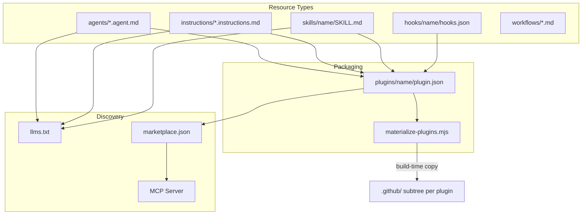
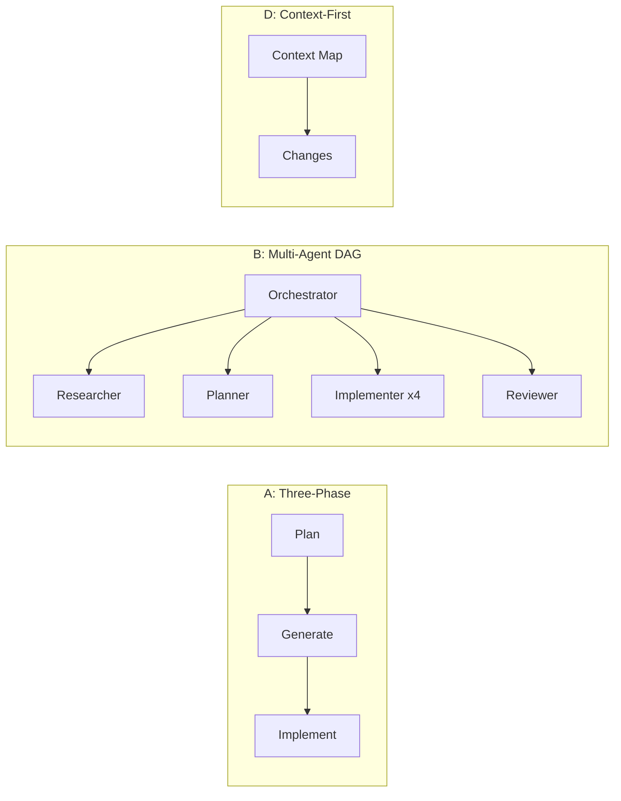

# Awesome Copilot

[`github/awesome-copilot`](https://github.com/github/awesome-copilot) | ~23k stars | MIT | Community Collection
Platforms: GitHub Copilot, VS Code, Visual Studio, Copilot CLI

> GitHub's official community-curated marketplace of agents, instructions, skills, hooks, plugins, and workflows for customizing GitHub Copilot. 23k+ stars, 270+ contributors, MIT licensed.
>
> **Key concepts:** resource type conventions, plugin materialization, hooks governance tiers, llms.txt discovery, filesystem as state machine, constraint > capability, cross-tool sync

## Overview

[Awesome Copilot](https://github.com/github/awesome-copilot) is GitHub's official community-curated collection of customizations for GitHub Copilot. It is the largest open repository of Copilot agents, instructions, skills, hooks, plugins, and workflows. It functions as both a marketplace (install resources into your editor) and a reference architecture for how large-scale Copilot customization ecosystems are built.

The repository is organized around a convention-over-configuration principle: every resource is a plain Markdown file with YAML frontmatter. No proprietary formats, no SDKs, no build dependencies for individual resources. The entire system is built on naming conventions that VS Code's Copilot natively understands.

At scale, the repo contains roughly **130+ agents**, **120+ instructions**, and **150+ skills** — numbers visible through its published `llms.txt` machine-readable index. It also ships an MCP server for searching and installing resources directly from VS Code.

## Repository Architecture and Resource Types

The repo defines a set of resource types, each with its own directory, naming convention, and frontmatter schema:

| Resource | Directory | Naming Convention | Key Frontmatter |
|---|---|---|---|
| **Agents** | `agents/` | `*.agent.md` | `description`, optional `name`, `tools[]`, `model` |
| **Instructions** | `instructions/` | `*.instructions.md` | `description`, `applyTo` (glob pattern) |
| **Skills** | `skills/{name}/` | `SKILL.md` + optional subdirs | `name` (max 64 chars), `description` (max 1024 chars) |
| **Hooks** | `hooks/{name}/` | `hooks.json` + scripts | `name`, `description`, event bindings |
| **Plugins** | `plugins/{name}/` | `plugin.json` + `.github/` subtree | `name`, `description`, `version`, resource references |
| **Workflows** | `workflows/` | Markdown with YAML frontmatter | `schedule`, `tools`, `safe-outputs` |
| **Cookbook** | `cookbook/` | Schema-validated YAML manifest | `id`, `name`, `languages[]`, `recipes[]` |

Additionally, `eng/` holds build scripts, `.schemas/` holds JSON Schema validation files, and `website/` powers the Astro-based project site.

Every resource file must pass schema validation at build time. The validation constants are centralized in `eng/constants.mjs` — for example, skill names max at 64 characters and descriptions at 1024.



## The Plugin System and Build-Time Materialization

Plugins are the primary distribution unit. A plugin bundles related agents, instructions, skills, and hooks into an installable package defined by a `plugin.json` manifest:

```json
{
  "name": "structured-autonomy",
  "description": "Three-phase autonomous workflow",
  "version": "1.0.0",
  "author": { "name": "..." },
  "keywords": ["workflow", "autonomy"],
  "agents": ["./agents/sa-plan.md"],
  "commands": ["./commands/sa-generate.md"],
  "skills": ["./skills/structured-autonomy-plan/"],
  "instructions": ["./instructions/spec-driven.md"],
  "hooks": ["./hooks/governance-audit/"]
}
```

All paths are plugin-relative, referencing shared resources in the monorepo. At build time, `materialize-plugins.mjs` resolves these references and copies files into each plugin's `.github/` directory structure — producing standalone installable packages from zero-copy references:

```
Source (monorepo)              →  Materialized (per-plugin)
agents/sa-plan.agent.md        →  plugins/structured-autonomy/.github/agents/sa-plan.agent.md
skills/structured-autonomy/    →  plugins/structured-autonomy/.github/skills/structured-autonomy/
```

This is the build-time resolution pattern: distributed authoring → centralized build → validated output. Plugin authors reference shared resources; the build produces self-contained packages. The `strict` field in `plugin.json` controls whether the plugin boundary is open (permissive, `false`) or closed (only listed resources, `true`).

Notable plugins span a range of architectures — from `structured-autonomy` (3-phase workflow, 0 agents, 3 commands) to `gem-team` (8-agent DAG orchestration) to `project-planning` (7 agents, 8 commands for full project lifecycle).

## Hooks System and Governance Tiers

Hooks are event-driven scripts that run at specific lifecycle points in Copilot coding agent sessions. Each hook set is defined in `hooks.json`:

```json
{
  "version": 1,
  "hooks": [
    {
      "event": "userPromptSubmitted",
      "script": "./scripts/prompt-check.sh",
      "cwd": ".",
      "timeout": 3000,
      "env": {
        "GOVERNANCE_LEVEL": "standard",
        "BLOCK_ON_THREAT": "true"
      }
    }
  ]
}
```

**Supported events:** `sessionStart`, `sessionEnd`, `userPromptSubmitted`, `preToolUse`, `postToolUse`, `errorOccurred`.

### The Governance-Audit Hook

The flagship hooks example implements a "security firewall for AI" with:

- **5 threat categories:** data exfiltration, privilege escalation, system destruction, prompt injection, credential exposure
- **4 governance tiers** controlling response severity:

| Tier | Behavior |
|---|---|
| **open** | Log only — threats recorded, never blocked |
| **standard** | Block high-severity threats |
| **strict** | Block medium-severity and above |
| **locked** | Block all detected threats |

The implementation uses pure shell scripts (bash) with no external dependencies, no network calls (air-gapped safe), and an append-only JSON audit log for compliance. This tiered governance model is a reusable design pattern for behavioral constraints — configure the level per environment rather than hard-coding policy.

## Agent Architecture Patterns

Examining the contributed agents reveals six recurring architecture patterns:

### Pattern A: Three-Phase Workflow with Model Specialization

A **plan → generate → implement** pipeline where each phase is a separate skill. The skills themselves are model-agnostic (no model specified in the SKILL.md files), but the pattern is designed for model specialization — using a stronger model for planning and a cheaper one for mechanical implementation:

| Phase | Role |
|---|---|
| Plan | Strategic planner — research via `runSubagent`, 80% confidence threshold |
| Generate | Code generator — reads plan, outputs copy-paste-ready implementation doc |
| Implement | Executor — follows implementation doc exactly, stops at STOP instructions |

The implementer is deliberately constrained: *"DO NOT WRITE ANY CODE OUTSIDE OF WHAT IS SPECIFIED IN THE PLAN."*

### Pattern B: Multi-Agent DAG Orchestration

An 8-agent team (Gem Team) with a pure orchestrator (`disable-model-invocation: true` — no LLM calls, just delegation). Up to 4 concurrent tasks via `runSubagent`, with DAG-based dependency tracking.

### Pattern C: Three-Agent Workflow

Simpler orchestration (RUG pattern): orchestrator coordinates, SWE subagent implements, QA subagent validates.

### Pattern D: Context-First Architecture

The Context Architect agent maps context **before** any changes — enumerating primary files (directly modified), secondary files (affected), test coverage, patterns to follow, and suggested sequence. The context map is shown to the user before proceeding.

### Pattern E: Research Spike

Deep investigation via the Research Technical Spike agent: 5-phase process (Investigation Planning → Spike Analysis → Documentation Research → Code Analysis → Experimental Validation). Uses granular todo management, citation requirements, and a living spike document.

### Pattern F: Repo Architect

The Repo Architect agent manages Copilot configuration itself using a three-layer model: Foundation (system context) → Specialists (agents) → Capabilities (skills/tools). Commands: `/bootstrap`, `/validate`, `/migrate`, `/sync`, `/suggest`.



## Instruction Patterns

Six notable instruction patterns address different workflow needs:

**Spec-Driven Workflow V1** — A 6-phase loop (ANALYZE → DESIGN → IMPLEMENT → VALIDATE → REFLECT → HANDOFF) maintaining 3 living artifacts. Includes confidence scoring: >85% proceed, 66–85% research first, <66% ask user. Applied globally via `applyTo: '**'`.

**Memory Bank** — Persistent memory surviving session resets via 6 core files in `memory-bank/` (`projectbrief.md`, `productContext.md`, `activeContext.md`, `systemPatterns.md`, `techContext.md`, `progress.md`). Two modes: Plan Mode (reads all memory, creates/updates tasks) and Act Mode (implements tasks, updates progress).

**Copilot Thought Logging** — Creates a visible `Copilot-Processing.md` file as a real-time progress log. All progress tracked in the file, not chat. Key rule: *"Work silently without announcements until complete."*

**TaskSync V5** — Continuous-operation protocol that turns Copilot into a persistent terminal agent using a never-ending task input loop. 20 "primary directives" ensuring the agent never terminates.

**Context Engineering** — Guidelines for structuring code to maximize Copilot effectiveness: descriptive file paths, colocated code, explicit types, strategic comments, a `COPILOT.md` architecture file.

**Task Implementation** — Applied to `.copilot-tracking/changes/*.md` with a 7-step process reading plans from `.copilot-tracking/plans/**`.

## Skill System

Skills are the most structured resource type. Each skill lives in its own directory:

```
skills/{name}/
├── SKILL.md            # Required — instructions + frontmatter
├── references/         # Optional — static reference material
├── sample_codes/       # Optional — code examples
└── assets/             # Optional — images, templates
```

The `description` field in frontmatter is the **primary triggering mechanism** — what the AI reads to decide whether to activate the skill. Names must match the folder name, max 64 characters. Descriptions are 10–1024 characters.

The `microsoft-skill-creator` skill demonstrates the full lifecycle: Investigate (using Microsoft Learn MCP tools) → Clarify requirements → Generate SKILL.md → Balance local vs. dynamic content (local for stable knowledge, dynamic for changing APIs) → Validate against schema.

Skills support `context: fork` for isolated execution. The `references/` and `sample_codes/` subdirectories enable progressive disclosure — keep the SKILL.md focused while bundling supporting material.

## Machine Discovery via llms.txt

The repo publishes an [`llms.txt`](https://github.github.io/awesome-copilot/llms.txt) file following the [llmstxt.org](https://llmstxt.org/) specification. This machine-readable endpoint lists every resource with raw download URLs, organized by type:

```
# Awesome GitHub Copilot

### Agents
- [.NET Upgrade](https://raw.githubusercontent.com/.../agents/dotnet-upgrade.agent.md): ...
- [4.1 Beast Mode](https://raw.githubusercontent.com/.../agents/4.1-Beast.agent.md): ...
...

### Instructions
...

### Skills
...
```

Two companion prompts enable other projects to adopt the pattern:
- `create-llms.prompt.md` — scaffolds a new `llms.txt` from repo structure
- `update-llms.prompt.md` — updates an existing `llms.txt` after documentation changes

The `context7.json` file at the repo root also registers the repo with Context7's knowledge system, enabling dual-protocol machine discovery.

## Cross-Tool Resource Discovery

Four self-referential "suggest" prompts analyze your repo and recommend matching resources from awesome-copilot (agents, instructions, prompts, skills), avoiding duplicates with existing config. This is the distribution mechanism — install one prompt, get recommendations for everything else.

## Persistent Memory System

Two prompts implement a cross-session memory lifecycle:

**`/remember`** — Transforms lessons into domain-organized memory instruction files:
```
/remember >domain [scope] lesson clue
```
Where scope is `global` (default), `user`, `workspace`, or `ws`.

**`/memory-merger`** — Merges mature lessons from domain memory files into consolidated instruction files:
```
/memory-merger >domain [scope]
```

This creates a memory lifecycle: **observe → remember → merge**.

## Agentic Workflows

Agentic Workflows are AI-powered repository automations running coding agents in GitHub Actions. Defined in markdown with YAML frontmatter, they support event-triggered and scheduled automation:

```yaml
schedule: weekly
tools:
  github:
    toolsets: [repos]
safe-outputs:
  create-issue:
    max: 1
    close-older-issues: true
```

The `tools:` block declares which GitHub MCP toolsets the agent can access. `safe-outputs:` constrains what the agent can create — declarative safety bounds for AI-driven CI.

## Cross-Cutting Themes

Three design principles run through the entire ecosystem:

### Filesystem as State Machine

Nearly every workflow uses the filesystem to track state rather than databases or external services:
- Structured Autonomy: `plans/{feature}/plan.md` → `implementation.md`
- Gem Team: `docs/plan/{plan_id}/plan.yaml` with status fields
- Task Implementation: `.copilot-tracking/plans/`, `.copilot-tracking/changes/`
- Memory Bank: `memory-bank/*.md`
- Thought Logging: `Copilot-Processing.md`

Phase detection works from file existence. No `plan.yaml`? Must be research phase. Plan + pending tasks? Execution phase. All tasks done? Completion phase.

### Constraint > Capability

The most effective agents are the most constrained:
- *"DO NOT WRITE ANY CODE OUTSIDE OF WHAT IS SPECIFIED IN THE PLAN"*
- *"NEVER execute tasks directly"* (orchestrator that only delegates)
- *"Direct answers in ≤3 sentences"*
- *"Stop at 80% confidence"*
- Forbidden phrase lists, specific model locks per phase, tool restrictions per command

### Schema Validation Everything

JSON Schema (draft-07) validates all manifests — `collection.schema.json`, `cookbook.schema.json`, `tools.schema.json`. Build fails if schemas don't match. The `tools.schema.json` also catalogs the broader Copilot ecosystem, classifying entries as MCP Servers, VS Code Extensions, CLI Tools, or Visual Studio Extensions with inline configuration snippets.

## References

- [github/awesome-copilot](https://github.com/github/awesome-copilot) — source repository
- [llms.txt](https://github.github.io/awesome-copilot/llms.txt) — machine-readable resource index
- [Awesome Copilot MCP Server announcement](https://developer.microsoft.com/blog/announcing-awesome-copilot-mcp-server) — official blog post
- [llmstxt.org](https://llmstxt.org/) — llms.txt specification
- [VS Code Copilot Customization docs](https://code.visualstudio.com/docs/copilot/copilot-customization) — official documentation for the file conventions
- [CONTRIBUTING.md](https://github.com/github/awesome-copilot/blob/main/CONTRIBUTING.md) — contribution guidelines and file specs
- [AGENTS.md](https://github.com/github/awesome-copilot/blob/main/AGENTS.md) — project overview for AI agents

## See Also

- [anthropic-skills.md](anthropic-skills.md) — Anthropic skills system (compare skill design patterns)
- [claude-cookbooks.md](claude-cookbooks.md) — Claude cookbooks (compare command-level tool restrictions)
- [gsd.md](gsd.md) — GSD framework (referenced three-phase and fresh-context patterns)
- [../vscode/customization-overview.md](../vscode/customization-overview.md) — VS Code customization (the runtime these resources target)
- [../vscode/hooks-and-lifecycle.md](../vscode/hooks-and-lifecycle.md) — hooks system (detailed lifecycle event documentation)
- [../patterns/behavioral-rules.md](../patterns/behavioral-rules.md) — behavioral constraint patterns (the "constraint > capability" principle)
- [../vscode/instructions-and-skills.md](../vscode/instructions-and-skills.md) — VS Code instruction and skill activation mechanics
