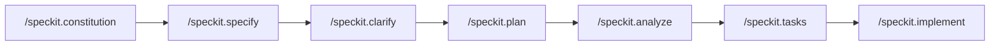

# Spec Kit

[`github/spec-kit`](https://github.com/github/spec-kit) | MIT | Toolkit | Version 0.1.13 | Last verified: 2026-03-05
Platforms: Claude Code, GitHub Copilot, Cursor, Windsurf, Gemini CLI, Codex CLI, Kilo Code, Roo Code, OpenCode, Aider

> GitHub's open-source Spec-Driven Development toolkit that scaffolds structured specifications and implementation plans across 20+ AI coding agents, treating specs as the primary artifact and code as generated output.
>
> **Key concepts:** specify CLI, Spec-Driven Development (SDD), constitution, slash commands, agent-agnostic specs, template-driven quality

## Overview

Spec Kit is an open-source toolkit by GitHub (the company) for practicing Spec-Driven Development (SDD). It provides a Python CLI (`specify`) that scaffolds structured project specifications, along with slash commands that guide an AI agent through a full specification → planning → tasking → implementation pipeline [1]. It supports 20+ AI coding agents as of v0.1.13 [1].

The repo lives at [github/spec-kit](https://github.com/github/spec-kit) — MIT licensed, Python-based, installed via `uv` [1]. The project is "heavily influenced by and based on the work and research of John Lam" (per the repo's Acknowledgements) [1]. Primary maintainers include @localden (Den Delimarsky) and @mnriem [1].

The core philosophy is **specifications as the primary artifact**: define what you want to build in structured, template-driven documents, then let the AI agent of your choice generate the implementation [2]. This makes Spec Kit a *project delivery methodology* rather than an *agent behavior system*.

## Spec-Driven Development (SDD)

Spec Kit is the reference implementation of a methodology its authors call Specification-Driven Development [2]. The central thesis — what the spec-driven.md document calls "The Power Inversion" — is that specifications should drive code, not the other way around [2]:

> Specifications don't serve code — code serves specifications. The Product Requirements Document isn't a guide for implementation; it's the source that generates implementation.

Key principles of SDD [2]:

- **Specifications are the lingua franca.** The spec is the primary artifact. Code is its expression in a particular language and framework. Maintaining software means evolving specifications.
- **Executable specifications.** Specs must be precise, complete, and unambiguous enough to generate working systems. This eliminates the gap between intent and implementation.
- **Continuous refinement.** AI analyzes specifications for ambiguity, contradictions, and gaps as an ongoing process — not a one-time gate.
- **Multi-step refinement over one-shot generation.** SDD uses a phased workflow (specify → plan → tasks → implement) rather than going directly from prompt to code.
- **Template-driven quality.** Templates constrain LLM output toward higher quality: preventing premature implementation details, forcing uncertainty markers (`[NEEDS CLARIFICATION]`), and enforcing test-first thinking.

## How It Works

### Installation and Project Initialization

Spec Kit is a Python CLI (`specify`) installed via [uv](https://docs.astral.sh/uv/) [1]. The `specify init` command scaffolds a project with spec templates, slash commands, and agent-specific config for your chosen platform (`--ai copilot`, `--ai claude`, etc.) [1] [3]. See the [Spec Kit README](https://github.com/github/spec-kit#readme) for installation prerequisites and the full `specify init` option reference.

### The Slash Command Workflow

After initialization, your AI agent gains access to structured slash commands that form a phased pipeline [3]:



**Core commands:**

| Command | Purpose |
|---|---|
| `/speckit.constitution` | Create project governing principles and development guidelines |
| `/speckit.specify` | Define what you want to build — requirements, user stories, acceptance criteria |
| `/speckit.plan` | Create a technical implementation plan with tech stack and architecture choices |
| `/speckit.tasks` | Generate an actionable, dependency-aware task list from the plan |
| `/speckit.implement` | Execute all tasks to build the feature according to the plan |

**Optional quality commands:**

| Command | Purpose |
|---|---|
| `/speckit.clarify` | Identify and resolve underspecified areas (recommended before `/speckit.plan`) |
| `/speckit.analyze` | Cross-artifact consistency and coverage analysis (run after `/speckit.tasks`) |
| `/speckit.checklist` | Generate quality checklists that validate requirements completeness and clarity |

Each command reads the output of previous commands and builds on it [3]. The workflow produces a directory of versioned specification documents per feature [3]:

```
.specify/specs/003-chat-system/
├── spec.md              # Feature specification
├── plan.md              # Technical implementation plan
├── tasks.md             # Actionable task list
├── data-model.md        # Entity schemas
├── research.md          # Technical research
├── contracts/           # API contracts
└── quickstart.md        # Key validation scenarios
```

### The Constitution

The `/speckit.constitution` command creates a `.specify/memory/constitution.md` file containing immutable project principles [3]. The spec-driven.md document describes nine articles covering library-first design, CLI interface mandates, test-first development, simplicity constraints, and integration-first testing [2]. The constitution acts as architectural DNA — every subsequent specification and plan must comply with it [2].

This is Spec Kit's mechanism for preventing the "vibe coding" problem. Instead of letting the AI improvise architecture, the constitution constrains it: "Using framework features directly rather than wrapping them" (Article VIII), "Maximum 3 projects for initial implementation" (Article VII), "No implementation code shall be written before unit tests" (Article III) [2].

## Supported Agents

Spec Kit supports 20+ AI coding agents as of v0.1.13, including GitHub Copilot, Claude Code, Cursor, Gemini CLI, Codex CLI, and Windsurf [1]. A `--ai generic` option allows any agent with file-reading capability to consume specs by providing a custom command template directory [1]. See the [Spec Kit repo](https://github.com/github/spec-kit) for the full supported agent list.

## Agent-Agnostic Design

The agent-agnostic approach is Spec Kit's most distinctive design choice. By targeting the *specification layer* rather than the *execution layer*, it avoids the portability problems that plague framework-specific tools:

- **GSD** requires Claude Code's specific tool interface (`Read`, `Write`, `Bash`, `Task`) and has 84+ `@path` references that need rewriting for other platforms.
- **Squad** is tightly coupled to GitHub Copilot's SDK (`@github/copilot-sdk`) and custom agent tools (`squad_route`, `squad_decide`), plus GitHub Actions for autonomous workflows.
- **Spec Kit** produces documents and slash commands that any supported agent can consume [1]. Adding a new agent means writing a command template adapter — no core changes needed [1].

The trade-off: Spec Kit can't enforce execution discipline the way GSD does (planning locks, deviation rules, context budget management) or create persistent team dynamics the way Squad does (reviewer protocol, knowledge compounding). It defines the *what* but delegates the *how* entirely to the consuming agent.

## Positioning vs GSD and Squad

Spec Kit, GSD, and Squad solve fundamentally different problems:

| Dimension | Spec Kit | GSD | Squad |
|---|---|---|---|
| **Core purpose** | What to build (specification) | How to execute (phased delivery) | Who does what (team simulation) |
| **Agent model** | Single agent + slash commands | Fresh-context-per-task | Persistent named specialists |
| **Platform** | Agent-agnostic (20+ agents) | Claude Code (+ community ports) | GitHub Copilot |
| **What it controls** | Specification quality | Execution discipline | Coordination and memory |
| **State** | Git-committed `.specify/specs/` directory | Gitignored `.planning/` | Git-committed `.squad/` |
| **Multi-agent** | No | Yes (task-level via subagents) | Yes (5–8 named specialists) |
| **Quality mechanism** | Templates, constitution, checklists | Deviation rules, planning lock | Reviewer protocol, directives |
| **Project scale** | Greenfield through brownfield | Multi-phase projects | Multi-week team projects |

These frameworks are **complementary rather than competitive**. You could use Spec Kit to define a project specification, then hand the tasks to GSD for phased execution or Squad for team-based delivery. Spec Kit's `/speckit.constitution` concept maps to a project-level `copilot-instructions.md` — a convention any Copilot user can adopt without adopting the full toolkit.

## Template-Driven Quality

One of Spec Kit's most transferable ideas is how it uses templates to constrain LLM behavior [2]. The specification and plan templates act as sophisticated prompts that enforce quality:

1. **Preventing premature implementation.** The spec template instructs: "Focus on WHAT users need and WHY. Avoid HOW to implement." This keeps specs stable even as technologies change [2].
2. **Forcing explicit uncertainty.** Templates mandate `[NEEDS CLARIFICATION]` markers instead of plausible-sounding guesses. The LLM must flag what it doesn't know [2].
3. **Structured self-review.** Checklists ("No `[NEEDS CLARIFICATION]` markers remain", "Requirements are testable and unambiguous") force the LLM to validate its own output [2].
4. **Constitutional compliance gates.** Implementation plans include "Phase -1" gates that check simplicity and anti-abstraction principles before any code is written [2].
5. **Test-first ordering.** File creation order is enforced: contracts first, then tests, then implementation to make tests pass [2].

The compound effect: templates transform the LLM from a creative code generator into a disciplined specification engineer.

## Limitations

Spec Kit's agent-agnostic, specification-focused approach means it intentionally avoids:

- **Execution orchestration** — no fresh-context-per-task isolation, no wave-based parallelism, no subagent spawning. The slash commands are sequential and run in a single agent context [1].
- **Behavioral constraints** — no deviation rules, no autonomy zones, no confidence scoring. Agent behavior is shaped only by the specification documents and constitution [1].
- **Persistent agent memory** — specs are static documents written once per phase, not living state files that agents update as they work [1]. There is no per-session history accumulation.
- **Multi-agent coordination** — no coordinator, no routing rules, no reviewer protocols. Spec Kit is a single-agent workflow [1].
- **Context window management** — no monitoring of context consumption, no automatic state dumps, no fresh-session recommendations [1].

For projects that need these capabilities, Spec Kit is a *starting point* — define the specification and constitution, then hand off to a more opinionated execution framework.

One possible criticism: the specify → plan → tasks → implement pipeline is inherently sequential, and while `/speckit.clarify` and `/speckit.analyze` add feedback loops, the overall flow is more waterfall-shaped than iterative.

## References

- [1] [github/spec-kit](https://github.com/github/spec-kit) — repository
- [2] [Spec-Driven Development methodology](https://github.com/github/spec-kit/blob/main/spec-driven.md) — full SDD philosophy document
- [3] [Spec Kit documentation site](https://github.github.io/spec-kit/) — official docs
- [4] [Spec Kit video overview](https://www.youtube.com/watch?v=a9eR1xsfvHg) — YouTube walkthrough

## See Also

- [GSD](gsd.md) — execution-focused framework (complementary: use Spec Kit for specification, GSD for phased delivery)
- [Squad](squad.md) — multi-agent team simulation (different coordination model, also for Copilot)
- [Anthropic Skills](anthropic-skills.md) — Anthropic's skills system and `.claude/` conventions that Spec Kit generates for Claude Code
- [Customization Overview](../platforms/copilot/customization-overview.md) — VS Code's native customization system (how Copilot consumes instructions)
- [Instructions and Skills](../platforms/copilot/instructions-and-skills.md) — instruction hierarchies in VS Code Copilot
- [Behavioral Rules](../patterns/behavioral-rules.md) — constraint patterns including planning locks and execution gates
