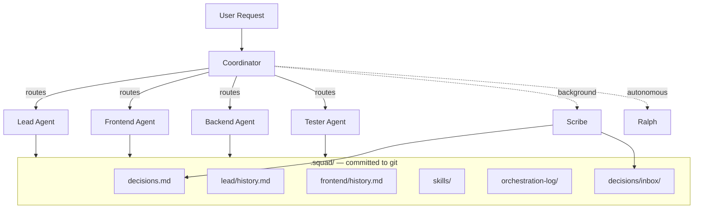
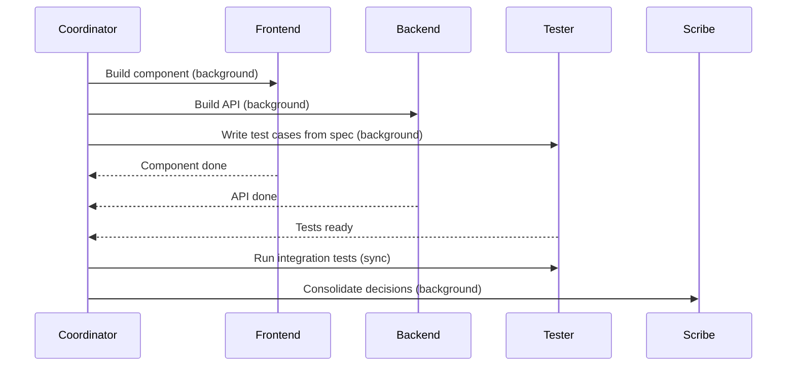

# Squad

[`bradygaster/squad`](https://github.com/bradygaster/squad) | v0.8.x alpha | Framework | Last verified: 2026-03-05
Platforms: GitHub Copilot, Copilot CLI, VS Code

> Multi-agent team simulator for GitHub Copilot that creates persistent named specialists with accumulated knowledge, coordinated by a thin orchestrator via filesystem-based shared memory.
>
> **Key concepts:** thin coordinator, fat workers, filesystem-as-memory, eager parallelism, reviewer protocol, decisions inbox, skill confidence lifecycle, Ralph (autonomous work monitor)

## Overview

Squad (by Brady Gaster) is a multi-agent team simulator for GitHub Copilot [1]. Its core thesis: **"It's not a chatbot wearing hats."** [1] Each team member runs in its own context window with its own charter, history, and tools [2]. The coordinator is deliberately thin — its job is routing and orchestration, not expertise [2]. Expertise lives in the specialist agents.

Where GSD gives you phased execution and Spec Kit gives you hierarchical instructions, Squad gives you a *team*. Named specialists (lead, frontend, backend, tester, scribe) persist across sessions, accumulate project knowledge, and coordinate through shared documents in a committed `.squad/` directory [5]. Anyone who clones the repo gets the team [5].

Squad runs on both Copilot CLI and VS Code [1]. It started as prompt-only orchestration (v0.5) and replatformed onto a TypeScript SDK (`@bradygaster/squad-sdk`) in v0.6+ [1], moving routing rules, tool validation, and governance from prompt text into compiled code [2]. As of v0.8.x, it includes an interactive shell, 15 CLI commands, 5 custom agent tools, a hook pipeline for governance enforcement, and the Ralph autonomous work monitor [1]. The project is experimental alpha software — APIs and file formats may change between releases [1].

The trade-off is complexity. Squad installs 5–8 agents, GitHub Actions workflows, a casting system, a scribe agent, and Ralph [2]. For a solo practitioner on two-day fixes, this is ceremonial overhead. For multi-week projects where you want the experience of coordinating a development team, it's compelling.

## Architecture



**Thin coordinator, fat workers.** The coordinator is deliberately lightweight — just routing rules and agent charters — leaving the bulk of the context window available for worker agents [2]. Each specialist agent gets its own 200K-token context window, so fanning out to 5 agents effectively gives you ~1M total tokens with no shared context bloat [2].

Since the SDK replatform (v0.6+), the coordinator is no longer just prompt text [1]. Routing is compiled TypeScript: `Router.matchRoute(message)` returns a typed result with agent, priority, and permissions [1]. Tools are validated before execution [1]. A `HookPipeline` enforces governance rules (file-write guards, PII scrubbing, reviewer lockout, ask-user rate limiting) *before* tool execution — not as prompt suggestions, but as code that blocks disallowed operations [1] [3].

The SDK also introduced five custom tools that let agents coordinate without returning control to the user: `squad_route` (hand off work), `squad_decide` (record a decision), `squad_memory` (append to agent history), `squad_status` (query session pool), and `squad_skill` (read/write skills) [2]. These tools enable agents to self-chain work without user intervention.

## The Charter Template

Squad's charter structure is one of its best-designed artifacts. Each specialist has a 7-section charter that defines identity, scope, and collaboration rules [2]:

```markdown
# {Name} — {Role}
> {One-line personality statement}

## Identity
- **Name:** / **Role:** / **Expertise:** / **Style:**

## What I Own
- {Area of responsibility 1–3}

## How I Work
- {Key approach or convention}

## Boundaries
**I handle:** {types of work}
**I don't handle:** {types of work belonging to others}
**When I'm unsure:** I say so and suggest who might know.

## Model
- **Preferred:** / **Rationale:** / **Fallback:**

## Collaboration
Before starting work, read `.squad/decisions.md` for team decisions.
After making a decision, write to `.squad/decisions/inbox/{name}-{slug}.md`

## Voice
{1–2 sentences. This agent has OPINIONS. Pushes back. Has a distinct style.}
```

The **Boundaries** section is especially powerful — explicit "I don't handle" lists make handoff triggers clear and prevent agents from wandering into each other's domains. The **Collaboration** section ensures every agent starts with current team knowledge by reading the shared decisions document before working [5].

Agents are cast from fictional universes (The Usual Suspects, Alien) via a `CastingEngine` [2]. Names are cosmetic but persistent — the same agent accumulates knowledge across sessions [5]. The casting registry persists in `.squad/casting/`, and alumni agents are archived (not deleted) when removed from the team [2].

## Memory System

Squad has the most layered memory system of any Copilot-native framework surveyed [5]:

| Layer | File | Purpose | Update Frequency |
|---|---|---|---|
| **Charter** | `{agent}/charter.md` | Identity, expertise, boundaries | Rarely (identity is stable) |
| **History** | `{agent}/history.md` | Learned knowledge per agent | After every session |
| **Decisions** | `decisions.md` | Team-wide policies and architectural choices | After substantial work |
| **Decisions Inbox** | `decisions/inbox/{agent}-{slug}.md` | Parallel write drop-box | During multi-agent work |
| **Skills** | `skills/SKILL.md` | Reusable patterns with confidence levels | As patterns emerge |
| **Session Log** | `log/` | Full session history | Every session |
| **Orchestration Log** | `orchestration-log/` | Per-spawn routing rationale | Every agent spawn |

**Filesystem as memory.** All state lives in `.squad/`, committed to git [5]. This is a fundamental design choice — team knowledge is a repo artifact, not ephemeral session state. Cloning the repo clones the team's accumulated knowledge. The trade-off: risk of repo bloat as history and logs grow. The Scribe enforces a ~20KB soft limit on `decisions.md`, archiving entries older than 30 days to prevent context bloat [5].

**Directive capture.** Squad detects signal words ("always", "never", "from now on") in user messages and auto-captures them as team rules in `decisions.md` [5]. Every agent reads `decisions.md` before starting work, so directives are always freshly loaded [5].

Squad also maintains two identity-layer files: `now.md` (ephemeral focus state — what the team is currently working on) and `wisdom.md` (distilled patterns and anti-patterns learned through work) [5].

## Decisions Inbox and Scribe Merge Protocol

When multiple agents work simultaneously, they can't all safely write to the same `decisions.md` file. Squad solves this with a drop-box pattern [5] [8]:

1. Each agent writes decisions to `decisions/inbox/{agent}-{slug}.md`
2. The Scribe agent (always running in background mode, never speaks to the user) merges inbox entries into the canonical `decisions.md`
3. Scribe deduplicates — if the same decision appears twice, it keeps the more detailed version
4. Scribe detects and flags contradictions between entries
5. Inbox files are deleted after successful merge

The Scribe is a silent coordination agent [5]. It also manages session logs and propagates updates across the team's shared state. Its charter explicitly marks it as `mode: "background"` — it never blocks other work [5].

## Eager Parallelism and Routing Rules

Squad defaults to launching all independent agents simultaneously [8]. Six routing principles govern the coordinator's delegation [8]:

1. **Eager by default** — spawn all agents who could usefully start work, including anticipatory downstream work
2. **Scribe always runs after substantial work**, always as background — never blocks
3. **Quick facts → coordinator answers directly** — don't spawn an agent for "what port does the server run on?"
4. **When two agents could handle it**, pick the one whose domain is the primary concern
5. **"Team, ..." → fan-out** — spawn all relevant agents in parallel
6. **Anticipate downstream work** — if a feature is being built, spawn the tester to write test cases simultaneously

Issue-labeled routing (`squad:{member}` labels) also exists via Ralph's triage system [4], but is not one of the core routing principles.



Rule 3 is particularly practical — it prevents over-delegation for simple questions. Rule 6 is forward-thinking — launching the tester to write test cases *while* the feature is being built maximizes throughput.

## Reviewer Protocol and Rejection Lockout

When the Tester or Lead rejects work, the original author **cannot revise it** [3]. This is a hard constraint enforced by the SDK's `HookPipeline` [1]:

1. Agent A submits work → Reviewer rejects
2. Agent A is **locked out** for that specific task
3. Coordinator reassigns to Agent B (fresh perspective) or escalates to the user
4. If Agent B is also rejected, Agent B is locked out too
5. If all capable agents are locked out → **deadlock detection** → escalate to user

Lockout is task-specific (Agent A locked out of issue #42 can still work on #43), session-persistent (survives restarts via `.squad/orchestration-log/`), and clearable by the user ("Unlock Fenster for issue #42") [3].

This prevents the "agent keeps fixing its own work in circles" failure mode — a real problem in single-agent systems where the same model pattern-matches the same wrong solution repeatedly.

Only designated reviewers (Lead, Tester) can lock out agents [3]. Other specialists cannot lock out peers. The user is the final arbiter and can override any decision [3].

## Ralph — Autonomous Work Monitor

Ralph is Squad's most novel feature with no parallel in other surveyed frameworks. Ralph is a permanent roster member (exempt from casting — always "Ralph") whose job is ensuring the team never sits idle when there's work to do [4].

Ralph operates across three layers [4]:

| Layer | Scope | Mechanism |
|---|---|---|
| **In-session** | Active Copilot chat | Self-chains through the backlog without asking permission until the board is clear |
| **Local watchdog** | Background process | `squad watch --interval N` polls GitHub every N minutes for new work |
| **Cloud heartbeat** | GitHub Actions cron | `squad-heartbeat.yml` runs every 30 minutes (configurable), triages issues, assigns `@copilot` for autonomous processing |

Ralph uses routing-aware triage: he reads `.squad/routing.md` to understand work types, agent assignments, and module ownership [4]. Triage priority: module path match → routing rule keywords → role keywords → Lead fallback [4].

Ralph also monitors work-in-progress [4]:
- Assigned but no PR → check if agent has started
- PR created → monitor for review feedback and CI status
- Changes requested → route feedback back to author agent
- CI passing → mark as ready to merge
- PR merged → close issue, pick up next item

Every 3–5 rounds, Ralph reports progress and continues [4]. The only things that stop Ralph: the board is clear, the user says "idle"/"stop", or the session ends [4].

## Response Mode Tiering

Squad classifies request weight before choosing action weight [7]:

| Mode | Latency | Behavior |
|---|---|---|
| **Direct** | ~2–3s | Coordinator answers from memory, no agent spawned |
| **Lightweight** | ~8–12s | One agent, minimal prompt, no charter/history reads |
| **Standard** | ~25–35s | Full agent spawn with charter, history, and decisions |
| **Full** | ~40–60s | Multi-agent parallel spawn |

Selection is based on complexity, domain count, and context needs [7]. The system biases toward upgrading when uncertain [7].

## Skill Confidence Lifecycle

Skills in Squad progress through confidence levels based on real-world usage [6]:

| Level | Meaning | Trigger |
|---|---|---|
| **Low** | Single experience, not yet proven | First observation |
| **Medium** | Applied in multiple contexts | Multiple agents or sessions independently observed the same pattern |
| **High** | Well-established, reliable | Consistently applied, well-tested, team-agreed |

This is unique in the ecosystem. Most frameworks treat skills as binary — present or absent. The confidence lifecycle adds nuance: an agent applying a `low`-confidence skill can flag uncertainty and suggest verification [6]. Skills are stored in `.squad/skills/` and managed via the `squad_skill` tool [6].

## Context Budget Management

Squad actively manages context consumption to prevent degradation [2]. The coordinator prompt, agent spawn overhead, team decisions, and per-agent history all compete for the 200K-token window. The Scribe's ~20KB limit on `decisions.md` with 30-day archival is one mitigation [5]; `squad nap` provides manual context hygiene — compressing, pruning, and archiving state (with `--deep` for aggressive compression and `--dry-run` for preview) [2].

## Ecosystem Positioning

| Dimension | Squad | GSD | Spec Kit |
|---|---|---|---|
| **Core purpose** | Team simulation | Phased task execution | Project specification |
| **Agent model** | Persistent named specialists | Fresh-context-per-task | Single agent |
| **Platform** | GitHub Copilot (CLI + VS Code) | Claude Code (+ ports) | Agent-agnostic (18 agents) |
| **What it controls** | Who does what | How to execute | What to build |
| **State** | Git-committed `.squad/` | Gitignored `.planning/` | Git-committed specs |
| **Multi-agent** | Yes (5–8 specialists) | Yes (task-level) | No |
| **Quality gates** | Reviewer lockout | Planning lock + deviation rules | None (spec-driven) |
| **Autonomous work** | Ralph (3-layer work monitor) | None | None |

Squad occupies a unique niche: **persistent team simulation with accumulated knowledge** [1]. GSD orchestrates tasks; Spec Kit defines what to build; Squad orchestrates *people* (even if the "people" are AI agents). The philosophical difference matters — Squad agents have opinions, push back, and develop expertise over time [2]. GSD agents are fresh and stateless by design.

These frameworks are complementary, not competitive. You could use Spec Kit to define a project and Squad to execute it, or borrow Squad's charter template for any framework that uses named agents.

## References

- [1] [Squad repository](https://github.com/bradygaster/squad) — v0.8.x alpha
- [2] [Squad documentation](https://bradygaster.github.io/squad) — installation, features, scenarios, SDK/CLI reference
- [3] [Reviewer Rejection Protocol](https://bradygaster.github.io/squad/features/reviewer-protocol.html) — lockout mechanics, deadlock handling, unlocking
- [4] [Ralph — Work Monitor](https://bradygaster.github.io/squad/features/ralph.html) — 3-layer architecture, board states, watch mode
- [5] [Memory System](https://bradygaster.github.io/squad/features/memory.html) — layered memory, SEM format, directive capture
- [6] [Skills System](https://bradygaster.github.io/squad/features/skills.html) — confidence lifecycle, skill extraction
- [7] [Response Modes](https://bradygaster.github.io/squad/features/response-modes.html) — direct/lightweight/standard/full tiering
- [8] [Parallel Execution](https://bradygaster.github.io/squad/features/parallel-execution.html) — fan-out, dependency analysis, deadlock detection

## See Also

- [GSD](gsd.md) — contrasting approach: fresh-context-per-task workers vs. Squad's persistent specialists
- [Spec Kit](spec-kit.md) — agent-agnostic project specification tool
- [Delegation and Subagents](../patterns/delegation-and-subagents.md) — cross-framework delegation patterns, including Squad's coordinator model
- [Context and Persistence](../patterns/context-and-persistence.md) — how frameworks handle state, including Squad's layered memory system
- [Behavioral Rules](../patterns/behavioral-rules.md) — autonomy and constraint patterns across frameworks
- [Subagents and Delegation](../platforms/copilot/subagents-and-delegation.md) — VS Code Copilot subagent mechanics and scope control
