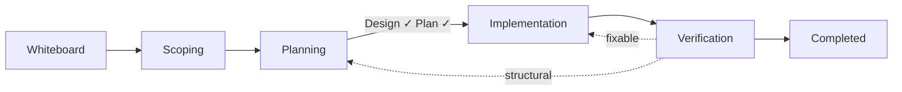

# EngAgent Workflow

How engineering work moves through the system — from exploratory whiteboard notes to done.

This guide covers the workflow phases, agents, skills, and handoffs. For other topics see:
- [Testing & Verification](design/test-philosophy.md)
- File types and schemas — see `eng-docs`
- `.eng/` setup — use `/eng-docs` and follow the init scaffold workflow

## The Flow



A **whiteboard** is freeform space for thinking. It can lead to an objective, support one, feed into a design, or just be notes. No gates, no status, no required transitions.

## Exploration Entry Point

When there is no active objective:

- Create `.eng/whiteboard/<date>-<slug>.md` first.
- A whiteboard is just a place to think. No gates, no status, no required transitions.
- Don't create objectives, design docs, or code unless the user asks.

## Phases

### 1. Scoping

**Agent:** `eng-plan`

During this phase, the objective file has `status: draft`. You and the agent define what you're solving, why it matters, and what success looks like.

During scoping, the agent refuses to write to `## Design` or `## Implementation Plan`. Those sections exist in the objective template but stay gated until scoping is done.

**Gates:**
- Objective statement exists (1-3 sentences, observable end state)
- Success criteria exist (3-5 independently verifiable bullets)
- You confirmed the scope

Once the gate passes, `status` moves from `draft` to `in-review`.

### 2. Planning

**Agent:** `eng-plan`

Planning produces two things: a design and an implementation plan.

#### Design

The design captures the key decisions for how you'll solve the problem. Each decision is numbered and locked once approved. A design decision includes:
- **What to do**
- **If violated**
- **Test**

For simple work, the design may live inline in the objective's `## Design` section. For complex work, it can live in `.eng/designs/` with its own frontmatter status.

#### Implementation Plan

Once the design is locked, write the concrete steps to get from current state to designed state. Tasks are checkboxes with done criteria and references to the decisions they implement.

```markdown
- [ ] **T1: Create eng-workflow skill** [implements: D7, D8]
  - Done: File exists and contains phase table and gate checklists
- [ ] **T2: Rewrite eng.agent.md** [implements: D7] (after: T1)
  - Done: No inline gate definitions remain
```

`[implements: D1, D2]` links a task to the design decisions it carries out. During implementation, the agent re-reads those specific decisions before starting the task.

`(after: T1, T2)` declares dependencies. The implementation agent uses those to decide what can run in parallel.

**Gates:**
- Design decisions locked (`*Status: approved*`)
- Implementation plan written with done criteria (`*Status: approved*`)
- No contradictions between design decisions and tasks
- You confirmed the plan

Once the gate passes, `status` moves from `in-review` to `approved`.

### 3. Implementation

**Agent:** `eng-code`

Implementation starts only when the objective is `approved`. `eng-code` reads the objective, picks up the implementation plan, respects `(after:)` dependencies, and delegates focused work to `eng-code-sub` workers.

Before every task, `eng-code` re-reads the design decisions referenced in that task's `[implements:]` tag. This is the main defense against implementation drift.

**Gates:**
- All task checkboxes checked
- Deliverables exist on disk (no stubs, no TODOs)
- Files are wired together where expected

Once the gate passes, the objective moves from `in-progress` to `needs-verify`.

### 4. Verification and Sign-Off

**Agent:** `eng` with `/eng-review`

Verification checks deliverables against two things:
- the **design decisions** (`Test:` fields)
- the **success criteria** from scoping

Use `/eng-review` in two modes:
- **Verification mode** — runs decision tests and success-criteria checks, and sets `needs-verify` if appropriate
- **Final sign-off mode** — closes the objective after verification passes and the user confirms

Three outcomes are possible:
- **Pass** — verification succeeds and the objective is ready for sign-off
- **Fixable issue** — the agent fixes a small issue and re-verifies
- **Structural gap** — the implementation does not match the design closely enough; stop and go back to implementation or planning

### Deferring or Cancelling

You can pause or abandon an objective at any point.

- **Deferred** (`status: deferred`) — work is paused, not abandoned. Timeline must record the reason.
- **Cancelled** (`status: cancelled`) — the work is not happening. Timeline must record the reason.

## Core Files

| File | Purpose | Notes |
|---|---|---|
| `.eng/whiteboard/<date>-<slug>.md` | Exploration before objective creation or direct execution | No `status` field |
| `.eng/objectives/objective-<slug>.md` | Central tracked work item | Scope, design, plan, timeline, mistakes |
| `.eng/designs/design-<slug>.md` | Separate design doc for complex work | Optional; inline design also supported |
| `.eng/findings/finding-<slug>.md` | Investigation results | Linked from objectives |
| `.eng/mistakes/mistake-<slug>-YYYY-MM-DD.md` | Detailed mistake write-up | Optional detail beyond one-liners |

## Agents

| Agent | What it does | When you use it |
|---|---|---|
| **eng** | Utility work, verification, and whiteboard direct-execute tasks | Ad-hoc work, verification, quick execution |
| **eng-plan** | Scoping, design, tasking, whiteboard exploration | Planning phases |
| **eng-code** | Implementation orchestrator | Approved objective implementation |
| **eng-code-sub** | Executes one coding task | Spawned by `eng-code` |
| **eng-research** | Investigates a topic and writes findings | Planning research or deep investigation |
| **eng-research-sub** | Answers one research sub-question | Spawned by `eng-research` or `eng-plan` |

## Skills and Slash Commands

Skills are invocable as slash commands and now replace the old workflow prompts.

| Command | What it does |
|---|---|
| `/eng-docs` | `.eng/` schemas, init scaffold workflow, whiteboards, mistake capture |
| `/eng-workflow` | Phase rules, gates, status lifecycle, objective kickoff |
| `/eng-review` | Gate review, deliverable verification, final sign-off |
| `/eng-check` | Validation, migration, backfill, documentation repair |
| `/eng-retro` | Session retrospectives and retro-pattern analysis |
| `/eng-push` | EngDirs init, commit, push, and pre-commit guidance |

## Handoffs

After an agent responds, you may see handoff buttons — suggested next steps:

| From | Button | Goes to |
|---|---|---|
| eng-plan | Approve & implement | eng-code |
| eng-plan | Switch to utility | eng |
| eng-code | Ready for verification | eng |
| eng-code | Back to planning | eng-plan |
| eng | Switch to planning | eng-plan |

These are shortcuts, not requirements. You can always switch agents manually or invoke a skill directly.

## Example: Add Rate Limiting to an API Client

1. Open chat with `@eng-plan` and describe the problem.
2. If there is no active objective, start with a whiteboard in `.eng/whiteboard/`.
3. Explore the problem, capture threads and open questions, and only create an objective when the user is ready for tracked work.
4. Scope the objective (`status: draft`) and define success criteria.
5. Use `/eng-review` in gate-review mode to advance from scoping to planning.
6. Lock the design and implementation plan, then use `/eng-review` again to advance to `approved`.
7. Switch to `@eng-code`. It picks up the approved objective and runs implementation.
8. Use `/eng-review` in verification mode to check deliverables.
9. Use `/eng-review` in final sign-off mode to close the objective once verification passes.
