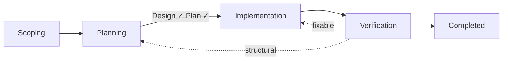
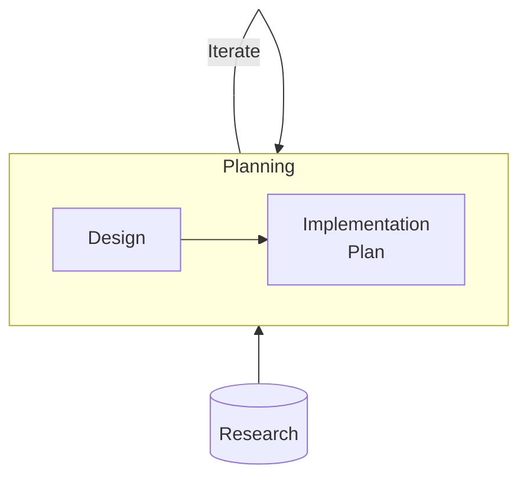
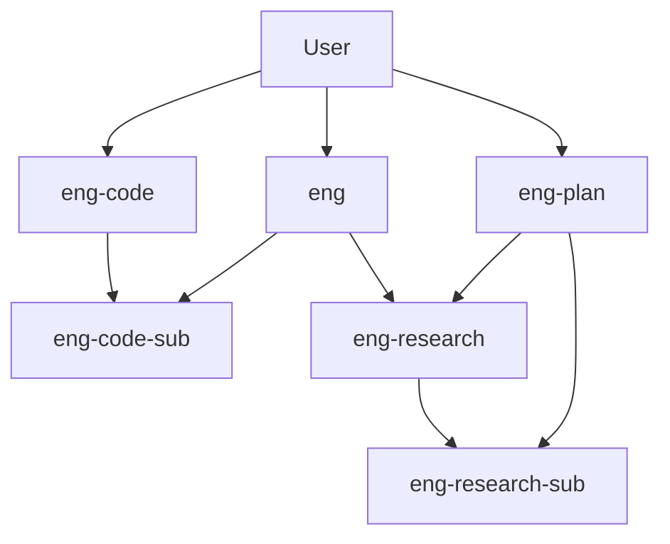

# EngAgent Workflow

How engineering work moves through the system — from idea to done.

This guide covers the workflow phases, agents, and prompts. For other topics see:
- [Testing & Verification](design/test-philosophy.md)
- File types and schemas — TBD
- `.eng/` directory setup — see `/eng-init`

## The Flow



The Planning phase expands into iterative sub-phases:



Every piece of work follows this flow. The depth varies — a bug fix might spend 2 minutes in Scoping and skip Design entirely. A large refactor spends days in Planning. But the phases are always the same.

## Phases

### 1. Scoping

**Agent** : `eng-plan`

During this phase, the objective file has `status: draft` in its frontmatter. This is the starting phase where you're still investigating or thinking about the problem. You and the agent work together to define what you're solving, why it matters, and what success looks like. This might involve some initial research, reading code, or just talking through the problem until you both understand it.

During scoping, the agent will refuse to write to `## Design` or `## Implementation Plan` — those sections are present in the template but marked with `<!-- Available after scoping -->` comments as a clear signal. However, you can both capture thoughts in `### Notes` and `### Open Questions` sections, which feed naturally into Design once scoping is complete. For a full list of sections in the objective see [The Objective File](#the-objective-file)

At the end of this phase you should have a clearly defined scope — an objective statement, and success criteria you can independently verify. To move to the next, phase ask the agent to 'advance' and it will check the gates, and update the status.


**Gates:**
- Objective statement exists (1-3 sentences, observable end state)
- Success criteria exist (3-5 independently verifiable bullets)
- You confirmed the scope

Once the gate passes, `status` moves from `draft` to `in-review`.

### 2. Planning

**Agent** : `eng-plan`

Once scoping is complete and you've confirmed the scope, you move into the planning phase. Here you work with `eng-plan` to create and approve two things: a design and an implementation plan. It's recommended that you complete the design first, then ask the agent to write the implementation plan. The specifics of each are below:

> [!TIP]
> **Skipping design:** For trivially small work with no unknowns — a simple bug fix, a one-file rename — you can skip the design sub-phase entirely. Just tell the agent "no design needed" and go straight to writing the implementation plan. You still need an approved implementation plan before moving to implementation.


#### Design Spec

The design captures the key decisions for how you'll solve the problem. Each decision is numbered and locked once approved — the implementation agent follows them exactly and cannot change them without user approval.

A design decision includes:
- **What to do** — the specific choice
- **If violated** — what goes wrong if the agent deviates
- **Test** — how to verify the decision was followed

Example:
```
**D1. Gate enforcement lives in prompt bodies.** Each transition prompt checks its entrance condition via status field and refuses if not met.
- *If violated:* Gates live in agent files (duplication) or skills (no enforcement).
- *Test:* /eng-go refuses if status ≠ approved.
```

For simple work, the design lives inline in the objective's `## Design` section with a `*Status: draft*` marker. For complex work, it's a separate design doc in `.eng/designs/` with its own frontmatter status. Either way, the design tracks through `draft → in-review → approved`. See the [design template](../src/skills/eng-docs/references/design-template.md) for the full structure.

Beyond decisions, the design has two more sections:

- **`### Agent's Discretion`** — things the agent can decide on its own without asking. This prevents the agent from asking questions about things you've already said are "your call." Example: "Exact wording of prompt gate-check instructions" or "Section ordering within the skill file."
- **`### Deferred`** — ideas or features that came up during design but aren't part of this work. Captured so they don't get lost, but explicitly not in scope. Example: "SessionStart hook for context injection — revisit after core workflow is working."

#### Implementation Plan

Once the design is locked, you write the concrete steps to get from current state to designed state. This is the `## Implementation Plan` section in the objective (previously called `## Tasks`).

Each task is a checkbox with clear done criteria and references to the design decisions it implements:
```
- [ ] **Create eng-workflow skill** [implements: D7, D8]
  - Files: src/skills/eng-workflow/SKILL.md
  - Done: File exists, contains phase table and gate checklists
- [ ] **Rewrite eng.agent.md** [implements: D7] (after: Create eng-workflow skill)
  - Files: src/agents/eng.agent.md
  - Done: No inline gate definitions, references eng-workflow
```

`[implements: D1, D2]` links the task to the design decisions it carries out. During implementation, the agent re-reads those specific decisions before starting the task. During verification,check each decision's test against the deliverable.

`(after: Task name)` declares a dependency. This tells the implementation agent which tasks can run in parallel and which must wait. In the example above, "Rewrite eng.agent.md" depends on the workflow skill existing first, but other independent tasks could run at the same time.

The implementation plan tracks its own status with `*Status: draft*` → `*Status: approved*`, just like the design. Both must be approved before the objective can advance to implementation.

> [!NOTE]
> **Research** can happen at any point during Planning. If you hit an unknown — how does this API work? what are the options for X? — `eng-research` investigates and produces a findings doc. Research isn't a separate phase; it's a tool you use within Planning to inform design decisions and task planning.

**Gates:**
- Design decisions locked (`*Status: approved*`)
- Implementation plan written with done criteria (`*Status: approved*`)
- No contradictions between design decisions and tasks
- You confirmed the plan

Once the gate passes, `status` moves from `in-review` to `approved`.

### 3. Implementation

**Agent** : `eng-code`

During this phase, the objective file moves from `status: approved` to `status: in-progress` once work begins. To begin, `status` must be `approved` — if it's not, `eng-code` refuses to start and points you back to `eng-plan` to finish planning.

This is the most automated phase. `eng-code` reads the objective, picks up the implementation plan, and starts orchestrating. It uses the `(after:)` dependency tags to figure out which tasks can run in parallel, then delegates independent tasks to `eng-code-sub` agents simultaneously. As workers report back, `eng-code` checks off tasks in the Implementation Plan, logs progress to the Timeline, and moves on to the next batch.

Before starting each task, `eng-code` re-reads the design decisions referenced in that task's `[implements:]` tag. This is the primary defense against implementation drifting from the design — the agent checks the specific constraints before every piece of work, not just once at the start.

You're mostly hands-off during this phase. If something goes wrong, `eng-code` reports what happened and either continues with the next task or stops and asks for input.

**Gates:**
- All task checkboxes checked
- Deliverables exist on disk (no stubs, no TODOs)
- Files are wired together where expected

Once the gate passes, `status` moves from `in-progress` to `needs-verify`.

### 4. Verification

**Agent** : `eng` (via `/eng-verify`)

During this phase, the objective file has `status: needs-verify` — implementation is done but hasn't been checked yet. To begin, `status` must be `in-progress` or `needs-verify` — the agent refuses otherwise.

Verification checks the deliverables against two things: the **design decisions** (did the agent follow them?) and the **success criteria** from scoping (does the result actually solve the problem?). For each design decision, the agent runs the `Test:` defined in the decision. For each success criterion, the agent checks whether it's independently verifiable against the deliverables.

This is collaborative — the agent runs automated checks where possible, but you make the final judgment. Run `/eng-verify` to kick off the automated checks, then `/eng-done` for your sign-off.

Three outcomes:
- **Pass** — everything checks out. `status` → `completed`.
- **Fixable issue** — something's wrong but it's a straightforward fix (one edit, no workers needed). `eng` fixes it directly, re-verifies.
- **Structural gap** — the implementation doesn't match the design in a fundamental way. `eng` stops and consults you. You can run `/eng-go` to resume implementation after fixing the tasks, or go back to `status: in-review` if the design needs revisiting.

### Deferring or Cancelling

You can pause or abandon an objective at any point in the workflow.

**Deferred** (`status: deferred`) — work is paused, not abandoned. Maybe priorities shifted, maybe you're blocked on something external. The agent logs the reason in the Timeline: `Status → deferred. Waiting on API access from vendor.` The objective stays in `.eng/objectives/` and can be picked back up later by setting `status` back to whatever phase you were in.

**Cancelled** (`status: cancelled`) — this work isn't happening. The problem changed, the approach was wrong, or it's no longer relevant. The agent logs the reason in the Timeline. The objective stays in `.eng/objectives/` as a record (or gets moved to `.eng/archive/` during cleanup).

Both require a reason. The agent should refuse to defer or cancel without one.

## The Objective File

The objective file is the central tracking document for each piece of work. Here's what each section does:

| Section | Purpose | When it's used |
|---|---|---|
| **`## Objective`** | Problem statement — what you're solving and why | Written during Scoping |
| **`### Success Criteria`** | How you know it's done — independently verifiable bullets | Written during Scoping |
| **`### Notes`** | Informal thoughts, observations, context | Available during Scoping |
| **`### Open Questions`** | Unknowns to resolve — feeds into Design | Available during Scoping, consumed during Design |
| **`## Design`** | Locked decisions (inline or linked design doc) | Written during Planning (Design sub-phase) |
| **`## Implementation Plan`** | Task list with done criteria and dependencies | Written during Planning (Tasking sub-phase) |
| **`## Timeline`** | Chronological log: what happened, why, outcome | Updated throughout all phases |
| **`## Mistakes`** | What went wrong and why — one-liners, linked to detail if needed | Updated any time |
| **`## Parking Lot`** | Ideas that came up but aren't in scope — one bullet per item | Updated any time |

**Timeline** is the objective's chronological record — status transitions, key decisions, session summaries. Each entry is self-contained: `YYYY-MM-DD: What — why — outcome`. A fresh reader should be able to reconstruct the history without following links.

**Mistakes** captures agent errors: wrong assumptions, missed context, convention violations. Format: `YYYY-MM-DD: What — why — severity`. For detailed write-ups, link to a file in `.eng/mistakes/`.

**Parking Lot** is for things the agent notices but aren't part of the current work — code smells, potential improvements, follow-on ideas. They stay here unless you promote them to tasks or a new objective.

See the [objective template](../src/skills/eng-docs/references/objective-template.md) for the full structure.

## Status

The objective's `status` field tracks where you are:

| Status | Phase | What's happening |
|---|---|---|
| `draft` | Scoping | Defining the problem |
| `in-review` | Planning | Designing + writing tasks |
| `approved` | Ready | Plan confirmed, implementation can start |
| `in-progress` | Implementation | Tasks being executed |
| `needs-verify` | Verification | Implementation done, needs checking |
| `completed` | Complete | Verified and finished |
| `deferred` | Paused | Reason in Timeline |
| `cancelled` | Abandoned | Reason in Timeline |

Within Planning, the sub-phase is tracked by the inline status markers on `## Design` and `## Implementation Plan`:

| Design | Impl Plan | What's happening |
|---|---|---|
| `draft` / `in-review` | `draft` | Design phase — discussing approach |
| `approved` | `draft` / `in-review` | Tasking phase — design locked, writing steps |
| `approved` | `approved` | Planning complete — ready to implement |

## Agents

| Agent | What it does | When you use it |
|---|---|---|
| **eng** | General-purpose utility + verification | Ad-hoc tasks. |
| **eng-plan** | Scoping, design, tasking. Can't edit code. | Planning phases. `/eng-review`. |
| **eng-code** | Implementation orchestrator. Delegates to workers. | `/eng-go` to kick off implementation. |
| **eng-code-sub** | Executes one coding task. Reports back. | Spawned by eng-code. You don't invoke directly. |
| **eng-research** | Investigates a topic. Produces findings. | Spawned during design. Or invoke directly. |
| **eng-research-sub** | Answers one sub-question. | Spawned by eng-research. |

### Who can spawn who



## Prompts

Slash commands that trigger workflow actions. Open a new chat (`+`), type the command.

### Workflow prompts

These prompts drive the workflow — creating objectives, reviewing work, transitioning between phases, and closing out.

#### `/eng-new`
**Agent:** `eng-plan`

Creates a new objective and starts scoping. The agent creates the objective file with `status: draft`, then walks you through defining the problem and success criteria.

#### `/eng-review`
**Agent:** `eng-plan`

Reviews the active objective against the next gate's conditions. If all conditions are met, the agent tells you and asks if you want to advance. If you approve, it updates the status.

**Scope review** (`draft` → gate: Scoping → Planning):
- Is the problem statement observable and specific (not vague)?
- Are success criteria independently verifiable?
- Are boundaries clear — what's in scope, what's out?
- If all pass → asks if you want to advance to `in-review`.

**Design review** (`in-review`, design not approved → gate: design sub-phase):
- For each decision: gray areas, failure modes, contradictions with other decisions, missing mechanisms
- Are Agent's Discretion and Deferred sections complete?
- Can optionally spawn a cold-reader subagent to find gaps the author and reviewer both miss
- Groups findings by severity: critical / significant / minor
- If all pass → asks if you want to approve the design (`*Status: approved*`).

**Implementation plan review** (`in-review`, design approved → gate: Planning → Implementation):
- Do tasks cover all design decisions? (`[implements:]` coverage)
- Are done criteria observable and specific?
- Do `(after:)` dependencies make sense? Could any tasks be parallelized?
- Any tasks that contradict a locked decision?
- Any deferred items accidentally in the task list?
- If all pass → asks if you want to advance to `approved`.

This is where active challenge happens — the agent pushes back on issues, probes trade-offs, and looks for gaps. It's not a rubber stamp.

#### `/eng-go`
**Agent:** `eng-code`

Kicks off or resumes implementation. Before starting, checks the gate:
- status must be >= `approved`. If not → refuses, tells you what's missing, suggests `/eng-review`.
- Design decisions must be locked
- Tasks must have done criteria

If everything passes, confirms the objective with you, sets `status: in-progress`, and begins orchestrating.

#### `/eng-verify`
**Agent:** `eng`

Runs automated verification checks. Before starting, checks the gate:
- status must be >= `in-progress`. If not → refuses.

For each design decision, runs the `Test:` defined in the decision. For each success criterion, checks whether deliverables satisfy it. Reports results. Sets `status: needs-verify` if not already set.

#### `/eng-done`
**Agent:** `eng`

Your final sign-off. Before proceeding, checks the gate:
- status must be >= `needs-verify`. If not → refuses, suggests `/eng-verify` first.

Confirms with you that everything checks out, sets `status: completed`, logs the completion in Timeline, and commits.

### Utility prompts

These prompts support the workflow but don't drive phase transitions.

| Command | Agent | What it does |
|---|---|---|
| `/eng-init` | `eng` | Set up `.eng/` directory in a project (one-time setup) |
| `/eng-status` | `eng-plan` | Dashboard — current phase, design status, task progress, next gate conditions |
| `/eng-retro` | `eng` | End-of-session retrospective — capture mistakes, observations, positives |
| `/eng-wtf` | `eng` | Record a mistake with full detail — what happened, why, and severity |

### How `/eng-status` reports

`/eng-status` gives you a dashboard of where things stand:

```
=== Objective: eng-docs-workflow-refactor ===
Status: in-review (Planning)

  Design:               approved ✓
  Implementation Plan:  3/6 tasks have done criteria ✗

Next gate: Planning → Implementation
  ✓ Design decisions locked
  ✗ All tasks have done criteria
  ✗ Human confirmed plan

Suggested: Finish writing done criteria, then /eng-review
```

## Handoffs

After an agent responds, you may see handoff buttons — suggested next steps:

| From | Button | Goes to |
|---|---|---|
| eng-plan | Approve & implement | eng-code |
| eng-plan | Switch to utility | eng |
| eng-code | Ready for verification | eng |
| eng-code | Back to planning | eng-plan |
| eng | Switch to planning | eng-plan |

These are shortcuts, not requirements. You can always switch agents manually or use prompts.

## Example: Add Rate Limiting to an API Client

1. Open chat with `@eng-plan`. "I want to add rate limiting to the payment API."
2. eng-plan creates objective (`status: draft`), walks through scoping.
3. You confirm scope. eng-plan sets `status: in-review`.
4. Design discussion. eng-plan spawns `@eng-research` to check the API's rate limit headers.
5. Decisions locked. `## Design` → `*Status: approved*`.
6. eng-plan writes tasks. `## Implementation Plan` → `*Status: approved*`.
7. You run `/eng-review`. eng-plan confirms everything checks out.
8. You run `/eng-go` (new chat). eng-code picks up the objective, starts delegating to eng-code-subs.
9. Tasks complete. eng-code sets `status: needs-verify`.
10. You run `/eng-verify` (new chat). eng checks deliverables against criteria.
11. All good. You run `/eng-done`. Objective → `status: completed`.
